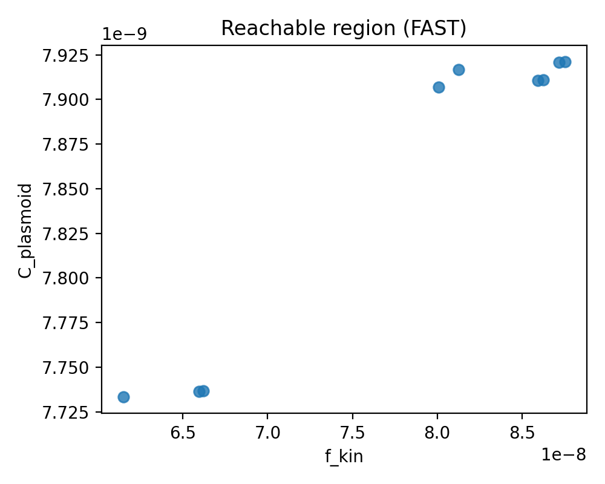
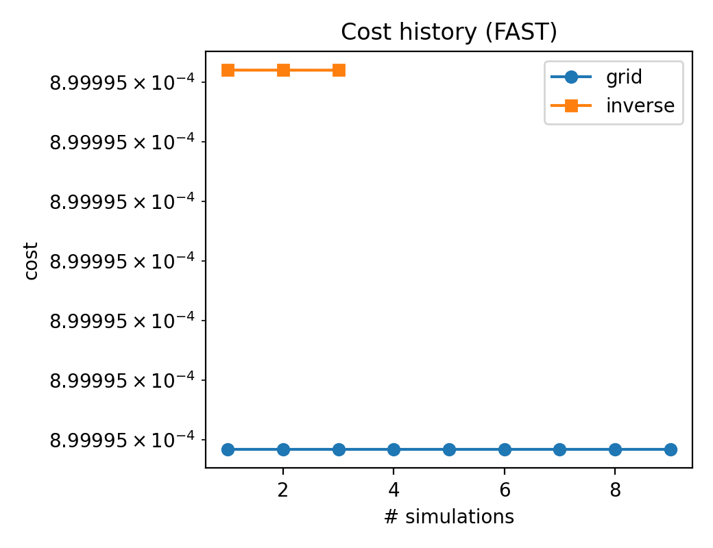

# MHX

Differentiable pseudo-spectral reduced MHD tearing/plasmoid solver and analysis tools (JAX-based).

## Install

```bash
pip install -e .
```

Inverse design / ML extras:

```bash
pip install -e ".[ml]"
```

Docs extras:

```bash
pip install -e ".[docs]"
```

CI/repro pinned set:

```bash
pip install -r requirements-ci.txt
```

## Quickstart (FAST)

Run a tiny simulation (seconds) and generate figures:

```bash
mhx simulate --fast --equilibrium original --eta 1e-3 --nu 1e-3
mhx figures --run outputs/runs/<timestamp>_simulate
```

Run a tiny scan and inverse design (requires `pip install -e ".[ml]"`):

```bash
mhx scan --equilibrium forcefree --grid 4x4
mhx inverse-design --equilibrium forcefree --steps 2 --fast
```

## Figures & Movies

Energy evolution (FAST example):


Midplane flux evolution (FAST example):


Reachable region (FAST example):



Cost history (FAST example):



## Outputs

Runs are written under:

```
outputs/runs/<timestamp>_<tag>/
  config.yaml
  history.npz
  solution_initial.npz
  solution_mid.npz
  solution_final.npz
  figures/
```

Grid scans and figure outputs:

```
outputs/scans/reachable_region_scan_<eq_mode>.npz
outputs/figures/*.png
```

## Objective consistency (important)

The inverse-design objective is persisted into `history.npz` (`target_f_kin`,
`target_complexity`, `lambda_complexity`). The figure generator will load these
values by default to avoid apples-to-oranges comparisons.

## Source code links

- Diagnostics API: [mhx/solver/diagnostics.py](https://github.com/uwplasma/MHX/blob/main/mhx/solver/diagnostics.py)
- Core solver: [mhx/solver/tearing.py](https://github.com/uwplasma/MHX/blob/main/mhx/solver/tearing.py)
- Inverse design training: [mhx/inverse_design/train.py](https://github.com/uwplasma/MHX/blob/main/mhx/inverse_design/train.py)

## Citation

If you use MHX, please cite it. See `CITATION.cff`.

## Notes

- Many scripts assume 64-bit JAX. Enable with:

```bash
export JAX_ENABLE_X64=1
```

## Legacy scripts

Legacy scripts have been moved to `scripts/legacy/`. Root-level files now
provide deprecation shims for backward compatibility.
See `docs/migration.rst` for the old → new command mapping.

## Physics plugins

Define additive physics terms via `PhysicsTerm` and pass them to the solver.
See `examples/physics_plugin_minimal.py` and `examples/physics_plugin_extended_mhd.py`
for toy terms (`hall`, `hyper_resistivity`, `anisotropic_pressure`).

Validate plugin metadata/signatures with:

```bash
mhx plugin lint
```

## Latent ODE

FAST tutorial:

```bash
python examples/latent_ode_fast.py
```

This generates `docs/_static/latent_ode_fit.png` and an ablation table
`docs/_static/latent_ode_ablation.rst`.

Baseline experiment:

```bash
python examples/latent_ode_experiment.py
```

This generates `docs/_static/latent_ode_experiment.png` and
`docs/_static/latent_ode_experiment.rst`, plus calibration and failure-case
plots.

Dataset generator:

```bash
python examples/latent_ode_dataset.py
```

## Reproduce all figures (FAST)

```bash
python examples/reproduce_figures.py
```

Expected outputs include `outputs/manifest.json` plus figures under `docs/_static/`.

## Reproducibility

See `docs/reproducibility.rst` for exact command sequences and expected outputs.

Output schema details are documented in `docs/output_schema.rst`.
To enforce API compatibility during loading, set `MHX_API_VERSION` (see
`docs/api_versioning.rst`).

## Model configuration

```bash
mhx simulate --fast --model-config model.yaml
```

Example YAML:

```yaml
model:
  equilibrium_mode: original
  rhs_terms: [linear_drag, hyper_resistivity]
  term_params:
    linear_drag:
      mu: 0.05
    hyper_resistivity:
      eta4: 1e-3
```
