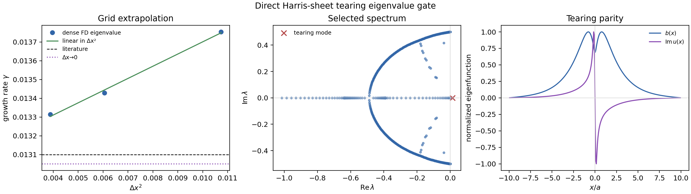
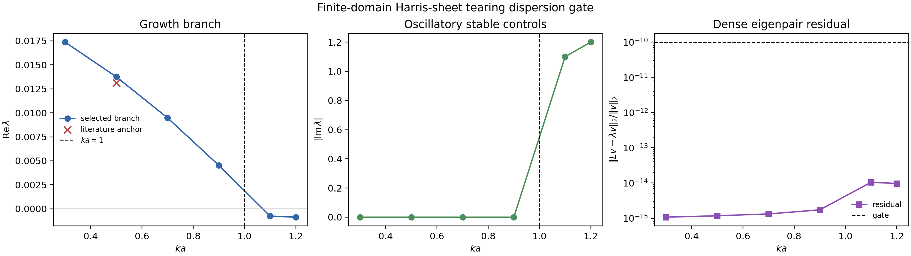
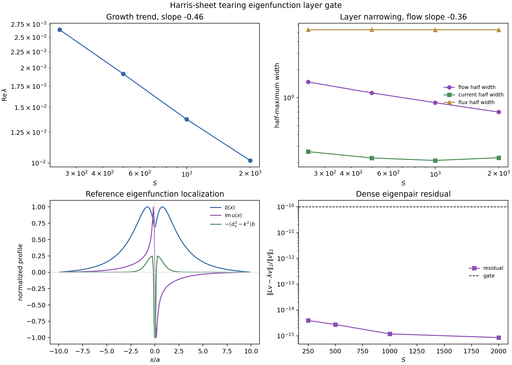
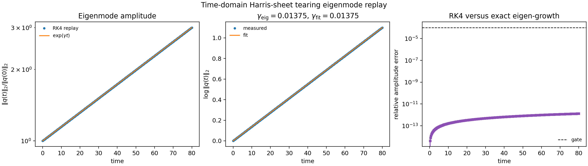
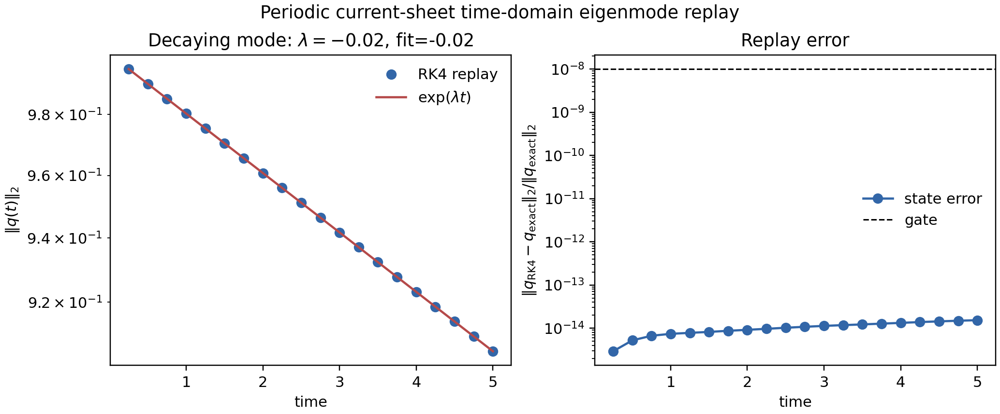
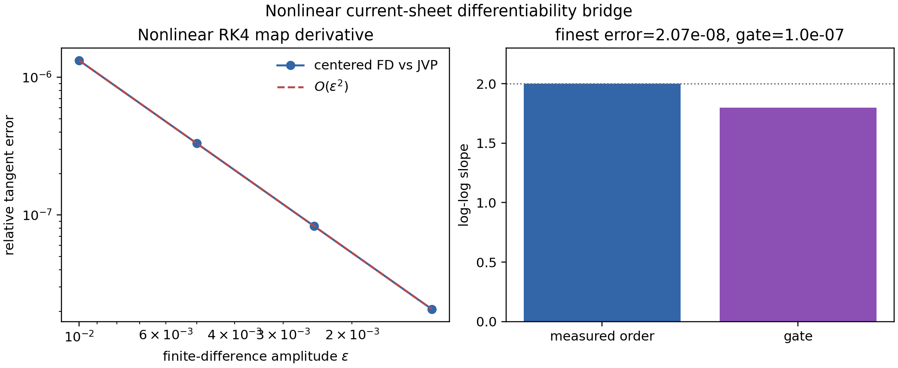

# MHX

[](https://github.com/uwplasma/MHX/actions/workflows/ci.yml)
[](https://mhx.readthedocs.io/)

**MHX is being rebuilt as a JAX-native, differentiable plasma and magnetohydrodynamics framework for magnetic reconnection, tearing modes, validation, extension experiments, and eventually inverse design.**

The previous reduced-MHD tearing/plasmoid code has been preserved under
`legacy/old_mhx/`. The active package is a clean rebuild under `src/mhx/`.

## Current status

This rebuild is intentionally starting from a small, tested core:

- Python 3.10+ package with `src/` layout.
- `mhx` CLI with `mhx version`, `mhx init`, and `mhx run`.
- TOML configuration loading.
- Periodic Cartesian grids.
- JAX spectral derivative, inverse-Laplacian, and reduced-MHD RHS operators.
- Sphinx/MyST documentation skeleton.
- CI for linting, tests, coverage, and docs.

The current FAST reduced-MHD runs are smoke tests, not nonlinear reconnection
claims. The strongest current results are exact linear validation gates,
the direct Harris-sheet tearing eigenvalue gate for one published reference
case, finite-domain dispersion and time-domain eigenmode replay gates,
eigenfunction-localization gates, matrix-free operator checks, a nonlinear
energy/dissipation budget gate, a nonlinear-duration audit that prevents
overclaiming short CI runs, seed-robust QI sweeps, a restartable Rutherford
execution lane, a fitted latent-ODE validation lane, and extension APIs. Full
FKR/Coppi production scans, converged Rutherford island growth, nonlinear
plasmoid dynamics, and production neural-ODE inverse-design claims remain
roadmap items.

See `docs/audit.md` for the current skeptical validation audit and maturity
table, and `docs/time_windows.md` for the enforced duration policy.

## Reviewer evidence and claim boundaries

MHX now treats every artifact as one of four claim levels:

| Level | Meaning |
| --- | --- |
| `smoke` | Runs and writes finite, schema-valid outputs. |
| `validation` | Passes a specific documented physics or API gate. |
| `production_template` | Defines a long-run plan that is duration guarded but not yet a completed simulation. |
| `production` | Requires a long run, convergence suite, seed/QI check, movies, and checksummed manifest. |

The most useful reviewer entry points are:

- [Reviewer evidence map](docs/reviewer_evidence.md): claim levels, gates,
  source-code links, and reproduction commands.
- [Publication plot checklist](docs/publication_checklist.md): what figures are
  ready, what is validation-only, and what remains before paper claims.
- [Campaign runner operations](docs/campaign_runner.md): how FAST campaign
  artifacts differ from long Rutherford/plasmoid production runs.
- [Skeptical audit](docs/audit.md): current maturity table and explicit
  non-claims.

Current nonlinear CI runs are intentionally short validation gates. They support
operator, differentiability, energy-budget, schema, seed-sensitivity,
restart/resume, and latent-ODE train/test checks. They do **not** yet support
converged Rutherford island growth, Sweet-Parker plasmoids, or neural-ODE
production claims.

## Literature-anchored movies

These small GIFs are intended to make the validation story visible at a glance.
They are either generated from MHX validation gates or from explicitly labeled
theory schematics, not from unvalidated nonlinear production simulations.

| Movie | What it shows | Literature anchor |
| --- | --- | --- |
|  | Direct Harris-sheet eigenproblem: growth decreases with S while the resonant flow/current layer narrows. | Classical tearing localization from [FKR 1963](https://doi.org/10.1063/1.1706761) and the reduced-MHD Harris eigenproblem used by [MacTaggart 2019](https://eprints.gla.ac.uk/191898/1/191898.pdf). |
|  | Schematic Sweet-Parker sheet fragmentation with $\gamma_{\max}\tau_A\propto S^{1/4}$ and $k_{\max}L\propto S^{3/8}$. | [Loureiro, Schekochihin & Cowley 2007](https://arxiv.org/abs/astro-ph/0703631); schematic only, not yet a nonlinear MHX plasmoid claim. |
|  | Real restartable Rutherford executor chunk with fixed-scale magnetic flux. | Execution-path validation for the chunked production runner; not a completed long Rutherford claim. |
|  | Same chunk shown through current density, using fixed color limits. | Checks the movie/artifact lane and the current-density visualization contract. |

The active public API is `v1`. Check it with:

```bash
mhx api status
MHX_API_VERSION=v1 mhx api status --json
```

## Install

```bash
git clone https://github.com/uwplasma/MHX.git
cd MHX
python -m pip install -e ".[dev,docs]"
```

JAX accelerator wheels are platform-specific. For GPU/TPU installs, follow the
official JAX instructions and then install MHX.

## Quickstart

Create a starter config:

```bash
mhx init examples/linear_tearing.toml
```

Run the deterministic reduced-MHD smoke workflow:

```bash
python tools/check_legacy_imports.py
mhx run examples/linear_tearing.toml --outdir outputs/smoke
```

Expected files:

- `outputs/smoke/config_effective.json`
- `outputs/smoke/diagnostics.json`
- `outputs/smoke/trajectory.npz`
- `outputs/smoke/manifest.json`

Regenerate figures:

```bash
mhx figures outputs/smoke --gif
```

This writes `energy_history.png`, `flux_final.png`, and `mode_amplitude.png`
under `outputs/smoke/figures/`, plus `flux_movie.gif` when `--gif` is passed.

Create a compact run report:

```bash
mhx report outputs/smoke
mhx artifact-manifest outputs/smoke
```

Run the same workflow as a benchmark:

```bash
mhx benchmark run --config examples/linear_tearing.toml --outdir outputs/benchmarks/linear_tearing_fast --gif
mhx benchmark validate outputs/benchmarks/linear_tearing_fast
mhx benchmark decay --outdir outputs/benchmarks/resistive_decay
mhx benchmark scaling --outdir outputs/benchmarks/reconnection_scaling
mhx benchmark fkr-window --outdir outputs/benchmarks/fkr_window
mhx benchmark fkr-growth --outdir outputs/benchmarks/fkr_growth_rate
mhx benchmark harris-delta-prime --outdir outputs/benchmarks/harris_delta_prime
mhx benchmark linear-tearing-eigenvalue --outdir outputs/benchmarks/linear_tearing_eigenvalue
mhx benchmark linear-tearing-dispersion --outdir outputs/benchmarks/linear_tearing_dispersion
mhx benchmark linear-tearing-layer --outdir outputs/benchmarks/linear_tearing_layer
mhx benchmark linear-tearing-timedomain --outdir outputs/benchmarks/linear_tearing_timedomain
mhx benchmark linearized-rhs --outdir outputs/benchmarks/linearized_rhs
mhx benchmark reduced-mhd-eigenmode --outdir outputs/benchmarks/reduced_mhd_eigenmode
mhx benchmark cosine-equilibrium-linearization --outdir outputs/benchmarks/cosine_equilibrium_linearization
mhx benchmark current-sheet-eigenvalue --outdir outputs/benchmarks/periodic_current_sheet_eigenvalue
mhx benchmark current-sheet-timedomain --outdir outputs/benchmarks/periodic_current_sheet_timedomain
mhx benchmark current-sheet-nonlinear-bridge --outdir outputs/benchmarks/periodic_current_sheet_nonlinear_bridge
mhx benchmark nonlinear-energy-budget --outdir outputs/benchmarks/nonlinear_energy_budget
mhx benchmark nonlinear-duration-audit --outdir outputs/benchmarks/nonlinear_duration_audit
mhx benchmark duration-policy --outdir outputs/benchmarks/duration_policy
mhx benchmark diffusion-eigenvalue --outdir outputs/benchmarks/diffusion_eigenvalue
mhx benchmark power-iteration --outdir outputs/benchmarks/power_iteration
mhx benchmark arnoldi --outdir outputs/benchmarks/arnoldi
mhx benchmark timing --outdir outputs/benchmarks/timing --repeats 3 --warmups 1
mhx benchmark catalog --outdir outputs/benchmarks/catalog
mhx benchmark seed-robust-qi --outdir outputs/benchmarks/seed_robust_qi
mhx benchmark seed-robust-qi-sweep --outdir outputs/benchmarks/seed_robust_qi_sweep
mhx neural-ode dataset --outdir outputs/neural_ode/seed_qi_fast
mhx neural-ode train --outdir outputs/neural_ode/latent_ode_fast
mhx campaign rutherford-template --outdir outputs/campaigns/rutherford_template
mhx campaign rutherford-run-fast --outdir outputs/campaigns/rutherford_fast
mhx campaign rutherford-plan-production --outdir outputs/campaigns/rutherford_production_plan
mhx campaign rutherford-resume-plan outputs/campaigns/rutherford_production_plan
mhx campaign rutherford-execute outputs/campaigns/rutherford_production_plan --max-steps 128
python examples/make_rutherford_production_plan.py --outdir outputs/examples/rutherford_production_plan
python examples/run_rutherford_production_chunk.py --outdir outputs/examples/rutherford_chunk --movies
python examples/train_latent_ode_fast.py --outdir outputs/examples/latent_ode_fast
mhx validate all --outdir outputs/validation_suite
mhx validate readiness --suite outputs/validation_suite --outdir outputs/validation_readiness
```

Current reviewer-facing validation figures include the direct Harris-sheet
tearing eigenvalue gate:



and the finite-domain tearing dispersion gate:



and the eigenfunction-layer localization gate:



and the time-domain eigenmode replay gate:



and the periodic current-sheet time-domain operator replay:



The nonlinear code-validity gates now include a full reduced-MHD
energy/dissipation budget and a duration audit that explicitly shows why the
current CI nonlinear runs are not long enough for Rutherford-island or
plasmoid-chain claims. The companion `duration-policy` artifact marks short
historical runs as validation-only and requires future production templates to
satisfy `t_end >= safety_factor * e_folds / gamma`:


For the next long nonlinear step, generate a duration-guarded Rutherford
production plan before launching any expensive run:

```bash
mhx campaign rutherford-plan-production \
  --outdir outputs/campaigns/rutherford_production_plan \
  --nx 128 --ny 128 --dt 0.1 --target-saved-frames 400
```

The resulting manifest is labeled `claim_level = "production_template"`; it is
a reproducible plan, not a completed nonlinear reconnection result.

To execute a restartable chunk from that plan:

```bash
mhx campaign rutherford-execute \
  outputs/campaigns/rutherford_production_plan \
  --max-steps 128 --movies
```

This writes `production_history.npz`, `diagnostics.json`, `validation.json`,
`resume_plan.json`, `checkpoints/state_step_*.npz`,
`figures/production_histories.png`, and optional fixed-scale GIFs. A partial
chunk remains `claim_level = "validation"` until the planned target is actually
completed and convergence evidence is attached.

To exercise the Rutherford diagnostic schema without making a production claim:

```bash
mhx campaign rutherford-run-fast \
  --outdir outputs/campaigns/rutherford_fast \
  --nx 16 --ny 16 --t-end 0.2 --seed 0
```

This writes `rutherford_fast_histories.npz`, `diagnostics.json`,
`validation.json`, `manifest.json`, and
`figures/rutherford_fast_histories.png`. The manifest remains
`claim_level = "validation"`.

To build the deterministic neural-ODE reproducibility bundle and fit the
CI-scale latent ODE:

```bash
mhx neural-ode dataset --outdir outputs/neural_ode/seed_qi_fast
mhx neural-ode train --outdir outputs/neural_ode/latent_ode_fast
```

The training command writes `latent_ode_model.json`,
`latent_ode_metrics.json`, `latent_ode_predictions.npz`, and
`figures/latent_ode_rmse_comparison.png` in addition to the dataset, split,
baseline, and calibration artifacts.

```bash
mhx neural-ode dataset \
  --outdir outputs/neural_ode/seed_qi_fast \
  --seeds 0,1,2,3,4,5 \
  --nx 16 --ny 16 \
  --steps 24
```

This writes `dataset.npz`, `splits.json`, `baseline_metrics.json`,
`calibration.json`, `experiment_spec.json`, `validation.json`,
`manifest.json`, and the figures `dataset_targets.png`, `baseline_rmse.png`,
and `calibration_coverage.png`. Use `mhx neural-ode train` to add
`latent_ode_model.json`, `latent_ode_predictions.npz`, and fitted train/test
metrics; both commands remain validation-level until trained on production
trajectories.

and the nonlinear current-sheet differentiability bridge:



and the exact resistive-decay gate:


Inspect configurable physics terms:

```bash
mhx physics equilibria
mhx physics list
mhx physics lint hyper_resistivity
mhx diagnostics list
```

Try a reduced-state two-fluid toy extension:

```bash
mhx run examples/linear_tearing_twofluid_toy.toml --outdir outputs/twofluid_toy
mhx figures outputs/twofluid_toy --gif
```

Try a local plugin module that registers both a physics term and a diagnostic:

```bash
mhx run examples/linear_tearing_plugin_demo.toml --outdir outputs/plugin_demo
mhx figures outputs/plugin_demo --gif
mhx report outputs/plugin_demo
mhx diagnostics list-with-plugins --plugin-module examples.local_extension_plugin
mhx physics lint example_flux_drive --plugin-module examples.local_extension_plugin
mhx diagnostics lint final_flux_l2 --plugin-module examples.local_extension_plugin
```

Installed plugin packages can also use Python entry-point groups:

```bash
mhx physics list-with-plugins --entry-point-group mhx.physics
mhx diagnostics list-with-plugins --entry-point-group mhx.diagnostics
```

Use `examples/plugin_template/` as the starting layout for an external plugin
repository with entry points, source modules, and tests.
The local plugin also demonstrates diagnostic figure hooks:
`mhx figures outputs/plugin_demo` writes
`outputs/plugin_demo/figures/diagnostics/final_flux_l2_history.png` and records
the same hook outputs in `report.json` when `mhx report outputs/plugin_demo`
runs.

## Python API

```python
from mhx.config import load_config
from mhx.grids import CartesianGrid
from mhx.numerics.spectral import fft_derivative

cfg = load_config("examples/linear_tearing.toml")
grid = CartesianGrid.from_mesh_config(cfg.mesh)
x, _ = grid.mesh()
dfdx = fft_derivative(x * 0.0, axis=0, length=grid.lengths[0])
```

For a real time-dependent smoke run from Python:

```python
from mhx.benchmarks import run_linear_tearing_smoke
from mhx.config import load_config

cfg = load_config("examples/linear_tearing.toml")
trajectory, diagnostics = run_linear_tearing_smoke(cfg)
print(diagnostics["final_total_energy"])
```

## Roadmap

The full rebuild plan and execution log live in `plan.md`. Major milestones:

1. Clean package skeleton and validation-first numerics.
2. Spectral reduced-MHD tearing benchmark plus gradient checks.
3. Plugin-style physics terms and standardized diagnostics.
4. Finite-volume MHD, constrained transport, and external-code comparisons.
5. Neural ODE and differentiable inverse-design workflows.
6. Manuscript-grade docs, figures, movies, and reproducibility pipelines.

## Release and migration

- `CHANGELOG.md` records release-facing changes.
- `RELEASE.md` defines the release checklist and deprecation policy.
- `docs/api_policy.md` documents the v1 compatibility contract.
- `docs/migration.md` maps archived scripts to active CLI workflows.
- `CITATION.cff` is present for repository-level citation metadata; formal DOI
  metadata should be updated when the first release is tagged.

## Citation

MHX is not yet publication-release-citable. Until a tagged release and DOI are
created for the rebuilt package, cite the repository URL and commit SHA, or use
the provisional metadata in `CITATION.cff`.
