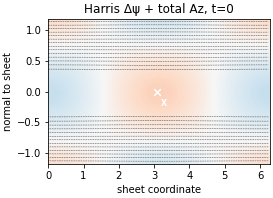
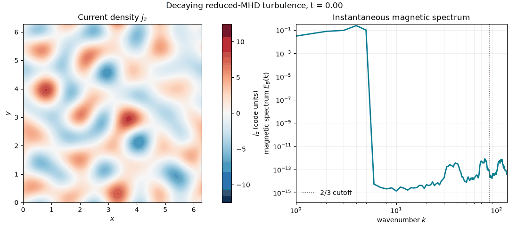
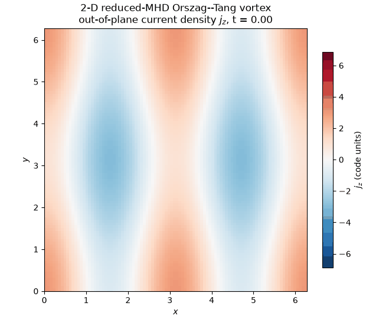
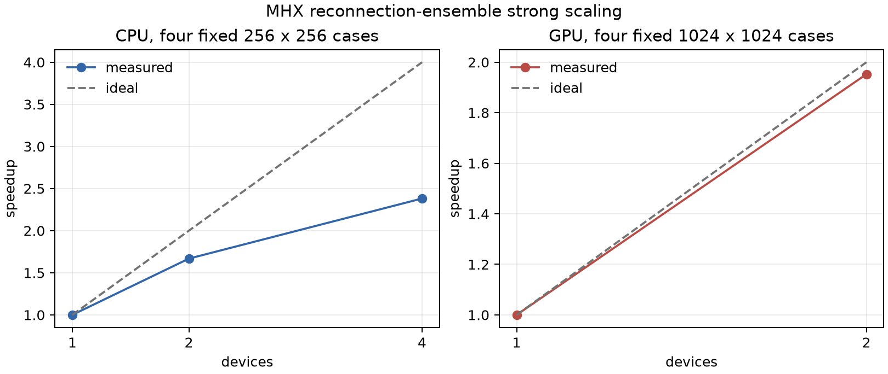

# MHX

[](https://github.com/uwplasma/MHX/actions/workflows/ci.yml)
[](https://github.com/uwplasma/MHX/actions/workflows/ci.yml)
[](https://mhx.readthedocs.io/)

MHX runs differentiable, two-dimensional reduced-MHD models in JAX. It builds
the plasma equations and diagnostics. [SOLVAX](https://github.com/uwplasma/SOLVAX)
contains the linear, Krylov, and nonlinear solvers.

Use MHX to study periodic current sheets, tearing modes, reconnection, and
reduced-MHD turbulence. MHX does not solve the full three-dimensional MHD
equations.

## First run

Install the current source:

```bash
git clone https://github.com/uwplasma/MHX.git
cd MHX
python -m venv .venv
source .venv/bin/activate
python -m pip install .
```

Create `reconnection.py`:

```python
from pathlib import Path

import mhx

output = Path("outputs/reconnection")

simulation = mhx.Simulation(
    shape=(64, 64),
    equilibrium=mhx.PeriodicDoubleHarrisEquilibrium(
        width=0.4,
        perturbation_amplitude=4.0e-3,
        perturbation_mode=(2, 1),
    ),
    resistivity=5.0e-3,
    viscosity=5.0e-3,
    dt=2.0e-2,
    t_end=2.0,
    save_every=10,
)

result = simulation.run()
result.print_summary()
result.plot(output / "summary.png")
result.save(output)
```

Run it:

```bash
python reconnection.py
```

MHX prints the grid, physics settings, device count, compile time, run time,
energy, and divergence error. It writes a four-panel summary and a compressed
field history.

## Example gallery

The scripts in [`examples/gallery/`](examples/gallery/) use the same sequence
as the first run. Edit the settings at the top of a script, then run it from
the repository root.

| Script | Purpose |
| --- | --- |
| [`01_reconnection.py`](examples/gallery/01_reconnection.py) | Seed and evolve a periodic double-Harris current sheet. |
| [`02_tearing_mode.py`](examples/gallery/02_tearing_mode.py) | Evolve a perturbed cosine current sheet. |
| [`03_implicit_step.py`](examples/gallery/03_implicit_step.py) | Use backward Euler with SOLVAX Newton--Krylov solves. |
| [`04_cpu_parallel.py`](examples/gallery/04_cpu_parallel.py) | Split one field across four local CPU devices. |
| [`05_gpu_parallel.py`](examples/gallery/05_gpu_parallel.py) | Split one field across all visible GPUs. |
| [`06_strong_scaling.py`](examples/gallery/06_strong_scaling.py) | Strong-scale one fixed reconnection ensemble. |
| [`07_multi_process.py`](examples/gallery/07_multi_process.py) | Run one ensemble across JAX processes. |

| Reconnection | Turbulence | Orszag--Tang |
| --- | --- | --- |
|  |  |  |

These images show bounded validation runs. See
[`docs/media.md`](docs/media.md) for their settings and claim limits.

## Physics and numerics

MHX owns quantities that depend on the model:

- reduced-MHD states and equations
- periodic equilibria and source terms
- Fourier spatial operators
- plasma diagnostics and validation cases

SOLVAX owns general numerical algebra:

- matrix-free operators
- GMRES and recycled Krylov methods
- Newton--Krylov root solves
- preconditioners and implicit differentiation

The base MHX install always includes SOLVAX. MHX has two optional dependency
groups: `dev` for repository work and `research` for neural-ODE experiments.

## Parallel runs

Set `device_count` to select a JAX device mesh. For one large trajectory, MHX
can divide the field. For a seed or parameter study, divide independent cases;
that avoids communication inside the time loop.

Create four logical CPU devices:

```bash
python examples/gallery/04_cpu_parallel.py
```

Run on every visible GPU:

```bash
JAX_PLATFORM_NAME=gpu python examples/gallery/05_gpu_parallel.py
```

JAX compiles one SPMD program for the device mesh. MHX reports compile and run
times separately. The scaling example times the run after compilation.



The plot holds four reconnection cases fixed. The measured speedup is 2.38x on
four logical CPU devices and 1.95x on two PCIe-connected RTX A4000 GPUs. Its
data and exact settings are in
[`docs/_static/performance/`](docs/_static/performance/).

```python
equilibria = tuple(
    mhx.PeriodicDoubleHarrisEquilibrium(
        perturbation_amplitude=1.0e-3 * (1.0 + 0.05 * case)
    )
    for case in range(4)
)

result = mhx.Simulation(
    shape=(1024, 1024),
    device_count=2,
).run_ensemble(equilibria)
```

One distributed two-dimensional FFT must exchange data. Independent cases do
not. Use ensemble parallelism for scans and seed studies; use field sharding
when one trajectory is too large for one device.

On a scheduler or MPI installation, run one copy per process:

```bash
mpirun -np 2 python examples/gallery/07_multi_process.py
```

Every process runs the same script. `mhx.initialize_distributed()` must execute
before any code queries JAX devices.

## Choose a time integrator

RK4 is the default:

```python
simulation = mhx.Simulation(integrator="rk4")
```

Backward Euler uses SOLVAX for each nonlinear step:

```python
simulation = mhx.Simulation(
    integrator="backward_euler",
    dt=1.0e-2,
    t_end=1.0e-1,
)
```

Use backward Euler when a larger stable time step offsets the cost of its
Newton and GMRES iterations. Check the convergence fields in
`result.diagnostics` before you use the output.

## Documentation

| Need | Read |
| --- | --- |
| Installation | [`docs/install.md`](docs/install.md) |
| Guided first model | [`docs/quickstart.md`](docs/quickstart.md) |
| Equations and assembly | [`docs/model_assembly.md`](docs/model_assembly.md) |
| Output files | [`docs/output_schema.md`](docs/output_schema.md) |
| Validation limits | [`docs/validation.md`](docs/validation.md) |
| Performance tests | [`docs/performance.md`](docs/performance.md) |
| Benchmark commands | [`docs/benchmarks.md`](docs/benchmarks.md) |
| Long-run evidence | [`docs/long_run_evidence.md`](docs/long_run_evidence.md) |
| Campaign runner | [`docs/campaign_runner.md`](docs/campaign_runner.md) |
| Writing rules | [`docs/writing_style.md`](docs/writing_style.md) |

The command-line benchmark and campaign tools remain available for validation
and long production runs. Run `mhx --help` to list them.

## Development

Install the repository tools, then run the checks:

```bash
python -m pip install -e ".[dev]"
python -m ruff check src tests examples tools
python tools/check_prose.py
python -m pytest
sphinx-build -W -b html docs docs/_build/html
```

Use the release tag or commit SHA when you cite a run. Provisional citation
metadata is in [`CITATION.cff`](CITATION.cff).
