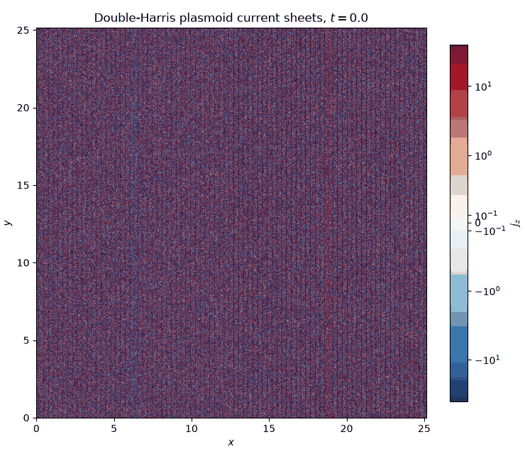

# MHX

[](https://github.com/uwplasma/MHX/actions/workflows/ci.yml)
[](https://github.com/uwplasma/MHX/actions/workflows/ci.yml)
[](https://mhx.readthedocs.io/)

MHX runs differentiable MHD models in JAX: two-dimensional reduced MHD,
full three-dimensional incompressible MHD, and subsonic compressible MHD. It builds the plasma equations
and diagnostics. [SOLVAX](https://github.com/uwplasma/SOLVAX)
contains the linear, Krylov, and nonlinear solvers.

Use MHX to study periodic current sheets, tearing modes, reconnection,
MHD turbulence, and dynamos. The capability matrix:

| | 2D | 3D |
| --- | --- | --- |
| Reduced MHD (incompressible) | validated | not offered |
| Incompressible MHD | via the reduced model | available |
| Compressible MHD, subsonic smooth | available, thin box | available |
| Shocks and supersonic flows | out of scope | out of scope |


## First run

Install the current source:

```bash
git clone https://github.com/uwplasma/MHX.git
cd MHX
python -m venv .venv
source .venv/bin/activate
python -m pip install .
```

Create `reconnection.py`:

```python
from pathlib import Path

import mhx

output = Path("outputs/reconnection")

simulation = mhx.Simulation(
    shape=(64, 64),
    equilibrium=mhx.PeriodicDoubleHarrisEquilibrium(
        width=0.4,
        perturbation_amplitude=4.0e-3,
        perturbation_mode=(2, 1),
    ),
    resistivity=5.0e-3,
    viscosity=5.0e-3,
    dt=2.0e-2,
    t_end=40.0,
    save_every=100,
)

result = simulation.run()
result.print_summary()
result.plot(output / "summary.png")
result.save(output)
```

Run it:

```bash
python reconnection.py
```

The run takes seconds on a laptop CPU. MHX prints the grid, physics settings,
device count, compile time, run time, energy, and divergence error. The
summary figure includes the island flux, the view that shows the growing
tearing mode. The saved NPZ file holds the full field history.

The documentation walks through every step:
[run your first model](https://mhx.readthedocs.io/en/latest/getting_started/first_run.html),
then [make your first movie](https://mhx.readthedocs.io/en/latest/getting_started/first_movie.html).

## Example gallery

The scripts in [`examples/gallery/`](examples/gallery/) use the same
structure as the first run. Edit the settings at the top of a script, then
run it from the repository root.

| Script | Purpose |
| --- | --- |
| [`01_reconnection.py`](examples/gallery/01_reconnection.py) | Seed and evolve a periodic double-Harris current sheet. |
| [`02_tearing_mode.py`](examples/gallery/02_tearing_mode.py) | Evolve a perturbed cosine current sheet. |
| [`03_implicit_step.py`](examples/gallery/03_implicit_step.py) | Use backward Euler with SOLVAX Newton--Krylov solves. |
| [`04_cpu_parallel.py`](examples/gallery/04_cpu_parallel.py) | Split one field across four local CPU devices. |
| [`05_gpu_parallel.py`](examples/gallery/05_gpu_parallel.py) | Split one field across all visible GPUs. |
| [`06_strong_scaling.py`](examples/gallery/06_strong_scaling.py) | Strong-scale one fixed reconnection ensemble. |
| [`07_multi_process.py`](examples/gallery/07_multi_process.py) | Run one ensemble across JAX processes. |
| [`08_gradient.py`](examples/gallery/08_gradient.py) | Differentiate a solve and check the gradient numerically. |
| [`09_orszag_tang_3d.py`](examples/gallery/09_orszag_tang_3d.py) | Run the 3D incompressible Orszag--Tang vortex. |
| [`10_compressible_orszag_tang.py`](examples/gallery/10_compressible_orszag_tang.py) | Run the subsonic compressible model in a thin box. |

| Reconnection | Turbulence | Orszag--Tang |
| --- | --- | --- |
|  |  |  |

These images show bounded validation runs. The
[gallery](https://mhx.readthedocs.io/en/latest/gallery.html) plays them as
movies, and the
[media inventory](docs/project/media_inventory.md) records their settings and
claim limits.

Regenerate the landing-page and documentation media from the same final
simulation bundles:

```bash
python examples/media/run_all.py simulate --preset final --allow-expensive
python examples/media/run_all.py render --preset final
```

The [media campaign guide](examples/media/README.md) documents individual
cases, preview runs, staging paths, and promotion checks. The committed
high-fidelity collection includes its GIFs, MP4s, posters, and provenance.
[Generation instructions](docs/how_to/generate_media.md) are organized by case.

## Three-dimensional MHD

The same call runs full 3D incompressible MHD: change the shape, the
equations name, and the equilibrium.

```python
result = mhx.Simulation(
    shape=(128, 128, 128),
    equations="mhd3d",
    equilibrium=mhx.OrszagTang3DEquilibrium(beta=0.8),
    viscosity=2.0e-3,
    resistivity=2.0e-3,
    dt=1.0e-3,
    t_end=4.0,
).run()
```

The [3D model page](docs/physics/mhd3d.md) states the equations, the
numerics, and the passing validation gates. The program plan and its
literature-anchored benchmark ladder are in [`plan_3d.md`](plan_3d.md).

## Physics and numerics

MHX owns quantities that depend on the model:

- reduced-MHD states and equations
- periodic equilibria and source terms
- Fourier spatial operators
- plasma diagnostics and validation cases

SOLVAX owns general numerical algebra:

- matrix-free operators
- GMRES and recycled Krylov methods
- Newton--Krylov root solves
- preconditioners and implicit differentiation

The documentation states the
[equations and their derivation](https://mhx.readthedocs.io/en/latest/physics/reduced_mhd.html),
the [spectral method](https://mhx.readthedocs.io/en/latest/physics/spectral_method.html),
and [what differentiates](https://mhx.readthedocs.io/en/latest/physics/differentiability.html).

## Parallel runs

Set `device_count` to shard one large field, or run independent cases as an
ensemble. Ensembles avoid communication inside the time loop, so prefer them
for scans and seed studies.

```bash
python examples/gallery/04_cpu_parallel.py
JAX_PLATFORM_NAME=gpu python examples/gallery/05_gpu_parallel.py
```


The measured speedup is 2.38x on four logical CPU devices and 1.95x on two
PCIe-connected RTX A4000 GPUs, for four fixed reconnection cases. The
[device guide](https://mhx.readthedocs.io/en/latest/how_to/run_on_gpus.html)
and [performance page](docs/reference/performance.md) hold the settings and
data.

## Documentation

| Need | Read |
| --- | --- |
| Install and first steps | [Get started](https://mhx.readthedocs.io/en/latest/getting_started/install.html) |
| Equations and derivation | [`docs/physics/reduced_mhd.md`](docs/physics/reduced_mhd.md) |
| Gradients | [`docs/physics/differentiability.md`](docs/physics/differentiability.md) |
| Validation gates and limits | [`docs/validation/index.md`](docs/validation/index.md) |
| TOML configuration | [`docs/reference/config_schema.md`](docs/reference/config_schema.md) |
| Output files | [`docs/reference/output_schema.md`](docs/reference/output_schema.md) |
| Movie gallery | [`docs/gallery.md`](docs/gallery.md) |
| Generate documentation media | [`docs/how_to/generate_media.md`](docs/how_to/generate_media.md) |

The benchmark and campaign tools remain available for validation and long
production runs. Run `mhx --help` to list them.

## Development

Install the repository tools, then run the checks:

```bash
python -m pip install -e ".[dev]"
python -m ruff check src tests examples tools
python tools/check_prose.py
python -m pytest
sphinx-build -W -b html docs docs/_build/html
```

Use the release tag or commit SHA when you cite a run. Provisional citation
metadata is in [`CITATION.cff`](CITATION.cff).
