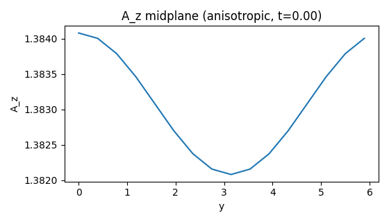

Adding New Physics Terms
========================

Checklist
---------

1. Implement a ``PhysicsTerm`` with a stable ``api_version``.
2. Register a factory for config-driven use.
3. Add a minimal example and a test.
4. Update docs if the term affects diagnostics.
5. Run ``mhx plugin lint`` to validate term metadata/signature.

How to test
-----------

.. code-block:: bash

   pytest -q tests/test_plugins.py
   python examples/physics_plugin_minimal.py
   python examples/physics_plugin_extended_mhd.py
   mhx plugin lint

How to add a diagnostic
-----------------------

1. Add a new key or group in ``mhx/solver/diagnostics.py``.
2. Reference it in ``ModelConfig.diagnostics`` via YAML.
3. Verify in a FAST run:

.. code-block:: bash

   mhx simulate --fast --model-config model.yaml

Template
--------

.. code-block:: python

   from mhx.solver.plugins import PhysicsTerm, API_VERSION

   class MyTerm(PhysicsTerm):
       name = "my_term"
       api_version = API_VERSION
       def rhs_additions(self, *, t, v_hat, B_hat, kx, ky, kz, k2, mask_dealias):
           dv = 0.0 * v_hat
           dB = 0.0 * B_hat
           return dv, dB

Extended-MHD toy example
------------------------

See:

- https://github.com/uwplasma/MHX/blob/main/examples/physics_plugin_extended_mhd.py

Extended-MHD reconnection media
-------------------------------

Generate Hall and anisotropic-pressure example movies:

.. code-block:: bash

   python examples/make_extended_mhd_media.py

Outputs:

- ``docs/_static/energy_hall.png``
- ``docs/_static/az_midplane_hall.png``
- ``docs/_static/az_midplane_hall.gif``
- ``docs/_static/energy_anisotropic.png``
- ``docs/_static/az_midplane_anisotropic.png``
- ``docs/_static/az_midplane_anisotropic.gif``
- ``docs/_static/energy_electron_pressure.png``
- ``docs/_static/az_midplane_electron_pressure.png``
- ``docs/_static/az_midplane_electron_pressure.gif``
- ``docs/_static/energy_two_fluid.png``
- ``docs/_static/az_midplane_two_fluid.png``
- ``docs/_static/az_midplane_two_fluid.gif``

Preview:

.. image:: _static/az_midplane_hall.gif
   :width: 400
   :alt: Hall MHD az midplane

.. image:: _static/az_midplane_electron_pressure.gif
   :width: 400
   :alt: Electron pressure tensor az midplane

.. image:: _static/az_midplane_two_fluid.gif
   :width: 400
   :alt: Two-fluid Ohm az midplane

Model-config usage:

.. code-block:: bash

   mhx simulate --fast --model-config examples/model_hall.yaml
   mhx simulate --fast --model-config examples/model_anisotropic.yaml
   mhx simulate --fast --model-config examples/model_electron_pressure.yaml
   mhx simulate --fast --model-config examples/model_two_fluid.yaml

Literature context
------------------

Hall-MHD and extended-MHD reconnection are widely used in the literature;
see :doc:`references` for the GEM challenge and Hall reconnection papers.

Plugin template
---------------

Copy the template under ``templates/physics_plugin_template/`` to bootstrap
your own plugin with tests and docs.

Built-in terms
--------------

MHX ships a few vetted toy terms for quick experimentation:

- ``hall`` (Hall-like induction term)
- ``hyper_resistivity`` (``-eta4 * k^4 * B``)
- ``anisotropic_pressure`` (parallel velocity damping)
