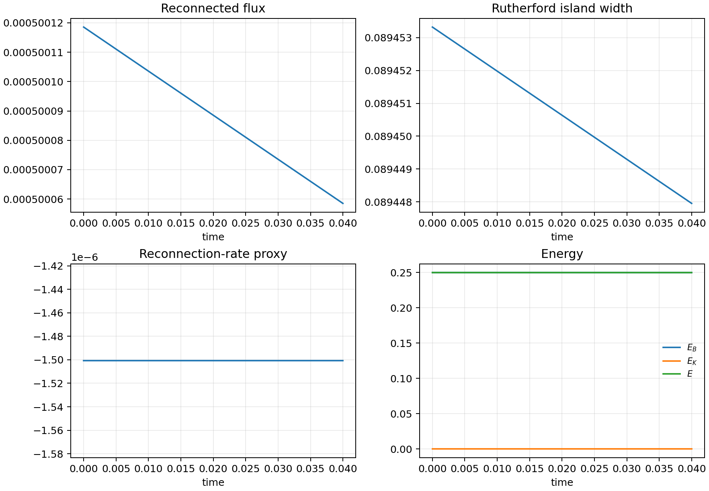

# Campaign runner operations

This page describes how MHX should move from FAST validation artifacts to long
nonlinear reconnection campaigns. It is intentionally operational: reviewers
should be able to see what was run, why it was long enough, what files were
written, and why a result is or is not a production physics claim.

## Current runner status

MHX currently ships six campaign-level commands:

```bash
mhx campaign rutherford-template --outdir outputs/campaigns/rutherford_template
mhx campaign rutherford-run-fast --outdir outputs/campaigns/rutherford_fast
mhx campaign rutherford-plan-production --outdir outputs/campaigns/rutherford_production_plan
mhx campaign rutherford-resume-plan outputs/campaigns/rutherford_production_plan
mhx campaign rutherford-execute outputs/campaigns/rutherford_production_plan --max-steps 128
mhx campaign rutherford-promotion-check outputs/campaigns/rutherford_production_plan
```

The first command writes a duration-guarded production template. The second
command runs a tiny deterministic nonlinear trajectory and writes the same
diagnostic vocabulary used by the future Rutherford campaign. The second command
is still `claim_level = "validation"` unless explicitly configured as smoke; it
is not a production nonlinear result.

The third and fourth commands write a duration-guarded production plan, runbook,
scheduler-neutral walltime chunks, checkpoint index, required output list, and
resume selection contract. The fifth command is the actual restartable executor:
it advances a real reduced-MHD chunk, writes a state checkpoint, appends
production-history arrays, refreshes the resume plan, and writes figures. A
partial chunk remains `claim_level = "validation"`; a completed target run can
only emit `claim_level = "production"` if the explicit production-claim gate is
enabled, all execution checks pass, and a passing promotion-readiness report is
attached under `<run-dir>/promotion/`. The sixth command writes that
promotion-readiness report and exits nonzero until the missing evidence is
attached.

Source links:

- [Campaign template implementation](https://github.com/uwplasma/MHX/blob/main/src/mhx/benchmarks/campaigns.py)
- [FAST runner implementation](https://github.com/uwplasma/MHX/blob/main/src/mhx/benchmarks/campaign_runner.py)
- [Duration guard](https://github.com/uwplasma/MHX/blob/main/src/mhx/benchmarks/duration_policy.py)
- [Production campaign executor](https://github.com/uwplasma/MHX/blob/main/src/mhx/campaigns/production.py)
- [Public campaign API](https://github.com/uwplasma/MHX/blob/main/src/mhx/campaigns/__init__.py)
- [CLI commands](https://github.com/uwplasma/MHX/blob/main/src/mhx/cli/main.py)
- [Campaign tests](https://github.com/uwplasma/MHX/blob/main/tests/test_campaign_runner.py)
- [Production executor tests](https://github.com/uwplasma/MHX/blob/main/tests/test_production_campaign.py)

## Duration gate

For a mode with linear growth rate $\gamma$, any growth or island-formation
claim must satisfy

$$
t_\mathrm{end} \ge s_f\frac{N_e}{\gamma}.
$$

Here $N_e$ is the number of required e-folds and $s_f$ is a safety factor. The
default Harris reference used by MHX is $\gamma\simeq0.0131$, so:

$$
10/\gamma \approx 763.4,\qquad 3\times10/\gamma\approx2290.1.
$$

The first number is a minimum linear-growth observation window. The second is
the default Rutherford-template window, leaving room for a resolved linear
phase plus nonlinear island tracking. A shorter run may still be useful as a
code-validity gate, but it must not be labeled as nonlinear reconnection
evidence.

## FAST runner artifacts

The FAST runner writes:

- `rutherford_fast_histories.npz`
- `diagnostics.json`
- `validation.json`
- `campaign_template.json`
- `manifest.json`
- `figures/rutherford_fast_histories.png`
- optionally `figures/flux_movie.gif`

The NPZ history keys are:

| Key | Meaning |
| --- | --- |
| `time` | Saved times for each trajectory. |
| `seed` | Seed associated with each saved trajectory row. |
| `reconnected_flux` | Reconnecting-mode flux proxy. |
| `rutherford_island_width` | $W=4\sqrt{|\psi_1|/|B_y'(0)|}$ proxy. |
| `reconnection_rate_proxy` | Finite-difference time derivative of reconnecting flux. |
| `magnetic_energy`, `kinetic_energy`, `total_energy` | Reduced-MHD energy diagnostics. |
| `magnetic_divergence_linf` | Spectral solenoidal-field check. |
| `current_density_linf` | Current-density magnitude proxy. |

These names are intentionally the same names that should appear in a future
production Rutherford campaign. That lets plotting, manifests, and reviewers
reuse one schema.

## Production planning and execution artifacts

The production planner writes these files before running the expensive PDE:

- `campaign_plan.json` with schema `mhx.campaign.rutherford_production_plan.v1`;
- `campaign_config.toml` with the effective long-run configuration;
- `validation.json` with duration, resolution, walltime, and artifact gates;
- `runbook.md` with the launch/restart checklist;
- `job_array.json` with scheduler-neutral walltime chunks;
- `checkpoints/checkpoint_index.json` with schema
  `mhx.campaign.rutherford_checkpoint_index.v1`;
- `manifest.json` with `claim_level = "production_template"`.

The executor then writes:

- `production_history.npz` with schema `mhx.campaign.rutherford_history.v1`;
- `diagnostics.json` with schema `mhx.campaign.rutherford_execution.v1`;
- `validation.json` with schema `mhx.campaign.rutherford_execution.gates.v1`;
- `checkpoints/state_step_*.npz` with schema `mhx.campaign.rutherford_state.v1`;
- `checkpoints/step_*.json` checkpoint metadata with hashes;
- `resume_plan.json`;
- `figures/production_histories.png`;
- `figures/current_sheet_aspect_ratio.png`;
- optional `figures/fixed_scale_flux_movie.gif` and
  `figures/fixed_scale_current_density_movie.gif`;
- `artifact_manifest.json` and an updated `manifest.json`.

The promotion checker then writes:

- `promotion/promotion_readiness.json` with schema
  `mhx.campaign.rutherford_promotion.v1`;
- `promotion/validation.json` with schema
  `mhx.campaign.rutherford_promotion.gates.v1`;
- `promotion/figures/promotion_matrix.png`;
- `promotion/artifact_manifest.json` and `promotion/manifest.json`.

The promotion gate is deliberately stricter than the executor. It requires a
completed target, finite histories, current-sheet geometry, detected X/O
critical-point counts, fixed-scale movies unless explicitly disabled,
convergence evidence, seed-QI evidence, and tolerances on energy-budget
residuals and magnetic-divergence error.

For a laptop-safe closed-lane example:

```bash
mhx campaign rutherford-plan-production \
  --outdir outputs/campaigns/rutherford_executor_demo \
  --nx 8 --ny 8 --dt 1e-2 --target-saved-frames 120 \
  --min-production-resolution 8

mhx campaign rutherford-execute \
  outputs/campaigns/rutherford_executor_demo \
  --max-steps 8 --movies

mhx campaign rutherford-promotion-check \
  outputs/campaigns/rutherford_executor_demo \
  --no-require-movies --min-history-samples 2 || true
```

The final command is expected to fail for this tiny demo because the target is
not complete and no convergence/seed-QI bundles are attached. The purpose is to
write `promotion/figures/promotion_matrix.png` so the missing evidence is
explicit rather than implicit.




The checkpoint index starts empty. Long-run executors register restartable state
files with:

```python
from mhx.campaigns import write_checkpoint_metadata

write_checkpoint_metadata(
    "outputs/campaigns/rutherford_production_plan",
    step=1000,
    time=100.0,
    state_path="checkpoints/state_0000001000.npz",
    history_path="histories.npz",
    metrics={
        "total_energy": 0.997,
        "magnetic_divergence_linf": 2.0e-13,
    },
)
```

Each checkpoint record stores the step, physical time, walltime spent, metrics,
artifact paths, file sizes, and SHA-256 hashes. `mhx campaign
rutherford-resume-plan <run-dir>` selects the latest valid checkpoint at or
before the target step. If files are missing or hashes change, the resume plan
marks the checkpoint invalid and falls back to step zero rather than silently
continuing from a corrupted state.

## Production campaign acceptance criteria

A production Rutherford or plasmoid campaign should pass all of the following:

| Requirement | Reviewer reason |
| --- | --- |
| Duration guard passes for the declared $\gamma$, $N_e$, and $s_f$. | Prevents short runs from being interpreted as nonlinear evolution. |
| At least two spatial resolutions and two time steps are archived. | Separates physics from discretization artifacts. |
| Energy-budget residual remains below the documented tolerance. | Checks bracket cancellation and dissipation signs during the long run. |
| Magnetic divergence remains near spectral roundoff or a documented tolerance. | Catches projection/derivative mistakes. |
| Seed-robust QI is run on the production diagnostic family. | Checks that the reported metrics are not seed accidents. |
| `mhx campaign rutherford-promotion-check` passes. | Blocks production claims until convergence, seed-QI, current-sheet geometry, X/O point counts, fixed-scale media, and tolerances are present. |
| Flux/current movies use fixed color limits and include timestamps. | Makes visual comparisons honest across resolutions and seeds. |
| Artifact manifests include hashes, config, git commit, API version, and dependencies. | Makes reviewer reruns and diffs possible. |

## Proposed production directory

```text
outputs/campaigns/rutherford_production/
  campaign_config.toml
  campaign_plan.json
  runbook.md
  job_array.json
  diagnostics.json
  validation.json
  production_history.npz
  resume_plan.json
  checkpoints/
    checkpoint_index.json
    state_step_*.npz
    step_*.json
  convergence/
    resolution_sweep/
    timestep_sweep/
  seed_qi/
  figures/
    production_histories.png
    current_sheet_aspect_ratio.png
    fixed_scale_flux_movie.gif
    fixed_scale_current_density_movie.gif
  promotion/
    promotion_readiness.json
    validation.json
    figures/promotion_matrix.png
    artifact_manifest.json
    manifest.json
  artifact_manifest.json
  manifest.json
```

This layout is now automated for chunked execution through
`mhx campaign rutherford-execute`. The remaining hard boundary is not the
executor itself; it is running enough chunks at production resolution, then
attaching convergence sweeps, seed-QI checks, fixed-scale movies, and a passing
promotion report before claiming a paper-grade nonlinear result.

## Reviewer questions to answer before claiming production

1. Which growth rate set the duration?
2. How many e-folds were covered before nonlinear island tracking?
3. Did island width show the expected algebraic phase after the linear phase?
4. Did the energy budget remain closed over the full run?
5. Did the result persist under resolution, time-step, and seed changes?
6. Are flux/current movies plotted with fixed ranges?
7. Are all files reproducible from the checked-in command sequence?

If the answer to any question is unknown, the result should remain a validation
artifact, not a paper claim.
