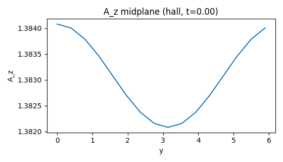
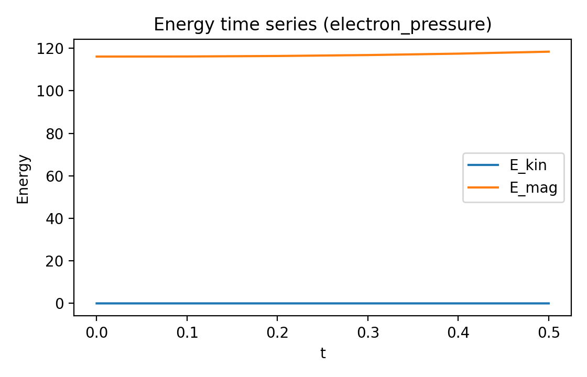
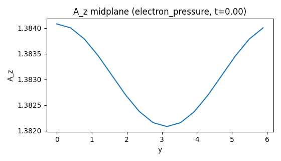
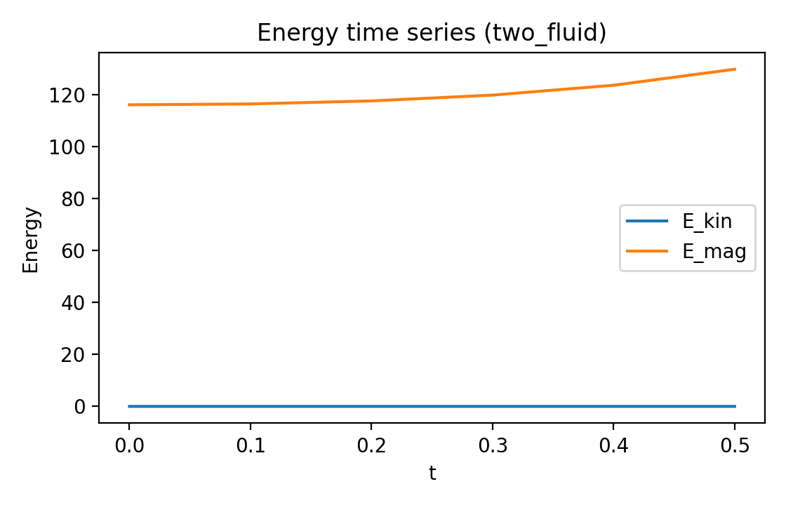
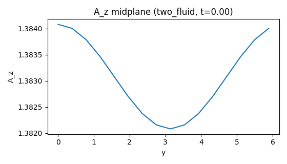

Extended-MHD Examples
=====================

This page documents two common reconnection extensions implemented as MHX
plugins: electron pressure tensor and two-fluid Ohm’s law (Hall + pressure).
The implementations are intentionally **toy** but follow the structure of the
generalized Ohm’s law and are fully reproducible with FAST settings.

Generalized Ohm’s law
---------------------

In many reconnection studies, the induction equation is closed with a
generalized Ohm’s law of the form:

.. math::

   \mathbf{E} + \mathbf{v} \times \mathbf{B}
   = \eta \mathbf{J}
   + \frac{1}{ne} \mathbf{J} \times \mathbf{B}
   - \frac{1}{ne} \nabla \cdot \mathbf{P}_e
   + \frac{m_e}{ne^2} \frac{d \mathbf{J}}{dt}.

Derivation sketch (two-fluid):

.. math::

   m_e n \frac{d\mathbf{v}_e}{dt}
   = -ne \left(\mathbf{E} + \mathbf{v}_e \times \mathbf{B}\right)
   - \nabla \cdot \mathbf{P}_e + \ldots

Combining ion and electron momentum equations and expressing
``\mathbf{v}_e = \mathbf{v} - \mathbf{J}/(ne)`` yields the generalized Ohm’s law
above. The Hall and electron-pressure terms are the first-order corrections
beyond resistive MHD.

The Hall term (``J × B``) and electron pressure tensor term (``∇·P_e``)
often dominate collisionless reconnection dynamics. See :doc:`references`
for Hall-MHD and GEM reconnection literature.
Key background references include the GEM reconnection challenge and
Hall-MHD studies, as well as reviews of generalized Ohm’s law and
electron pressure tensor effects (see :doc:`references`).

Toy implementations in MHX
--------------------------

MHX keeps terms additive in spectral space and uses simple proxies:

- **Hall term**: ``dB ∝ -d_h k^2 curl(B)``
- **Electron pressure tensor**: ``dB ∝ -pe_coef k^2 J`` (proxy for ``∇×(∇·P_e)``)
- **Two-fluid Ohm’s law**: Hall + electron-pressure proxies

These forms keep the RHS JAX-friendly and composable; they are not intended to
replace full kinetic or full two-fluid closures.

Run the examples
----------------

Generate figures and GIFs:

.. code-block:: bash

   python examples/make_extended_mhd_media.py

Or use YAML configs:

.. code-block:: bash

   mhx simulate --fast --model-config examples/model_hall.yaml
   mhx simulate --fast --model-config examples/model_electron_pressure.yaml
   mhx simulate --fast --model-config examples/model_two_fluid.yaml

Results (FAST)
--------------

Hall example:

.. image:: _static/energy_hall.png
   :width: 500
   :alt: Hall energy

Electron pressure tensor example:

Two-fluid Ohm’s law example:

Validation notes
----------------

- These examples are **qualitative** and intended as templates.
- For quantitative validation, compare to published Hall-MHD reconnection
  benchmarks and GEM challenge results (see :doc:`references`).
