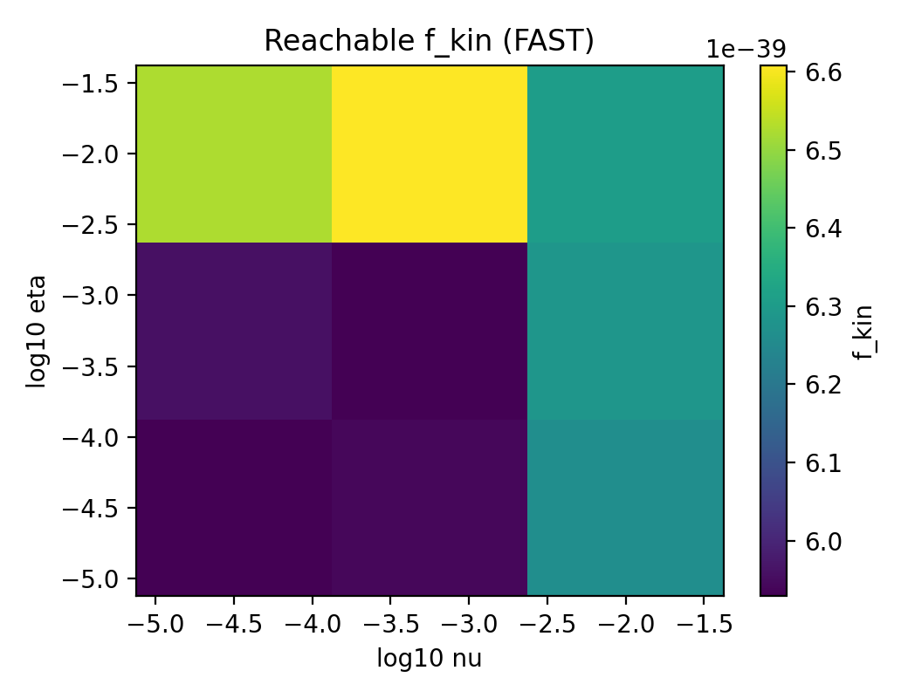

Inverse Design
==============

We optimize transport parameters to match a target behavior vector:

.. math::

   \mathbf{y}^* = (f_{\mathrm{kin}}^*, C_{\mathrm{plasmoid}}^*)

The objective used by both inverse design and comparison plots is:

.. math::

   \mathcal{L} = (f_{\mathrm{kin}} - f_{\mathrm{kin}}^*)^2 +
   \lambda_C (C_{\mathrm{plasmoid}} - C_{\mathrm{plasmoid}}^*)^2

The objective values are persisted in the training history so comparison plots
use the exact same target and weighting.

Requires `pip install -e ".[ml]"`

CLI:

.. code-block:: bash

   mhx inverse-design --equilibrium forcefree --steps 10

Source: https://github.com/uwplasma/MHX/blob/main/mhx/inverse_design/train.py

Tutorial (FAST)
----------------

1) Run a small inverse-design and scan to generate figures:

.. code-block:: bash

   python examples/make_inverse_design_media.py

2) Inspect the generated figures:

.. image:: _static/fig_reachable_region.png
   :width: 600
   :alt: Reachable region scatter

.. image:: _static/fig_cost_history.png
   :width: 600
   :alt: Cost history grid vs inverse design

