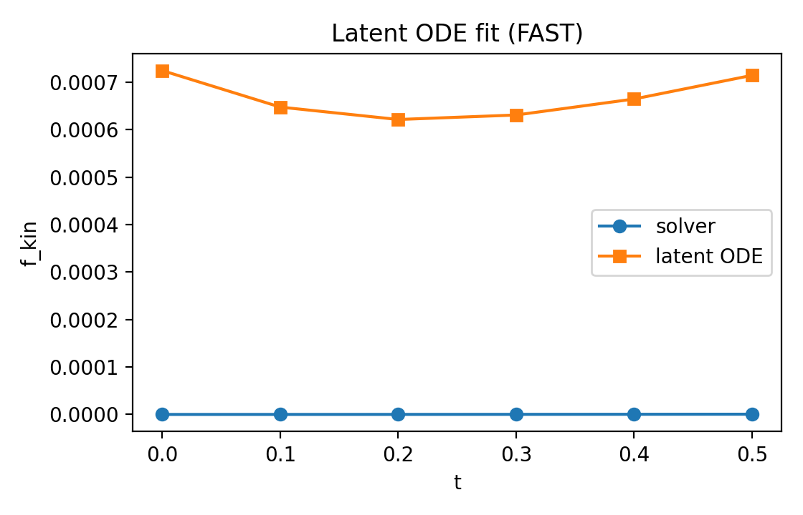
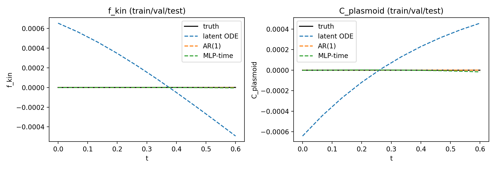
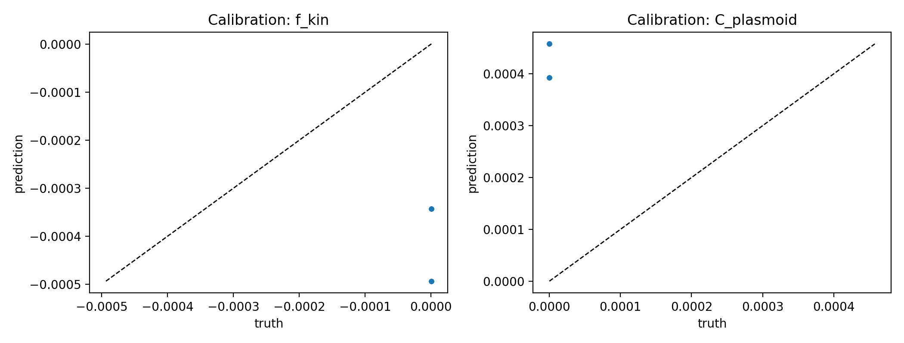
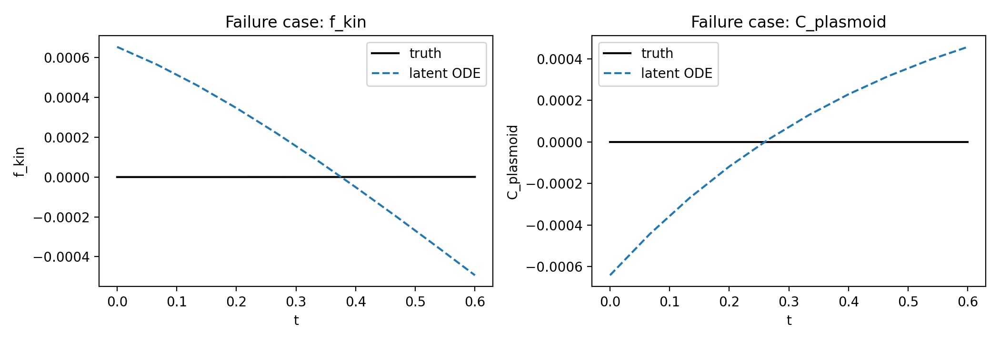

Latent ODE
==========

We provide a minimal latent ODE module for learning reduced dynamics from
solver trajectories. The core model follows

.. math::

   \dot{z} = f_\theta(z), \quad y = g_\phi(z)

where ``z`` is a latent state and ``y`` is an observed diagnostic.

FAST tutorial
-------------

.. code-block:: bash

   python examples/latent_ode_fast.py

This produces a comparison plot for ``f_kin`` and ``C_plasmoid`` and reports
mean-squared error (MSE) in the figure titles:

It also generates an ablation table:

.. include:: _static/latent_ode_ablation.rst

Experiment with baselines
-------------------------

Run:

.. code-block:: bash

   python examples/latent_ode_experiment.py

This produces a baseline comparison plot:

And a summary table:

.. include:: _static/latent_ode_experiment.rst

Dataset generator
-----------------

The experiment uses a fixed FAST dataset with explicit train/val/test splits:

.. code-block:: bash

   python examples/latent_ode_dataset.py

The dataset is written to ``outputs/datasets/latent_ode_dataset.npz`` and is
reused by the experiment script.

Calibration and failure cases
-----------------------------

Calibration scatter (test split):

Worst-case example (test split):

Source:

- https://github.com/uwplasma/MHX/blob/main/mhx/ml/latent_ode.py

Training regime
---------------

The FAST demo fits a latent ODE with:

- latent dimension: 2
- MLP widths: 32 (latent + decoder)
- optimizer: Adam
- loss: mean squared error in diagnostic space

When it works / when it doesn’t
-------------------------------

Works best when:

- the solver trajectories are smooth and low-dimensional,
- the diagnostics vary slowly in time,
- the training window is short (FAST settings).

Can fail when:

- the dynamics are stiff or strongly multi-scale,
- diagnostics are noisy or non-smooth,
- the training window includes regime changes.

See the failure-case plot above for a concrete example on the FAST dataset.
