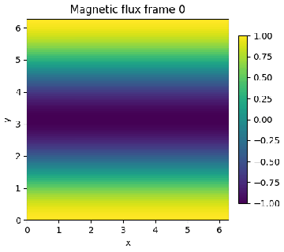
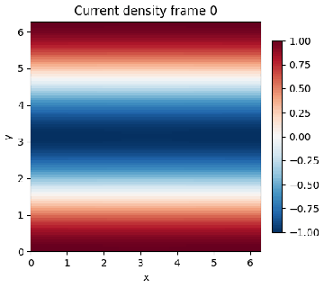
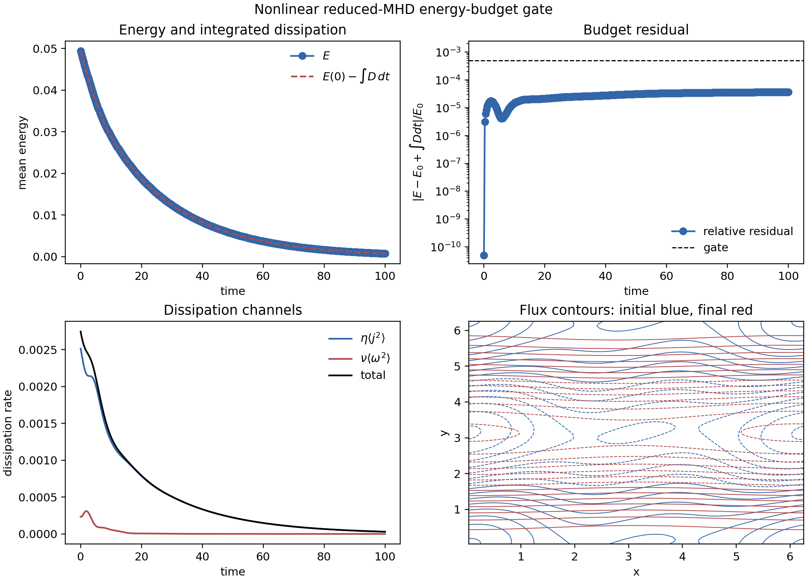

# Long-run evidence

This page records the first real nonlinear runs executed under a 30-minute
single-run budget. The evidence is useful, but the interpretation is deliberately
skeptical: these runs validate long integration, checkpointing, media, and
nonlinear budget gates; they do **not** yet demonstrate Rutherford growth or
plasmoid onset.

## Reproducible command sequence

The completed duration run used the restartable production executor:

```bash
mhx campaign rutherford-plan-production \
  --outdir outputs/long_runs/rutherford_96_dt005_full_20260512 \
  --nx 96 --ny 96 --dt 0.05 --target-saved-frames 200 \
  --max-walltime-hours 0.5 \
  --seconds-per-step-estimate 0.04 \
  --checkpoint-interval-minutes 5 \
  --preemption-margin-minutes 2

mhx campaign rutherford-execute \
  outputs/long_runs/rutherford_96_dt005_full_20260512 \
  --max-steps 45802 --movies \
  --max-relative-energy-growth 1e-6 \
  --max-divergence-linf 1e-8
```

The active nonlinear-budget run used the multi-mode reduced-MHD state from
[`nonlinear.py`](https://github.com/uwplasma/MHX/blob/main/src/mhx/benchmarks/nonlinear.py):

```python
from mhx.benchmarks.nonlinear import write_nonlinear_energy_budget_validation

write_nonlinear_energy_budget_validation(
    "outputs/long_runs/nonlinear_budget_96_dt005_steps20000_20260512",
    shape=(96, 96),
    resistivity=2e-2,
    viscosity=2e-2,
    dt=5e-3,
    steps=20000,
    save_every=50,
    max_budget_residual=5e-4,
    max_relative_energy_growth=1e-8,
)
```

## Rutherford-duration executor run

The `96×96` Rutherford-duration executor run completed the configured duration
target:

| Quantity | Value |
| --- | ---: |
| RK4 steps | 45,802 |
| final time | 2290.1 |
| saved samples | 202 |
| policy e-folds | 30 |
| elapsed walltime | 888.6 s |
| executor gates | passed |
| final/initial reconnecting-flux proxy | `2.73e-6` |
| final/initial island-width proxy | `1.65e-3` |
| final/initial total energy | `1.03e-2` |
| max kinetic energy | `5.85e-9` |


The fixed-scale movies show the same conclusion visually: the periodic cosine
field diffuses away rather than forming growing islands.





### Skeptical interpretation

This is strong evidence for the production-executor path:

- the full target step count is completed in one restartable bundle;
- checkpoint state, checkpoint metadata, resume plan, manifest hashes, fixed-scale
  movies, and history schema are written;
- finite-history, energy, divergence, checkpoint, and movie gates all pass.

It is **not** evidence for Rutherford growth. The reconnecting-flux proxy,
island-width proxy, current, and total energy all decay, and the kinetic energy
stays nearly zero. The current periodic cosine initial condition is therefore a
long dissipative integration test, not a tearing-growth experiment.

## Active nonlinear energy-budget run

The second run uses a genuinely nonlinear multi-mode initial condition with a
large ideal-to-full RHS ratio. It checks the periodic reduced-MHD budget

$$
\frac{dE}{dt} = -\eta \langle j^2 \rangle - \nu \langle \omega^2 \rangle,
\qquad
E = \frac{1}{2}\langle |\nabla\psi|^2 + |\nabla\phi|^2\rangle .
$$

| Quantity | Value |
| --- | ---: |
| grid | `96×96` |
| RK4 steps | 20,000 |
| final time | 100.0 |
| saved samples | 401 |
| nonlinear RHS ratio | 0.994 |
| relative energy drop | 0.985 |
| max relative budget residual | `3.65e-5` |
| gates | passed |



This is good evidence that nonlinear Poisson brackets, spectral current,
dissipation signs, and RK4 integration remain coherent over a substantially
longer run than the FAST CI defaults.

## Current claim boundary

These runs support:

- long-run stability of the current reduced-MHD code path;
- production-executor artifact correctness under a completed duration target;
- nonlinear energy/dissipation-budget correctness for an active nonlinear state.

These runs do not yet support:

- Rutherford island-growth scaling;
- plasmoid onset statistics;
- Sweet-Parker reconnection-rate scaling;
- publication-grade reconnection claims.

The next required code/physics step is to replace the periodic cosine
duration-run initial condition with a calibrated unstable Harris/current-sheet
nonlinear setup that is consistent with the validated linear tearing benchmark,
then repeat this page with convergence and seed-robustness sweeps.

