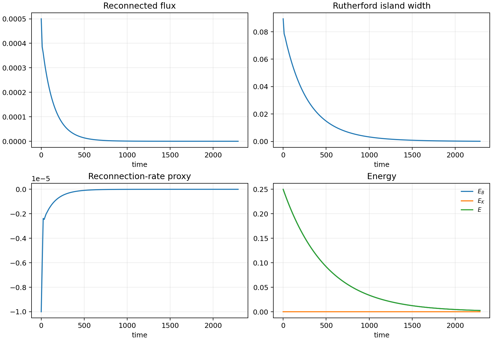
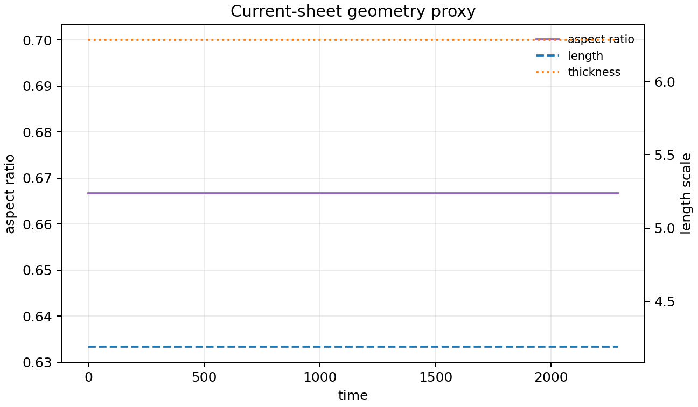
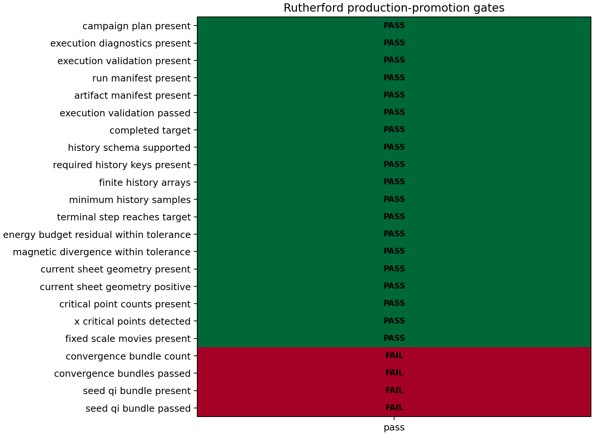
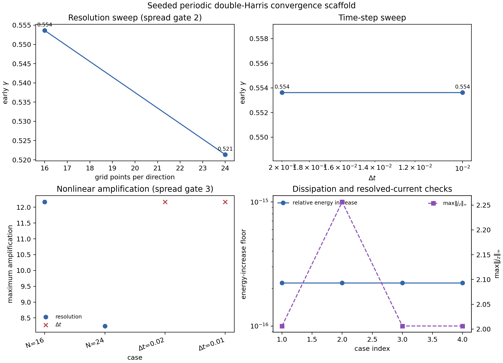
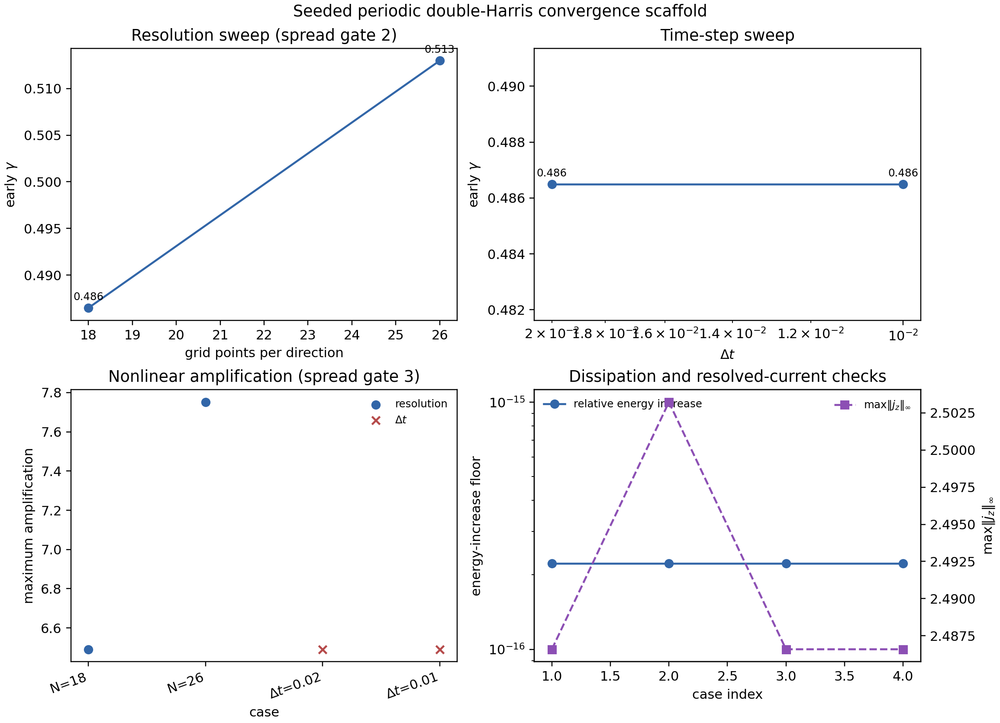
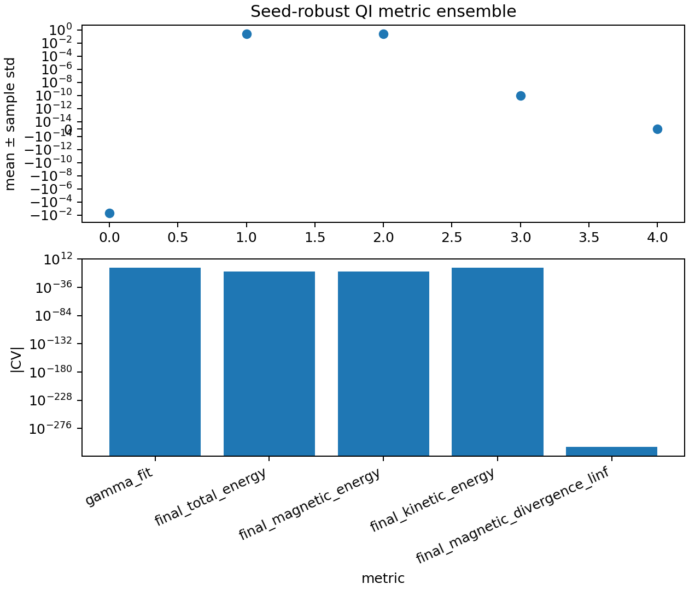
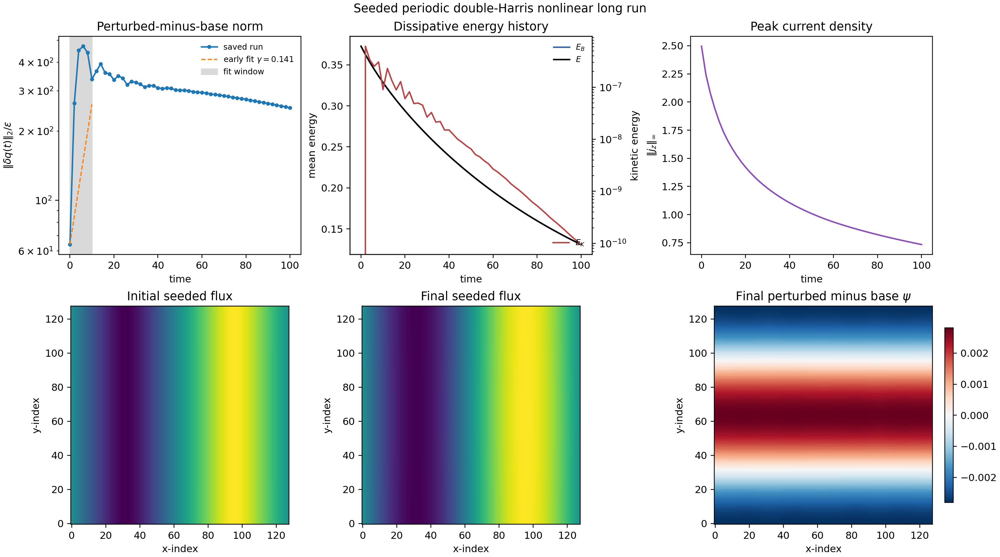
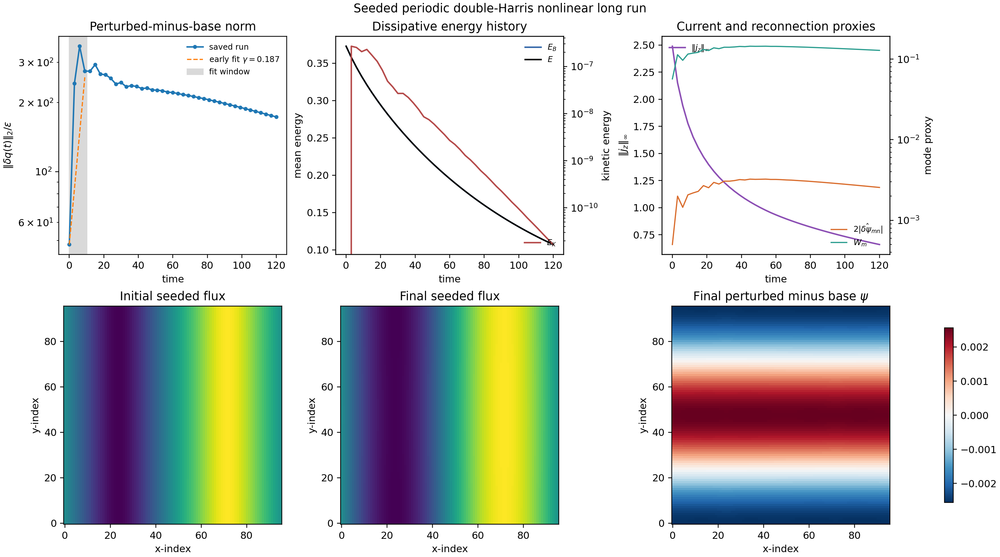
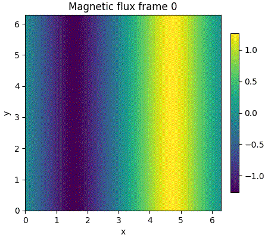
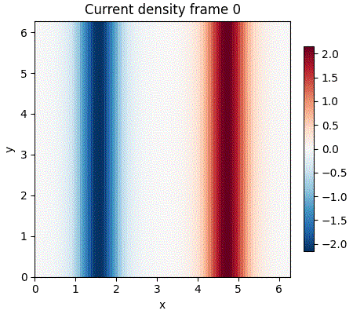

# Long-run evidence

This page records the first real nonlinear runs executed under a 30-minute
single-run budget. The evidence is useful, but the interpretation is deliberately
skeptical: these runs validate long integration, checkpointing, media, and
nonlinear budget gates; they do **not** yet demonstrate Rutherford growth or
plasmoid onset.

## Reproducible command sequence

The completed duration run used the restartable production executor:

```bash
mhx campaign rutherford-plan-production \
  --outdir outputs/long_runs/rutherford_96_dt005_full_20260512 \
  --nx 96 --ny 96 --dt 0.05 --target-saved-frames 200 \
  --max-walltime-hours 0.5 \
  --seconds-per-step-estimate 0.04 \
  --checkpoint-interval-minutes 5 \
  --preemption-margin-minutes 2

mhx campaign rutherford-execute \
  outputs/long_runs/rutherford_96_dt005_full_20260512 \
  --max-steps 45802 --movies \
  --max-relative-energy-growth 1e-6 \
  --max-divergence-linf 1e-8
```

The active nonlinear-budget run used the multi-mode reduced-MHD state from
[`nonlinear.py`](https://github.com/uwplasma/MHX/blob/main/src/mhx/benchmarks/nonlinear.py):

```python
from mhx.benchmarks.nonlinear import write_nonlinear_energy_budget_validation

write_nonlinear_energy_budget_validation(
    "outputs/long_runs/nonlinear_budget_96_dt005_steps20000_20260512",
    shape=(96, 96),
    resistivity=2e-2,
    viscosity=2e-2,
    dt=5e-3,
    steps=20000,
    save_every=50,
    max_budget_residual=5e-4,
    max_relative_energy_growth=1e-8,
)
```

The current-sheet long replay uses the periodic double-Harris initializer from
[`equilibria.py`](https://github.com/uwplasma/MHX/blob/main/src/mhx/physics/equilibria.py)
and the scalable base-vs-seeded benchmark in
[`current_sheet.py`](https://github.com/uwplasma/MHX/blob/main/src/mhx/benchmarks/current_sheet.py):

```bash
mhx benchmark double-harris-long-run \
  --outdir outputs/long_runs/periodic_double_harris_seeded_128_t100_20260512 \
  --nx 128 --ny 128 --t-end 100 --save-every 200 --fit-stop 10 --no-movies
```

## Rutherford-duration executor run

The `96×96` Rutherford-duration executor run completed the configured duration
target under the executor schema available when it was generated. It remains a
validation-level bundle unless rerun or upgraded with current history keys and a
passing promotion-readiness report.

| Quantity | Value |
| --- | ---: |
| RK4 steps | 45,802 |
| final time | 2290.1 |
| saved samples | 202 |
| policy e-folds | 30 |
| elapsed walltime | 888.6 s |
| executor gates | passed; promotion gates not claimed |
| final/initial reconnecting-flux proxy | `2.73e-6` |
| final/initial island-width proxy | `1.65e-3` |
| final/initial total energy | `1.03e-2` |
| max kinetic energy | `5.85e-9` |


The fixed-scale movies show the same conclusion visually: the periodic cosine
field diffuses away rather than forming growing islands.


### Skeptical interpretation

This is strong evidence for the restartable production-executor path, not for a
promotion-ready production physics claim:

- the full target step count is completed in one restartable bundle;
- checkpoint state, checkpoint metadata, resume plan, manifest hashes, fixed-scale
  movies, and history schema are written;
- finite-history, energy, divergence, checkpoint, and movie gates all pass for
  that execution bundle.
- the archived history predates the newer current-sheet geometry and refined
  X/O-count promotion keys, so it is not sufficient for today’s promotion gate.

It is **not** evidence for Rutherford growth. The reconnecting-flux proxy,
island-width proxy, current, and total energy all decay, and the kinetic energy
stays nearly zero. The current periodic cosine initial condition is therefore a
long dissipative integration test, not a tearing-growth experiment.

## Current-schema Rutherford executor rerun

A current-schema `96×96`, `dt=0.05` rerun was executed with the same duration
target so the long-run bundle includes the newer current-sheet geometry and
refined critical-point count histories:

```bash
mhx campaign rutherford-plan-production \
  --outdir outputs/campaigns/rutherford_current_schema_96_dt005_20260517_161235 \
  --nx 96 --ny 96 --dt 0.05 --target-saved-frames 200 \
  --max-walltime-hours 0.5 \
  --seconds-per-step-estimate 0.04 \
  --checkpoint-interval-minutes 5 \
  --preemption-margin-minutes 2

mhx campaign rutherford-execute \
  outputs/campaigns/rutherford_current_schema_96_dt005_20260517_161235 \
  --max-steps 45802 --movies \
  --max-relative-energy-growth 1e-6 \
  --max-divergence-linf 1e-8

mhx campaign rutherford-promotion-check \
  outputs/campaigns/rutherford_current_schema_96_dt005_20260517_161235 \
  --convergence-dir outputs/campaigns/rutherford_current_schema_96_dt005_20260517_161235/evidence_20260517_response_gate/convergence_n16_24 \
  --convergence-dir outputs/campaigns/rutherford_current_schema_96_dt005_20260517_161235/evidence_20260517_response_gate/convergence_n18_26 \
  --seed-qi-dir outputs/campaigns/rutherford_current_schema_96_dt005_20260517_161235/evidence_20260517_response_gate/seed_robust_qi_n16 || true
```

| Quantity | Value |
| --- | ---: |
| RK4 steps | 45,802 |
| final time | 2290.1 |
| saved samples | 202 |
| execution gates | passed |
| promotion gates | failed: no positive reconnecting-flux/island-width response |
| convergence evidence | two small validation bundles passed and were checksummed |
| seed-QI evidence | one small validation bundle passed |
| reconnecting-flux amplification | `1.00` versus required `1.05` |
| island-width amplification | `1.00` versus required `1.05` |
| max X/O counts | `2 / 1` |
| current-sheet aspect proxy | `0.667` |
| final/initial total energy | `1.03e-2` |
| max energy-budget residual | `0` |













The important result is negative but useful: the executor now writes every
history key required by the current promotion gate. The promotion gate also
requires positive reconnecting-flux and island-width amplification, so this
purely dissipative duration-complete run remains validation evidence even after
convergence and seed-QI bundles are attached.

## Active nonlinear energy-budget run

The second run uses a genuinely nonlinear multi-mode initial condition with a
large ideal-to-full RHS ratio. It checks the periodic reduced-MHD budget

$$
\frac{dE}{dt} = -\eta \langle j^2 \rangle - \nu \langle \omega^2 \rangle,
\qquad
E = \frac{1}{2}\langle |\nabla\psi|^2 + |\nabla\phi|^2\rangle .
$$

| Quantity | Value |
| --- | ---: |
| grid | `96×96` |
| RK4 steps | 20,000 |
| final time | 100.0 |
| saved samples | 401 |
| nonlinear RHS ratio | 0.994 |
| relative energy drop | 0.985 |
| max relative budget residual | `3.65e-5` |
| gates | passed |


This is good evidence that nonlinear Poisson brackets, spectral current,
dissipation signs, and RK4 integration remain coherent over a substantially
longer run than the FAST CI defaults.

## Seeded double-Harris long replay

The new periodic double-Harris run is the first long nonlinear current-sheet
replay in this rebuild that shows an early instability-path response rather
than pure decay of a stable cosine equilibrium. It advances a base run and a
seeded run on the same grid and measures

$$
A_s(t)=\frac{\|q_s(t)-q_b(t)\|_2}{\epsilon}.
$$

| Quantity | Value |
| --- | ---: |
| grid | `128×128` |
| RK4 steps | 10,000 |
| final time | 100.0 |
| saved samples | 51 |
| early fitted growth rate | `0.141` |
| early amplification | `5.27×` |
| maximum amplification | `7.35×` |
| final/initial total energy | `0.351` |
| max kinetic energy | `6.13e-7` |
| elapsed walltime | `61.9 s` |
| gates | passed |



### Skeptical interpretation

This result is a real improvement over the earlier Rutherford-duration cosine
run because the perturbation grows for several Alfvén times before saturating
and relaxing. It still does **not** close a paper-grade reconnection claim:
the kinetic energy remains very small, the current-sheet peak decays under the
chosen resistivity/viscosity, and the run has no resolution, time-step, seed,
or aspect-ratio sweep. The correct conclusion is that MHX now has a scalable
nonlinear current-sheet validation lane suitable for those sweeps.

## GPU-assisted double-Harris response rerun

After adding explicit response diagnostics, the double-Harris lane was rerun on
`office` with the system CUDA JAX backend (`NVIDIA RTX A4000`) to verify that a
longer validation run records more than a norm-only perturbation history. The
archived command was:

```bash
mhx benchmark double-harris-long-run \
  --outdir outputs/campaigns/growing_double_harris_gpu_96_t120_20260518_044120 \
  --nx 96 --ny 96 --t-end 120 --dt 0.01 --save-every 300 \
  --fit-stop 10 --min-max-growth-factor 2 --movies
```

| Quantity | Value |
| --- | ---: |
| grid | `96×96` |
| final time | 120.0 |
| saved samples | 41 |
| early fitted growth rate | `0.1869` |
| early amplification | `5.72×` |
| maximum perturbation amplification | `7.35×` |
| dominant reconnecting-flux amplification | `6.47×` |
| Rutherford-width proxy amplification | `2.54×` |
| max detected X/O counts | `4 / 2` |
| relative total-energy increase | `0.0` |
| gates | passed |







The skeptical read is unchanged: this is now stronger validation evidence
because the response gate is explicit and positive, but it remains below
production claim level until larger convergence, seed, aspect-ratio, and
Lundquist-number sweeps close.

## Current claim boundary

These runs support:

- long-run stability of the current reduced-MHD code path;
- production-executor artifact correctness under a completed duration target;
- nonlinear energy/dissipation-budget correctness for an active nonlinear state.
- early seeded-growth response for a periodic double-Harris current-sheet replay.
- explicit evidence that execution-level validation and production promotion are
  separate gates.

These runs do not yet support:

- Rutherford island-growth scaling;
- plasmoid onset statistics;
- Sweet-Parker reconnection-rate scaling;
- publication-grade reconnection claims.

The next required physics step is no longer a single missing script: MHX now
ships a FAST double-Harris convergence scaffold that sweeps tiny resolution and
time-step cases and gates spread in early growth/amplification. To promote the
result to production physics, extend that scaffold to larger resolution, seed
amplitude/mode, sheet width/aspect ratio, Lundquist number, and duration sweeps,
then promote only the figures whose scalings survive the full campaign.
