# Validation media

The README only keeps a compact visual teaser. Detailed media context belongs
here so each visual carries its claim level, source path, equations, and
literature anchor. These assets are either generated from MHX validation gates
or explicitly labeled theory schematics; none are production nonlinear plasmoid
claims.

## README media scope

The README should stay concise and show only landing-page media from
`docs/_static/readme/`: solver-generated Harris-sheet reconnection movies with
magnetic-flux contours, solver-generated reduced-MHD Orszag--Tang nonlinear
movies, and one compact Harris tearing layer sweep. Detailed benchmark command
catalogs, validation figure galleries, artifact inventories, CI output
checklists, production-run chunking details, neural-ODE outputs, plugin
walkthroughs, still figures, and scaffold comparisons belong in the
documentation pages where they can carry tolerances, commands, claim
boundaries, and maintenance context.

## At-a-glance media table

| Asset | What it shows | Claim boundary and anchor |
| --- | --- | --- |
| 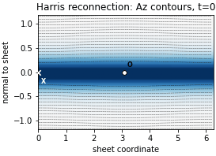 | Single-sheet Harris reconnection zoom from a `96×96`, `t_end=120` periodic double-Harris replay: out-of-plane current density with magnetic-flux/Az contours and X/O guide markers. | Solver-generated validation media anchored to the Harris current-sheet and FKR tearing picture; bounded evidence, not converged Rutherford/plasmoid production. |
| 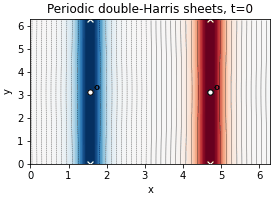 | Full-domain periodic double-Harris view from the same run, showing both current sheets and island-forming flux contours. | Solver-generated validation media; useful for morphology QA before larger seed, duration, and resolution sweeps. |
|  | Current-density filament formation from a `96×96`, `t_end=10` reduced-MHD Orszag--Tang replay. | Solver-generated validation media; nonlinear reduced-MHD cascade evidence, not a compressible shock-capturing full-MHD result. |
|  | Vorticity roll-up from the same Orszag--Tang replay. | Solver-generated validation media with energy, divergence, and high-wavenumber-fraction gates. |
| 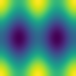 | Flux-function deformation and dissipative mixing from the same Orszag--Tang replay. | Solver-generated validation media; useful as a nonlinear example for new users. |
| 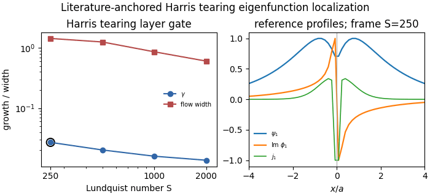 | Direct Harris-sheet eigenproblem: growth decreases with $S$ while the resonant flow/current layer narrows. | Solver-generated validation media from `mhx benchmark linear-tearing-layer`; anchored to classical tearing localization from [FKR 1963](https://doi.org/10.1063/1.1706761) and the reduced-MHD Harris eigenproblem used by [MacTaggart 2019](https://eprints.gla.ac.uk/191898/1/191898.pdf). |
| 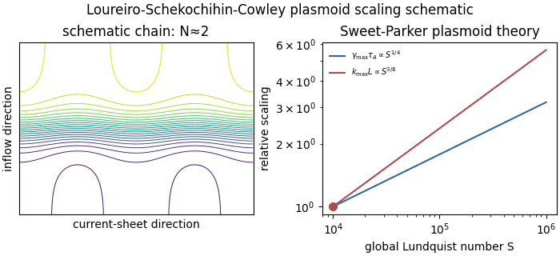 | Schematic Sweet-Parker sheet fragmentation with $\gamma_{\max}\tau_A\propto S^{1/4}$ and $k_{\max}L\propto S^{3/8}$. | Theory schematic only; anchored to [Loureiro, Schekochihin & Cowley 2007](https://arxiv.org/abs/astro-ph/0703631), not a nonlinear MHX plasmoid result. |
| 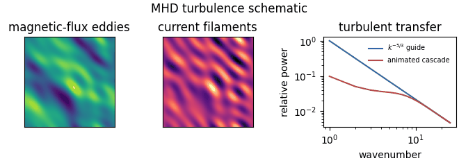 | Synthetic magnetic-flux eddies, current filaments, and an animated cascade guide. | Theory/pedagogy schematic only; not a nonlinear MHX turbulence simulation. |
| 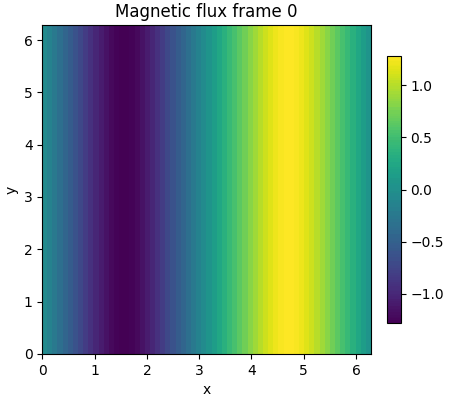 | Seeded periodic double-Harris nonlinear replay at `64×64`, showing magnetic-flux evolution over `t_end=30`. | Validation bridge from Harris tearing to longer nonlinear campaigns; bounded evidence, not converged Rutherford/plasmoid production. |
| 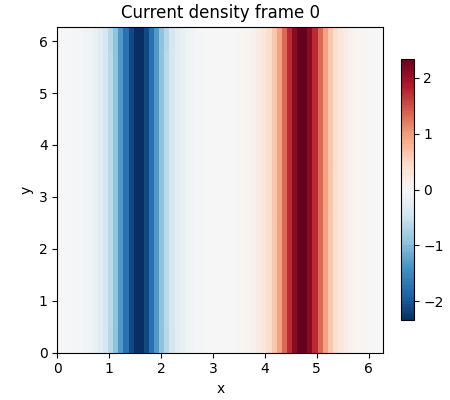 | Same seeded run through fixed-scale out-of-plane current density. | Checks current-density visualization and dissipative nonlinear replay before aspect-ratio, seed, and resolution sweeps. |
| 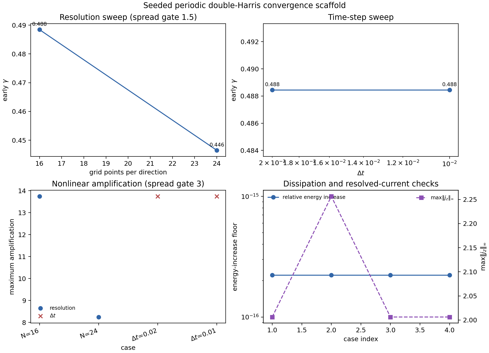 | FAST resolution/time-step sweep for the seeded periodic double-Harris replay. | Convergence scaffold that gates spread in early growth/amplification before any production Rutherford/plasmoid claim. |
| 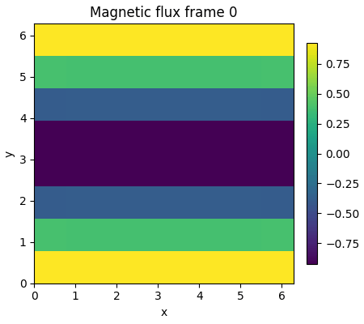 | Restartable Rutherford executor chunk with fixed-scale magnetic flux. | Execution-path validation for the chunked production runner; not completed nonlinear production evidence. |
| 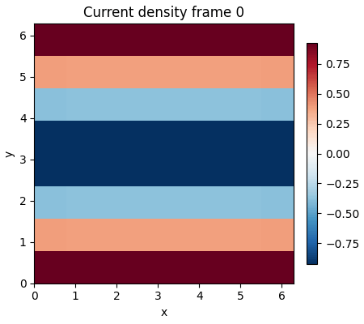 | Same executor chunk through current density, using fixed color limits. | Checks the movie/artifact lane and the current-density visualization contract. |

Still validation figures live on the [physics validation](validation.md),
[long-run evidence](long_run_evidence.md), and
[publication checklist](publication_checklist.md) pages where they can be
interpreted with equations, tolerances, and source links.

## README Harris-sheet reconnection previews

The README Harris pair is regenerated from the longest available seeded
periodic double-Harris history under `outputs/readme_media/`,
`outputs/long_runs/`, `outputs/docs_validation/`, or `outputs/ci/`. The current
release media were regenerated from a `96×96`, `t_end=120` run chosen for
visible topology rather than production convergence:

```bash
mhx benchmark double-harris-long-run \
  --outdir outputs/readme_media/periodic_double_harris_reconnection_96_t120 \
  --nx 96 --ny 96 --width 0.32 --eta 1.5e-3 --nu 1.5e-3 \
  --perturbation-amplitude 1e-2 --mode-x 0 --mode-y 1 \
  --dt 2e-2 --t-end 120 --save-every 100 \
  --fit-stop 20 --min-early-growth-rate 1e-9 \
  --min-max-growth-factor 1.000000001 --movies

python examples/make_readme_media.py
```

The underlying periodic double-Harris field is the spectral analogue of a
Harris sheet:

$$
B_y(x)=B_0\left[
\tanh\left(\frac{x-L_x/4}{a}\right)
-\tanh\left(\frac{x-3L_x/4}{a}\right)-1
\right],
$$

with a tearing-like seed

$$
\delta\psi(y,0)=\epsilon \cos(2\pi y/L_y).
$$

The movie uses the total out-of-plane current density
$j_z=-\nabla^2\psi$ as the color field and overlays magnetic-flux
(`Az`/`ψ`) contours. The single-sheet movie rotates the view into standard
current-sheet coordinates: horizontal is the sheet direction and vertical is
the normal coordinate. The `X`/`O` labels are deterministic guide markers for
the seed phase; they are not an automated critical-point classifier.

This media is literature-anchored to the Harris equilibrium
([Harris 1962](https://doi.org/10.1007/BF02733547)) and the classical tearing
instability picture
([Furth, Killeen & Rosenbluth 1963](https://doi.org/10.1063/1.1706761)).
The validation manifest confirms finite histories, positive early perturbation
growth, visible nonlinear amplification, and dissipative total energy. It
remains `claim_level = "validation"` until convergence, seed, aspect-ratio,
and duration sweeps are attached.


Visual QA artifacts are written next to the README movies:

- `docs/_static/readme/readme_media_visual_qa.json`
- `docs/_static/readme/double_harris_flux_snapshots.png`
- `docs/_static/readme/double_harris_current_snapshots.png`
- `docs/_static/readme/double_harris_current_sheet_snapshots.png`

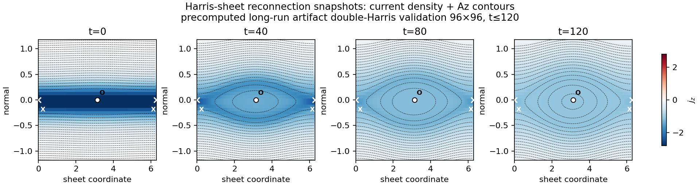

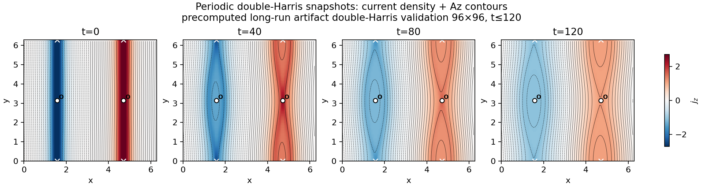

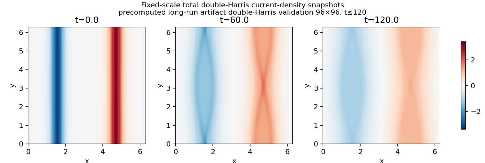

Source links:

- [Current-sheet validation implementation](https://github.com/uwplasma/MHX/blob/main/src/mhx/benchmarks/current_sheet.py)
- [Current-sheet tests](https://github.com/uwplasma/MHX/blob/main/tests/test_current_sheet_eigenvalue_validation.py)
- [README media generator](https://github.com/uwplasma/MHX/blob/main/examples/make_readme_media.py)

## Orszag--Tang nonlinear reduced-MHD vortex

The README now includes a second nonlinear solver-generated example: an
incompressible reduced-MHD adaptation of the Orszag--Tang vortex. The classic
test was introduced for two-dimensional MHD turbulence by
[Orszag & Tang 1979](https://doi.org/10.1017/S002211207900210X) and is widely
used as an MHD-code stress test; full compressible variants develop shocks,
while MHX currently uses the reduced-MHD periodic vortex to exercise nonlinear
advection, magnetic tension, dissipation, current-density diagnostics, and
movie generation.

MHX uses

$$
\phi(x,y,0)=\cos x+\cos y,\qquad
\psi(x,y,0)=\cos y+\frac{1}{2}\cos 2x,
$$

so that, with the MHX convention
$\mathbf{v}_\perp=(\partial_y\phi,-\partial_x\phi)$ and
$\mathbf{B}_\perp=(\partial_y\psi,-\partial_x\psi)$,

$$
\mathbf{v}_\perp=(-\sin y,\sin x),\qquad
\mathbf{B}_\perp=(-\sin y,\sin 2x).
$$

The committed README media were regenerated from a `96×96`, `t_end=10` run:

```bash
mhx benchmark orszag-tang \
  --outdir outputs/readme_media/orszag_tang_vortex_96_t10 \
  --nx 96 --ny 96 --t-end 10 --save-every 40 --movies

python examples/make_readme_media.py
```

The validation gates check finite arrays, monotone resistive-viscous energy
decay, nonzero net dissipation, growth of current/vorticity high-wavenumber
fractions, and preservation of $\nabla\cdot\mathbf{B}_\perp=0$ by construction.
The QA manifest records the peak high-wavenumber fractions and energy drop.

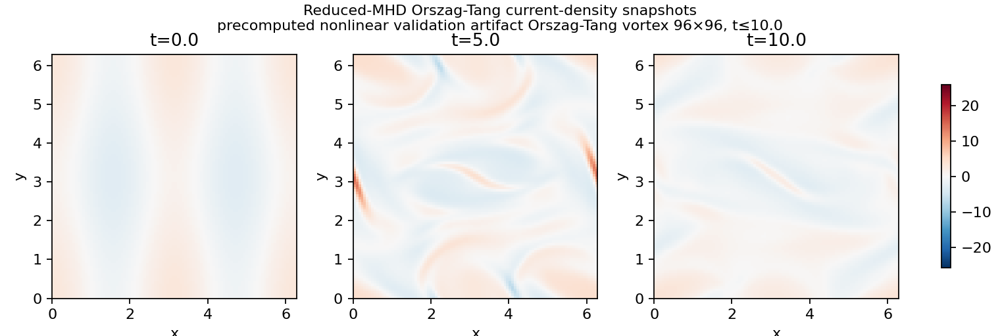

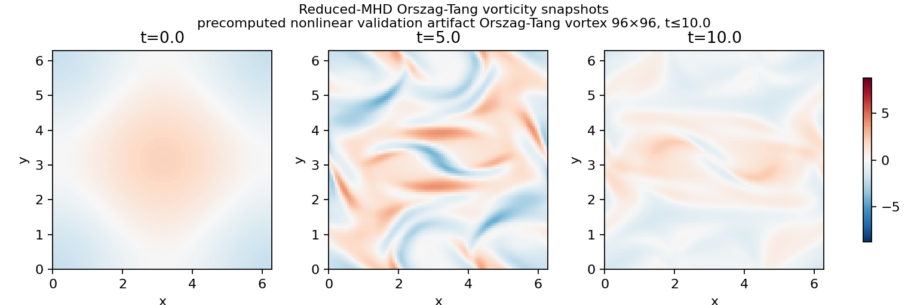

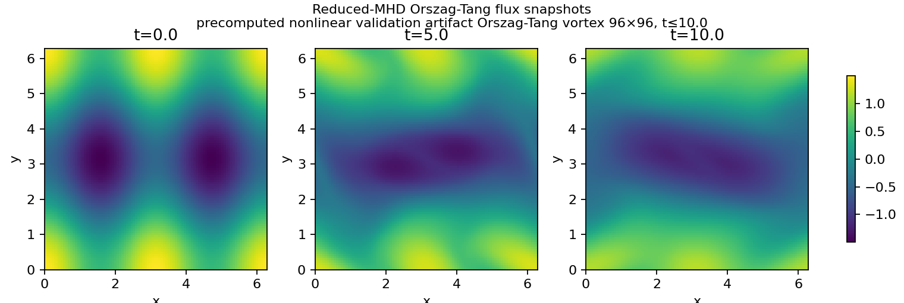

Source links:

- [Orszag--Tang benchmark implementation](https://github.com/uwplasma/MHX/blob/main/src/mhx/benchmarks/orszag_tang.py)
- [Orszag--Tang tests](https://github.com/uwplasma/MHX/blob/main/tests/test_orszag_tang_validation.py)
- [README media generator](https://github.com/uwplasma/MHX/blob/main/examples/make_readme_media.py)

## Harris tearing layer sweep

This GIF is generated from `mhx benchmark linear-tearing-layer`. It uses the
direct finite-domain Harris-sheet eigenproblem and shows the FAST validation
trend: increasing Lundquist number reduces the growth rate and narrows the
localized flow/current response near the resonant surface. The anchor is the
classical tearing-mode picture from Furth, Killeen & Rosenbluth and the
reduced-MHD Harris eigenproblem used in the MacTaggart validation papers.


Source links:

- [Layer benchmark implementation](https://github.com/uwplasma/MHX/blob/main/src/mhx/benchmarks/tearing_eigen.py)
- [Layer validation tests](https://github.com/uwplasma/MHX/blob/main/tests/test_linear_tearing_eigenvalue_validation.py)
- [README media generator](https://github.com/uwplasma/MHX/blob/main/examples/make_readme_media.py)

## Sweet-Parker plasmoid scaling schematic

This GIF is an explicitly labeled theory schematic, not a nonlinear MHX solver
result. It visualizes the Loureiro-Schekochihin-Cowley Sweet-Parker plasmoid
scalings

$$
\gamma_{\max}\tau_A\propto S^{1/4},\qquad k_{\max}L\propto S^{3/8}.
$$

The purpose is pedagogic: readers should immediately see the literature target
that future nonlinear MHX plasmoid runs must recover.


Source links:

- [Schematic generator](https://github.com/uwplasma/MHX/blob/main/examples/make_readme_media.py)
- [Analytic scaling gate](https://github.com/uwplasma/MHX/blob/main/src/mhx/benchmarks/scaling.py)
- [Scaling validation tests](https://github.com/uwplasma/MHX/blob/main/tests/test_reconnection_scaling_validation.py)

## MHD turbulence cascade schematic

This GIF is explicitly schematic. It combines synthetic magnetic-flux eddies,
current filaments, and a $k^{-5/3}$ guide curve to communicate the kind of
turbulent MHD morphology future high-Re campaigns should target. The exponent
is used as a recognizable inertial-range guide, not as a validation result.
Classical reference points include
[Kraichnan 1958](https://doi.org/10.1103/PhysRev.109.1407), the
Iroshnikov--Kraichnan phenomenology summarized in
[Verma 2004](https://doi.org/10.1016/j.physrep.2004.07.007), and anisotropic
strong-MHD-turbulence ideas associated with Goldreich--Sridhar as discussed in
modern reviews such as
[Schekochihin 2009](https://arxiv.org/abs/0911.2581).


## Nonlinear validation movies

The periodic double-Harris long-run movie pair is generated by:

```bash
mhx benchmark double-harris-long-run \
  --outdir outputs/benchmarks/periodic_double_harris_seeded_long_run \
  --nx 64 --ny 64 --t-end 100 --save-every 200 --movies
```

It visualizes the validation bridge documented in
[physics validation](validation.md).
The run advances a base periodic double-Harris sheet and a seeded copy, then
tracks normalized perturbation growth, total energy, kinetic energy, peak
current, and current-density frames. It remains `claim_level = "validation"`
until convergence, seed, aspect-ratio, and duration sweeps are attached.


The restartable Rutherford executor movie pair is generated by:

```bash
mhx campaign rutherford-execute \
  outputs/campaigns/rutherford_production_plan \
  --max-steps 128 --movies
```

It validates fixed-scale flux/current movie writing, checkpoint metadata, and
manifested artifacts for a production executor chunk. A partial chunk is still
validation-level unless the planned duration is completed and production
convergence evidence is attached.


Source links:

- [Current-sheet validation implementation](https://github.com/uwplasma/MHX/blob/main/src/mhx/benchmarks/current_sheet.py)
- [Production executor implementation](https://github.com/uwplasma/MHX/blob/main/src/mhx/campaigns/production.py)
- [Current-sheet tests](https://github.com/uwplasma/MHX/blob/main/tests/test_current_sheet_eigenvalue_validation.py)
- [Production executor tests](https://github.com/uwplasma/MHX/blob/main/tests/test_production_campaign.py)

Regenerate the README teaser movies with:

```bash
python examples/make_readme_media.py
```

The generated files are intentionally compact:

- `docs/_static/readme/double_harris_reconnection.gif`
- `docs/_static/readme/double_harris_current_sheet.gif`
- `docs/_static/readme/orszag_tang_current.gif`
- `docs/_static/readme/orszag_tang_vorticity.gif`
- `docs/_static/readme/orszag_tang_flux.gif`
- `docs/_static/readme/harris_layer_sweep.gif`
- `docs/_static/readme/plasmoid_scaling_schematic.gif`
- `docs/_static/readme/mhd_turbulence_cascade.gif`
