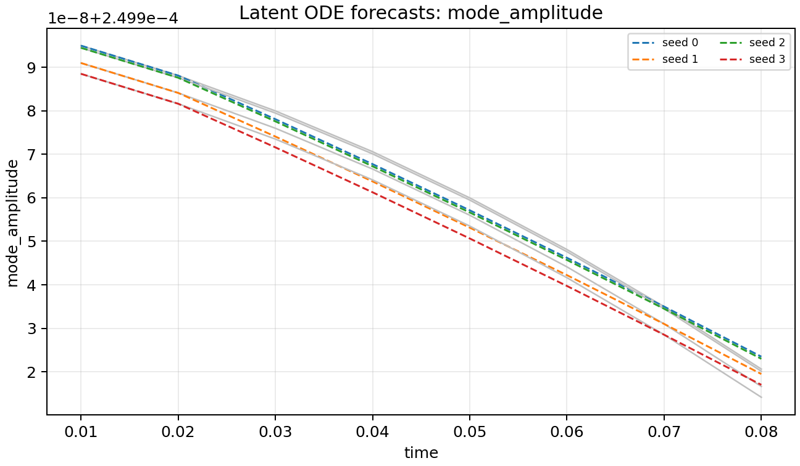
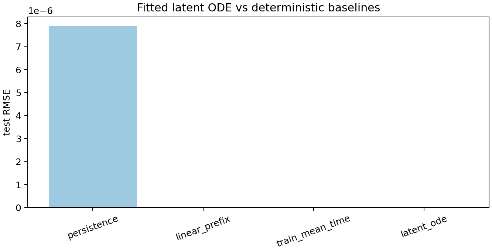

# Neural-ODE reproducibility and fitted latent-ODE lane

The neural-ODE lane now has two closed FAST workflows:

1. a deterministic dataset/baseline/calibration bundle; and
2. a fitted random-feature latent ODE with train/validation/test metrics.

This is still `claim_level = "validation"` because the data are FAST
trajectories, not production reconnection campaigns. The lane writes model
parameters, predictions, metrics, plots, and hashes.

## Dataset contract

Generate the FAST deterministic dataset with:

```bash
mhx neural-ode dataset \
  --outdir outputs/neural_ode/seed_qi_fast \
  --seeds 0,1,2,3,4,5 \
  --nx 16 --ny 16 \
  --steps 24 \
  --dt 1e-2
```

Expected files:

- `dataset.npz`
- `splits.json`
- `baseline_metrics.json`
- `calibration.json`
- `experiment_spec.json`
- `validation.json`
- `figures/dataset_targets.png`
- `figures/baseline_rmse.png`
- `figures/calibration_coverage.png`
- `manifest.json`

The dataset arrays are:

| Array | Shape | Meaning |
| --- | --- | --- |
| `seeds` | `(n_seed,)` | Deterministic sample identifiers. |
| `times` | `(n_time,)` | Saved simulation times. |
| `features` | `(n_seed, n_time, n_feature)` | Diagnostic histories used as model inputs. |
| `targets` | `(n_seed, n_time, n_target)` | Forecast targets selected from the feature tensor. |

Default features are mode amplitude, magnetic energy, kinetic energy, total
energy, magnetic-divergence error, $\|\psi\|_2$, and $\|\omega\|_2$.  Default
targets are mode amplitude, total energy, and magnetic-divergence error.

## Baselines

The lane evaluates no-training baselines:

- persistence: $\hat y(t)=y(t_\mathrm{obs})$;
- linear-prefix extrapolation: fit a two-point slope from the observed prefix;
- train-mean history: use the mean target history over training seeds.

For each baseline and split, MHX writes MAE, RMSE, maximum absolute error, and
target-wise scores:

$$
\mathrm{MAE}=\langle |y-\hat y|\rangle,\qquad
\mathrm{RMSE}=\sqrt{\langle (y-\hat y)^2\rangle}.
$$

The calibration file estimates train residual standard deviations and reports
empirical one- and two-sigma coverage on train/validation/test splits.  These
checks are not a probabilistic model; they are a minimum benchmark a later
trainable latent or neural ODE must beat.

## Fitted latent ODE

Train the deterministic CI-scale model with:

```bash
mhx neural-ode train \
  --outdir outputs/neural_ode/latent_ode_fast \
  --seeds 0,1,2,3,4,5 \
  --nx 16 --ny 16 \
  --steps 24 \
  --hidden-size 8
```

The fitted model is the autonomous ODE

$$
\frac{dz}{dt}=W\,\phi(z),\qquad
\phi(z)=\left[z,\tanh(zR+b),1\right],
$$

where $z$ contains the target diagnostics.  The random feature matrix $R$ and
bias $b$ are deterministic from `--model-seed`; $W$ is fitted by ridge
regression to train-set finite differences,

$$
W=\arg\min_W \|XW-\dot Z\|_2^2+\lambda\|W\|_2^2.
$$

Standalone `mhx neural-ode train` first writes the dataset bundle when it is
not provided, then writes the fitted-model artifacts. Expected files therefore
include the dataset contract plus:

- `latent_ode_model.json`
- `latent_ode_metrics.json`
- `latent_ode_predictions.npz`
- `figures/latent_ode_predictions.png`
- `figures/latent_ode_rmse_comparison.png`
- `manifest.json`

The metric file reports train/validation/test MAE, RMSE, target-wise errors,
the best baseline test RMSE, and the latent-ODE test-RMSE ratio to that
baseline. The ratio is reported rather than hidden; this keeps the current
model honest and makes future neural-ODE improvements directly comparable.





## Claim boundary

The manifest is `claim_level = "validation"`.  The current lane supports claims
that the dataset/split/baseline/calibration contract is deterministic and that
the fitted latent-ODE experiment is reproducible and schema-valid.  It does
**not** support claims that the model generalizes to production nonlinear
reconnection until it is trained and tested on production-quality trajectories.

`validation.json` uses schema `mhx.neural_ode.reproducibility.gates.v1` and
gates four prerequisites together: the source seed-QI validation passed, the
split manifest is disjoint and complete, all baseline arrays are finite, and
the calibration report was generated from the same target tensor.

`mhx neural-ode train` uses schema `mhx.neural_ode.training.gates.v1` and adds
gates for finite fitted coefficients, finite predictions, matching prediction
shapes, and held-out test forecasts.

## Source links

- [Dataset and baseline implementation](https://github.com/uwplasma/MHX/blob/main/src/mhx/neural_ode/reproducibility.py)
- [Public exports](https://github.com/uwplasma/MHX/blob/main/src/mhx/neural_ode/__init__.py)
- [CLI entrypoint](https://github.com/uwplasma/MHX/blob/main/src/mhx/cli/main.py)
- [Example script](https://github.com/uwplasma/MHX/blob/main/examples/make_neural_ode_reproducibility.py)
- [Latent-ODE training example](https://github.com/uwplasma/MHX/blob/main/examples/train_latent_ode_fast.py)
- [Tests](https://github.com/uwplasma/MHX/blob/main/tests/test_neural_ode_reproducibility.py)
