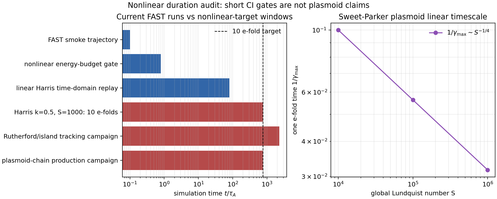

# Paper plan and claim boundaries

This page is the working blueprint for a complete MHX methods/validation paper.
It is intentionally conservative: it separates claims already supported by CI
artifacts from nonlinear reconnection claims that still require long production
runs.

## Proposed paper title

**MHX: a validation-first differentiable reduced-MHD framework for magnetic
reconnection, physics plugins, and neural surrogate experiments**

## Core contributions

1. A pure-JAX reduced-MHD solver stack with explicit spectral operators,
   deterministic fixed-step integration, x64 validation gates, and artifact
   schemas.
2. A public diagnostics API with shared definitions for energy, Fourier-mode
   growth, divergence error, reconnecting-flux amplitude, and Rutherford-style
   island-width proxies.
3. Literature-anchored tearing/reconnection benchmarks: exact resistive decay,
   FKR regime formulas, Harris $\Delta'$ matching, direct Harris eigenvalues,
   finite-domain dispersion, eigenfunction-layer localization, and time-domain
   eigenmode replay.
4. A physics-plugin interface for Hall, hyper-resistive, anisotropic-pressure,
   two-fluid, and local user-defined terms without changing solver internals.
5. Differentiability gates for nonlinear trajectory maps, establishing the
   local tangent checks required before inverse-design or neural-ODE claims.
6. A reproducible paper pipeline with figures, GIFs, manifests, checksums, and
   CI artifact validation.

## Current claim status

| Claim | Current status | Required before paper claim |
| --- | --- | --- |
| Spectral derivative signs and diffusion rates | Supported by exact Fourier tests and exact-decay benchmark. | Maintain x64 regression gates. |
| Linear tearing eigenvalue at one Harris reference case | Supported against the $S=1000$, $ka=0.5$ benchmark value $\gamma\simeq0.0131$. | Add medium-grid reproducibility run and artifact hash bundle. |
| Finite-domain tearing dispersion branch | Supported as a small sampled branch/residual gate. | Extend to a documented FKR/Coppi parameter sweep. |
| Nonlinear reduced-MHD budget | Supported for a periodic multi-mode state. | Add longer current-sheet runs with same budget diagnostics. |
| Rutherford island growth | Not yet supported. | Run long enough for many linear e-folds, then track $W(t)$ and compare algebraic growth. |
| Sweet-Parker/plasmoid chains | Not yet supported. | Resolve long thin sheets and secondary islands at adequate Lundquist number. |
| Neural ODE surrogate for reconnection metrics | Framework item, not yet a paper result. | Freeze dataset generation, train/val/test splits, baselines, calibration, and failure cases. |

## Nonlinear duration requirement

For a linear eigenmode with growth rate $\gamma$, observing $N_e$ e-folds
requires

$$
t_\mathrm{end} \ge \frac{N_e}{\gamma}.
$$

The direct Harris benchmark used by MHX has $\gamma\simeq0.0131$ at
$S=1000$, $ka=0.5$. Ten e-folds therefore require

$$
t_\mathrm{end} \simeq \frac{10}{0.0131} \approx 763.4.
$$

The current nonlinear energy-budget gate runs to $t=0.8$, which is only about
$1.0\times 10^{-3}$ of this ten-e-fold window. It is a nonlinear code-validity
gate, not an island-growth or plasmoid result.

```bash
mhx benchmark nonlinear-duration-audit \
  --outdir outputs/benchmarks/nonlinear_duration_audit
```



## Proposed figure set

| Figure | Contents | Status |
| --- | --- | --- |
| 1 | Architecture: configs → model registry → solver → diagnostics → artifacts. | Draft in docs/architecture. |
| 2 | Exact decay and spectral-operator identities. | CI artifact exists. |
| 3 | FKR, plasmoid, and ideal-tearing analytic scaling targets. | CI artifact exists; analytic only. |
| 4 | Harris $\Delta'$ and direct eigenvalue benchmark. | CI artifact exists. |
| 5 | Finite-domain dispersion and eigenfunction layer localization. | CI artifact exists. |
| 6 | Time-domain eigenmode replay and growth-fit recovery. | CI artifact exists. |
| 7 | Nonlinear differentiability and energy-budget gates. | CI artifact exists. |
| 8 | Nonlinear duration audit and production-run requirements. | CI artifact exists. |
| 9 | Rutherford island growth campaign. | Planned. |
| 10 | Sweet-Parker/plasmoid nonlinear campaign. | Planned. |
| 11 | Neural-ODE dataset/baselines/calibration/failure cases. | Planned. |

## Production nonlinear campaign checklist

Every nonlinear island/plasmoid result should archive:

- full config, code commit, API version, dependency lock file, and manifest;
- x64 setting and JIT setting;
- grid, timestep, CFL or fixed-step stability rationale, and tolerances;
- reconnected flux $\psi_1(t)$ and island width
  $W=4\sqrt{|\psi_1|/|B_y'(0)|}$;
- reconnection proxy $E_\mathrm{rec}$, current-sheet length/thickness, and aspect ratio;
- magnetic, kinetic, total energy, resistive dissipation, viscous dissipation, and budget residual;
- at least one resolution/time-step comparison;
- visual flux/current movies with fixed color ranges;
- explicit claim boundary: smoke, validation, or production physics result.

## Literature anchors

- [Furth, Killeen & Rosenbluth (1963)](https://doi.org/10.1063/1.1706761) for constant-$\psi$ tearing theory.
- [Rutherford (1973)](https://doi.org/10.1063/1.1694232) for nonlinear tearing/island growth.
- [Loureiro, Schekochihin & Cowley (2007)](https://arxiv.org/abs/astro-ph/0703631) for Sweet-Parker plasmoid instability scalings.
- [Pucci & Velli (2014)](https://doi.org/10.1088/2041-8205/780/2/L19) for ideal tearing.
- [MacTaggart Harris benchmark PDF](https://eprints.gla.ac.uk/191898/1/191898.pdf) for the direct Harris-sheet eigenvalue anchor used in MHX.
