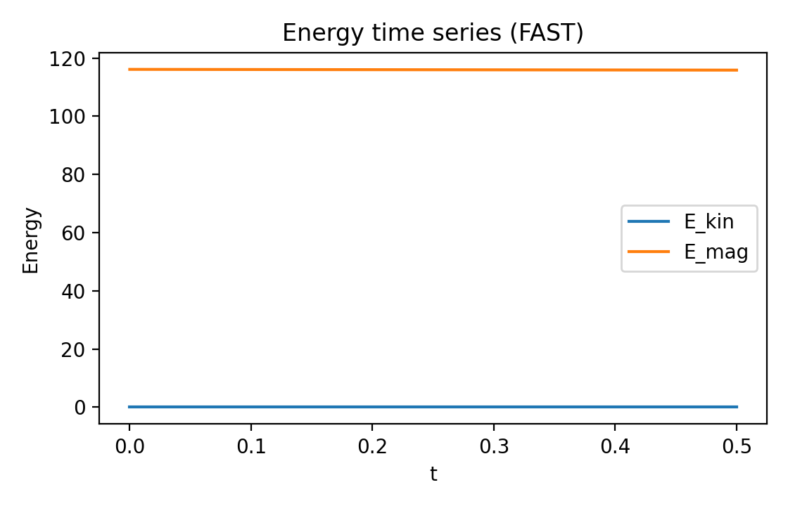
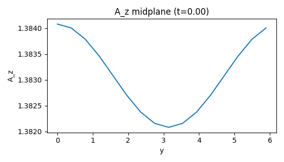

Quickstart
==========

Run a tiny simulation (seconds):

.. code-block:: bash

   mhx simulate --fast --equilibrium original --eta 1e-3 --nu 1e-3

Generate figures from the run directory:

.. code-block:: bash

   mhx figures --run outputs/runs/<timestamp>_simulate

Example outputs
---------------

Media generation script:

- https://github.com/uwplasma/MHX/blob/main/examples/make_fast_media.py
