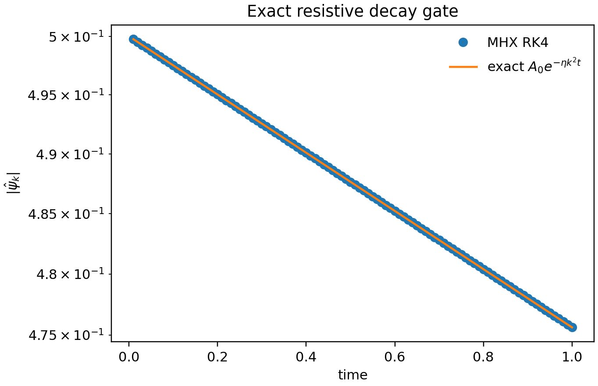
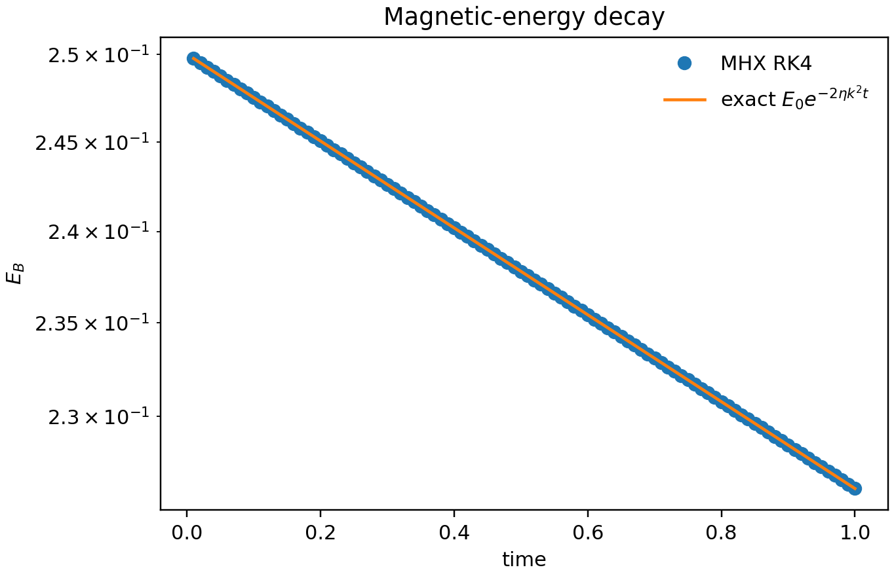
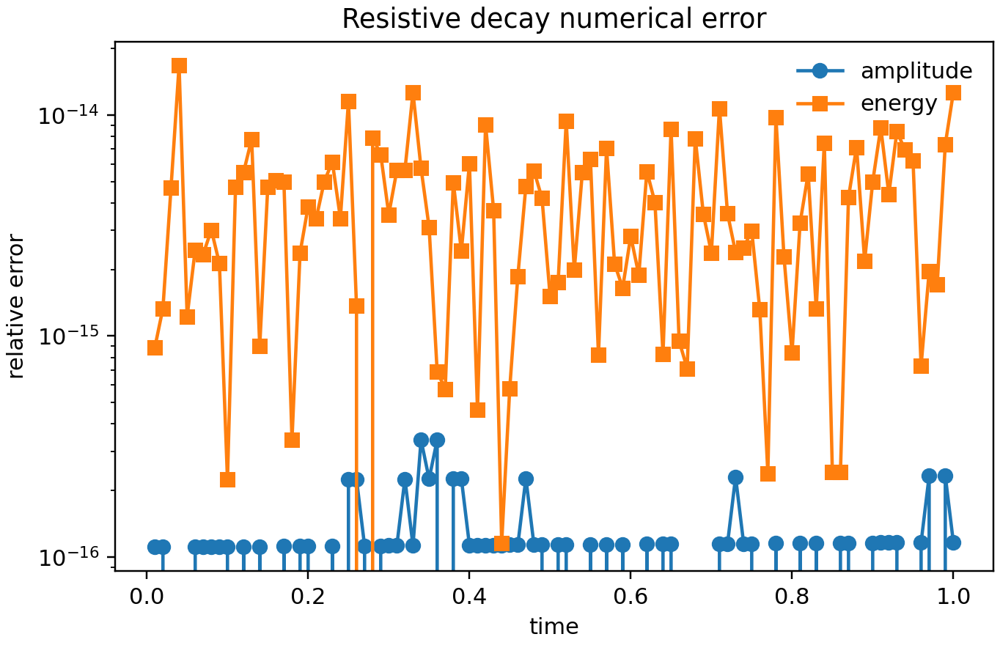
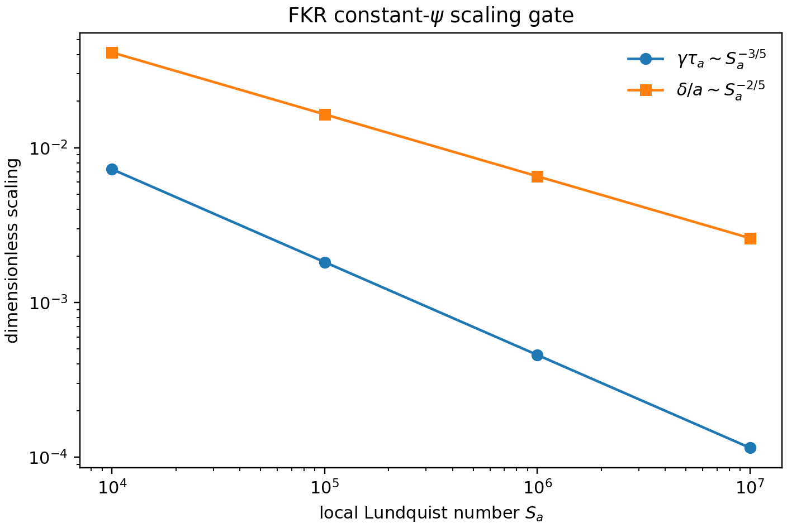
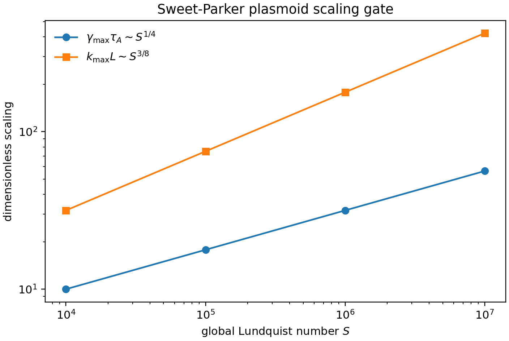
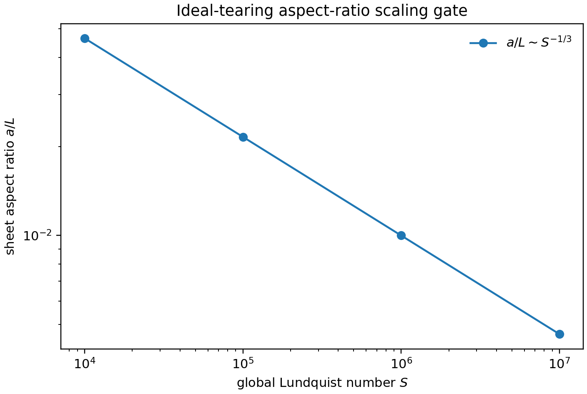
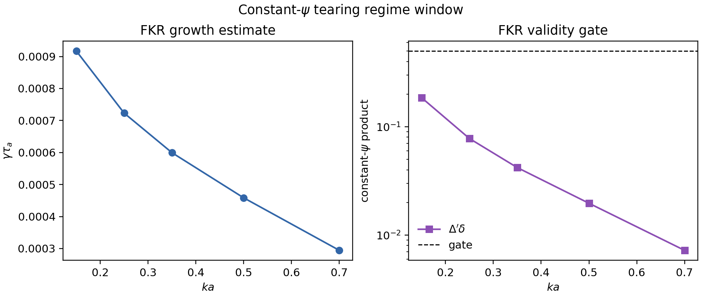

# Physics validation

MHX validation tests should have explicit physics gates, not just smoke-run
assertions. The first active gate is exact resistive diffusion of a single
periodic Fourier mode. This is the linear induction-equation limit of
resistive reduced MHD and is a prerequisite for credible tearing-mode,
plasmoid, and extended-MHD studies.

## Exact resistive decay

With zero flow and one flux mode,

$$
\psi(x,y,0)=\cos(k_x x + k_y y), \qquad \omega(x,y,0)=0,
$$

the reduced-MHD flux equation collapses to

$$
\partial_t\psi = \eta\nabla^2\psi.
$$

The exact solution is

$$
\psi(x,y,t)=\psi(x,y,0)\exp(-\eta |k|^2 t),
\qquad |k|^2=k_x^2+k_y^2,
$$

and magnetic energy must decay as

$$
E_B(t)=E_B(0)\exp(-2\eta |k|^2t).
$$

These gates test the spectral Laplacian sign convention, RK4 time stepping,
mode diagnostics, energy diagnostics, output files, and plotting path.

Run the validation:

```bash
mhx benchmark decay --outdir outputs/benchmarks/resistive_decay
```

Expected files:

- `outputs/benchmarks/resistive_decay/diagnostics.json`
- `outputs/benchmarks/resistive_decay/validation.json`
- `outputs/benchmarks/resistive_decay/decay_history.npz`
- `outputs/benchmarks/resistive_decay/figures/decay_amplitude.png`
- `outputs/benchmarks/resistive_decay/figures/decay_energy.png`
- `outputs/benchmarks/resistive_decay/figures/decay_relative_error.png`

Regenerate the documentation figures:

```bash
python examples/make_validation_media.py
```

## Publication figures

The numerical mode amplitude is visually indistinguishable from
$A_0\exp(-\eta |k|^2t)$ at FAST settings.



The magnetic energy follows the required $E_B(0)\exp(-2\eta |k|^2t)$ law.



The relative-error plot is the reviewer-facing numerical gate. The corresponding
unit test fails if amplitude, energy, fitted rate, monotonicity, or final-field
L2 gates exceed documented tolerances.



## Literature anchors

The exact-decay test is deliberately simpler than a tearing eigenvalue problem,
but it validates the finite-resistivity induction term used in classical
resistive-MHD reconnection theory. The benchmark roadmap then builds toward
the [FKR tearing mode](https://cir.nii.ac.jp/crid/1363107370207531008),
[plasmoid instability scalings](https://arxiv.org/abs/astro-ph/0703631), and
ideal-tearing regimes. For broader reconnection context, see Biskamp's
[Magnetic Reconnection in Plasmas](https://www.cambridge.org/core/books/magnetic-reconnection-in-plasmas/bibliography/AE068F5AE38E940925A4291E3087F02D)
and the MHX [literature page](literature.md).

## Source links

- [Validation implementation](https://github.com/uwplasma/MHX/blob/main/src/mhx/benchmarks/decay.py)
- [Validation tests](https://github.com/uwplasma/MHX/blob/main/tests/test_resistive_decay_validation.py)
- [Plotting helpers](https://github.com/uwplasma/MHX/blob/main/src/mhx/plotting/reduced_mhd.py)

## Reconnection scaling gates

The next validation layer checks that MHX's analytic benchmark scaffolds encode
the literature exponents that future numerical benchmarks must recover.

For constant-$\psi$ FKR tearing, using the Harris-sheet proxy

$$
\Delta'a = 2\left[(ka)^{-1}-ka\right],
$$

MHX gates the order-unity-coefficient-free scalings

$$
\gamma\tau_a \sim S_a^{-3/5}(ka)^{2/5}(\Delta'a)^{4/5},
\qquad
\delta/a \sim S_a^{-2/5}(ka)^{-2/5}(\Delta'a)^{1/5}.
$$



For a Sweet-Parker current sheet, the Loureiro--Schekochihin--Cowley plasmoid
theory predicts

$$
\gamma_{\max}\tau_A \sim S^{1/4}, \qquad k_{\max}L \sim S^{3/8}.
$$



For ideal tearing, MHX checks the Pucci--Velli aspect-ratio scaling

$$
a/L \sim S^{-1/3}.
$$



Run the scaling gates:

```bash
mhx benchmark scaling --outdir outputs/benchmarks/reconnection_scaling
```

Expected files:

- `outputs/benchmarks/reconnection_scaling/diagnostics.json`
- `outputs/benchmarks/reconnection_scaling/validation.json`
- `outputs/benchmarks/reconnection_scaling/scaling_history.npz`
- `outputs/benchmarks/reconnection_scaling/figures/fkr_scaling.png`
- `outputs/benchmarks/reconnection_scaling/figures/plasmoid_scaling.png`
- `outputs/benchmarks/reconnection_scaling/figures/ideal_tearing_scaling.png`

These gates do not prove the PDE solver has recovered FKR or plasmoid growth.
They make the expected exponents explicit, tested, plotted, and reviewable so
that future eigenmode and nonlinear-current-sheet benchmarks have fixed targets.

## FKR constant-psi regime window

The FKR estimate is only appropriate in a restricted asymptotic window. MHX now
ships a separate analytic gate that samples wavenumbers at fixed local
Lundquist number and checks:

$$
\Delta'a > 0,\qquad \delta/a \le \delta_{\max},\qquad
\Delta'\delta \le \epsilon_{\max}.
$$

The last condition is the constant-$\psi$ gate; large values move toward the
Coppi large-$\Delta'$ regime and should not be judged against the FKR
constant-$\psi$ scaling.

```bash
mhx benchmark fkr-window --outdir outputs/benchmarks/fkr_window
```

Expected files:

- `outputs/benchmarks/fkr_window/diagnostics.json`
- `outputs/benchmarks/fkr_window/validation.json`
- `outputs/benchmarks/fkr_window/fkr_window.npz`
- `outputs/benchmarks/fkr_window/figures/fkr_constant_psi_window.png`



Additional source links:

- [Scaling validation implementation](https://github.com/uwplasma/MHX/blob/main/src/mhx/benchmarks/scaling.py)
- [Scaling validation tests](https://github.com/uwplasma/MHX/blob/main/tests/test_reconnection_scaling_validation.py)
- [FKR window implementation](https://github.com/uwplasma/MHX/blob/main/src/mhx/benchmarks/fkr.py)
- [FKR window tests](https://github.com/uwplasma/MHX/blob/main/tests/test_fkr_window_validation.py)
