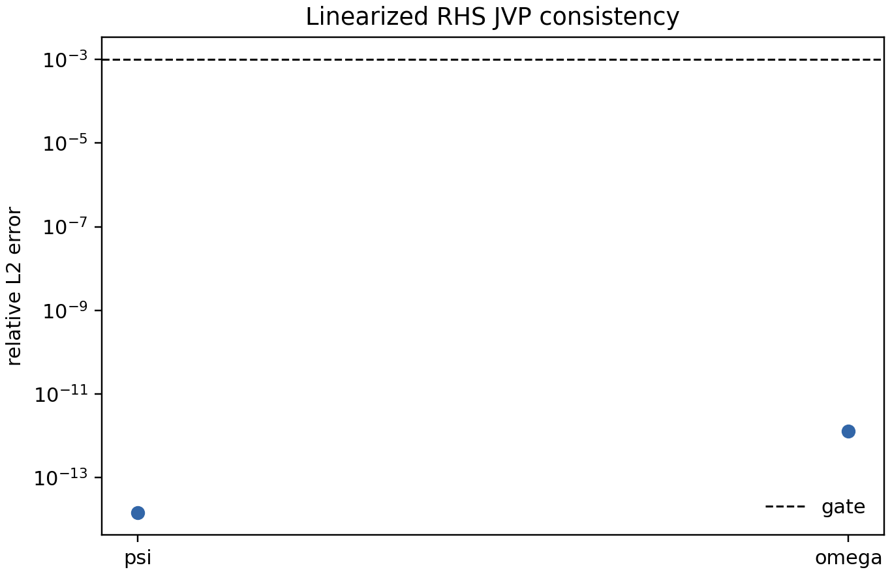
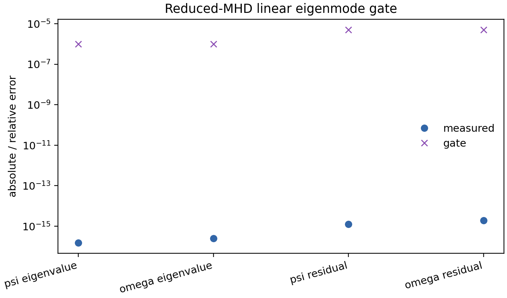
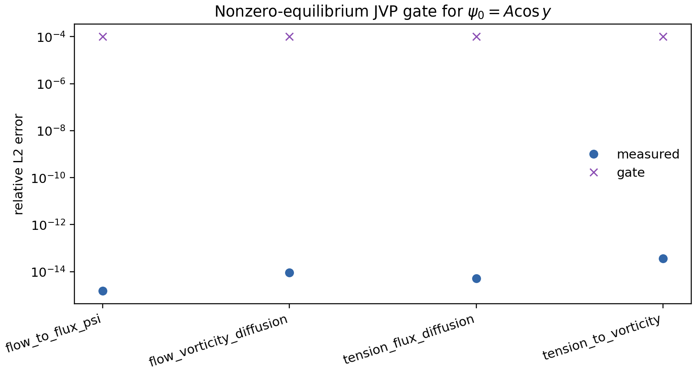
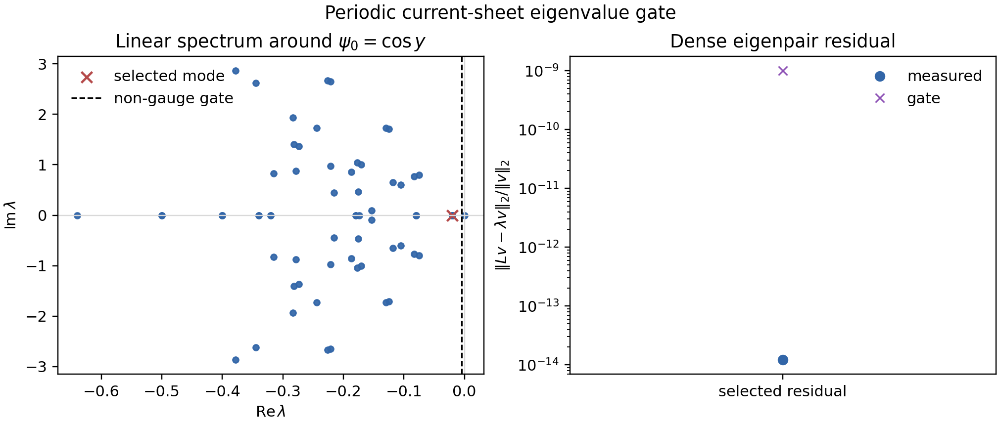
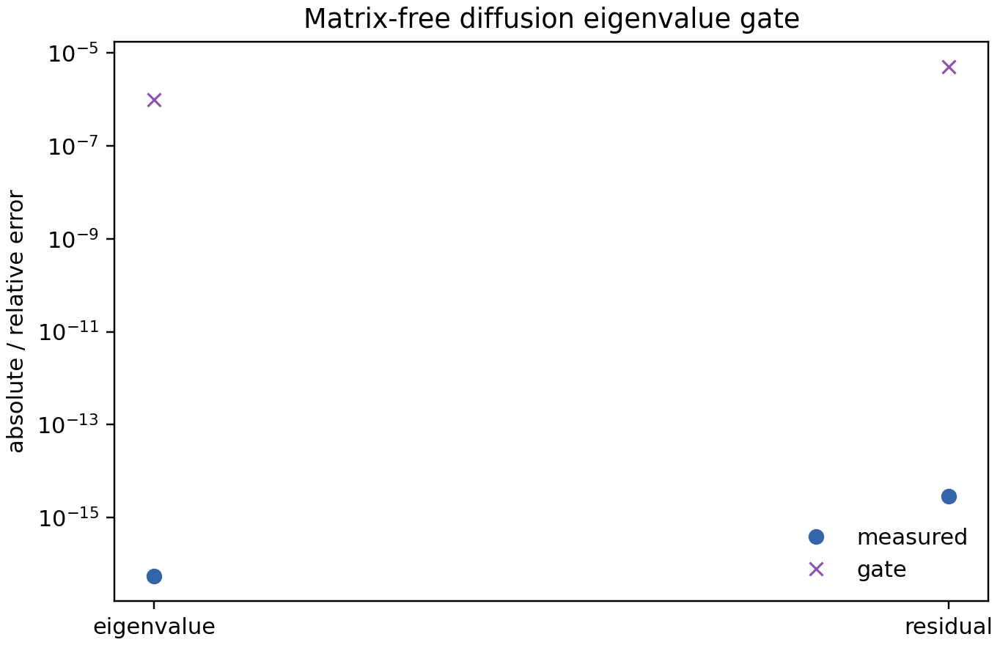
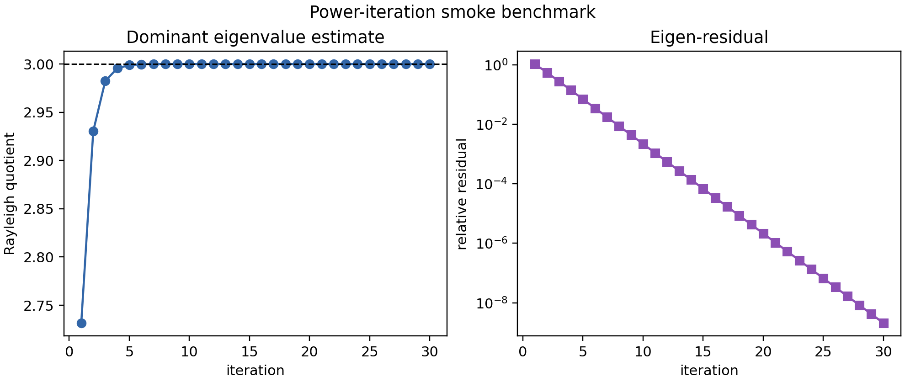
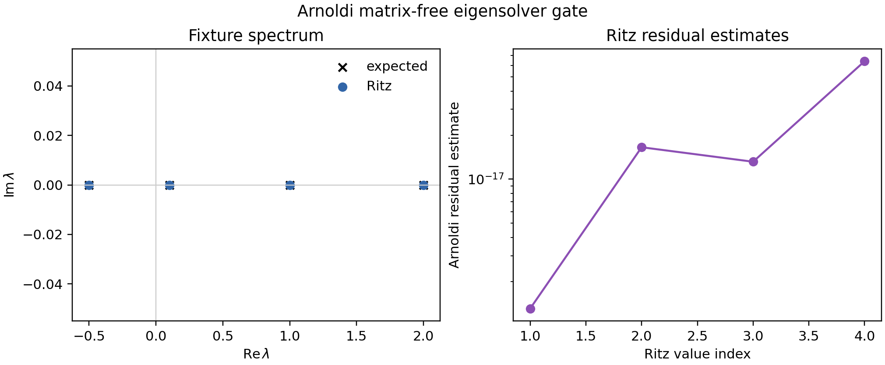

# Physics validation

MHX validation tests should have explicit physics gates, not just smoke-run
assertions. The first active gate is exact resistive diffusion of a single
periodic Fourier mode. This is the linear induction-equation limit of
resistive reduced MHD and is a prerequisite for credible tearing-mode,
plasmoid, and extended-MHD studies.

## Exact resistive decay

With zero flow and one flux mode,

$$
\psi(x,y,0)=\cos(k_x x + k_y y), \qquad \omega(x,y,0)=0,
$$

the reduced-MHD flux equation collapses to

$$
\partial_t\psi = \eta\nabla^2\psi.
$$

The exact solution is

$$
\psi(x,y,t)=\psi(x,y,0)\exp(-\eta |k|^2 t),
\qquad |k|^2=k_x^2+k_y^2,
$$

and magnetic energy must decay as

$$
E_B(t)=E_B(0)\exp(-2\eta |k|^2t).
$$

These gates test the spectral Laplacian sign convention, RK4 time stepping,
mode diagnostics, energy diagnostics, output files, and plotting path.

Run the validation:

```bash
mhx benchmark decay --outdir outputs/benchmarks/resistive_decay
```

Expected files:

- `outputs/benchmarks/resistive_decay/diagnostics.json`
- `outputs/benchmarks/resistive_decay/validation.json`
- `outputs/benchmarks/resistive_decay/decay_history.npz`
- `outputs/benchmarks/resistive_decay/figures/decay_amplitude.png`
- `outputs/benchmarks/resistive_decay/figures/decay_energy.png`
- `outputs/benchmarks/resistive_decay/figures/decay_relative_error.png`

Regenerate the documentation figures:

```bash
python examples/make_validation_media.py
```

Run every active FAST validation gate and write a single reviewer-facing
summary:

```bash
mhx validate all --outdir outputs/validation_suite
```

The suite writes `validation_suite.json`, `validation_suite.md`,
`artifact_manifest.json`, and one subdirectory per validation case.

## Validation figures

The numerical mode amplitude is visually indistinguishable from
$A_0\exp(-\eta |k|^2t)$ at FAST settings.


The magnetic energy follows the required $E_B(0)\exp(-2\eta |k|^2t)$ law.


The relative-error plot is the reviewer-facing numerical gate. The corresponding
unit test fails if amplitude, energy, fitted rate, monotonicity, or final-field
L2 gates exceed documented tolerances.


## Literature anchors

The exact-decay test is deliberately simpler than a tearing eigenvalue problem,
but it validates the finite-resistivity induction term used in classical
resistive-MHD reconnection theory. The benchmark roadmap then builds toward
the [FKR tearing mode](https://cir.nii.ac.jp/crid/1363107370207531008),
[plasmoid instability scalings](https://arxiv.org/abs/astro-ph/0703631), and
ideal-tearing regimes. For broader reconnection context, see Biskamp's
[Magnetic Reconnection in Plasmas](https://www.cambridge.org/core/books/magnetic-reconnection-in-plasmas/bibliography/AE068F5AE38E940925A4291E3087F02D)
and the MHX [literature page](literature.md).

## Source links

- [Validation implementation](https://github.com/uwplasma/MHX/blob/main/src/mhx/benchmarks/decay.py)
- [Validation tests](https://github.com/uwplasma/MHX/blob/main/tests/test_resistive_decay_validation.py)
- [Plotting helpers](https://github.com/uwplasma/MHX/blob/main/src/mhx/plotting/reduced_mhd.py)

## Reconnection scaling gates

The next validation layer checks that MHX's analytic benchmark scaffolds encode
the literature exponents that future numerical benchmarks must recover.

For constant-$\psi$ FKR tearing, using the Harris-sheet proxy

$$
\Delta'a = 2\left[(ka)^{-1}-ka\right],
$$

MHX gates the order-unity-coefficient-free scalings

$$
\gamma\tau_a \sim S_a^{-3/5}(ka)^{2/5}(\Delta'a)^{4/5},
\qquad
\delta/a \sim S_a^{-2/5}(ka)^{-2/5}(\Delta'a)^{1/5}.
$$


For a Sweet-Parker current sheet, the Loureiro--Schekochihin--Cowley plasmoid
theory predicts

$$
\gamma_{\max}\tau_A \sim S^{1/4}, \qquad k_{\max}L \sim S^{3/8}.
$$


For ideal tearing, MHX checks the Pucci--Velli aspect-ratio scaling

$$
a/L \sim S^{-1/3}.
$$


Run the scaling gates:

```bash
mhx benchmark scaling --outdir outputs/benchmarks/reconnection_scaling
```

Expected files:

- `outputs/benchmarks/reconnection_scaling/diagnostics.json`
- `outputs/benchmarks/reconnection_scaling/validation.json`
- `outputs/benchmarks/reconnection_scaling/scaling_history.npz`
- `outputs/benchmarks/reconnection_scaling/figures/fkr_scaling.png`
- `outputs/benchmarks/reconnection_scaling/figures/plasmoid_scaling.png`
- `outputs/benchmarks/reconnection_scaling/figures/ideal_tearing_scaling.png`

These gates do not prove the PDE solver has recovered FKR or plasmoid growth.
They make the expected exponents explicit, tested, plotted, and reviewable so
that future eigenmode and nonlinear-current-sheet benchmarks have fixed targets.

## FKR constant-psi regime window

The FKR estimate is only appropriate in a restricted asymptotic window. MHX now
ships a separate analytic gate that samples wavenumbers at fixed local
Lundquist number and checks:

$$
\Delta'a > 0,\qquad \delta/a \le \delta_{\max},\qquad
\Delta'\delta \le \epsilon_{\max}.
$$

The last condition is the constant-$\psi$ gate; large values move toward the
Coppi large-$\Delta'$ regime and should not be judged against the FKR
constant-$\psi$ scaling.

```bash
mhx benchmark fkr-window --outdir outputs/benchmarks/fkr_window
```

Expected files:

- `outputs/benchmarks/fkr_window/diagnostics.json`
- `outputs/benchmarks/fkr_window/validation.json`
- `outputs/benchmarks/fkr_window/fkr_window.npz`
- `outputs/benchmarks/fkr_window/figures/fkr_constant_psi_window.png`


## Matrix-free linearized RHS

Tearing eigenmode calculations require a linearized operator
$\mathcal{L}=\partial F/\partial q$ for the reduced-MHD state
$q=(\psi,\omega)$. MHX exposes this as a matrix-free Jacobian-vector product:

$$
\mathcal{L}(q)\,\delta q
=
\left.\frac{d}{d\epsilon}F(q+\epsilon\delta q)\right|_{\epsilon=0},
$$

computed by JAX forward-mode automatic differentiation. The validation gate
compares that JVP against the centered finite-difference approximation

$$
\frac{F(q+\epsilon\delta q)-F(q-\epsilon\delta q)}{2\epsilon}.
$$

```bash
mhx benchmark linearized-rhs --outdir outputs/benchmarks/linearized_rhs
```

Expected files:

- `outputs/benchmarks/linearized_rhs/diagnostics.json`
- `outputs/benchmarks/linearized_rhs/validation.json`
- `outputs/benchmarks/linearized_rhs/linearized_rhs.npz`
- `outputs/benchmarks/linearized_rhs/figures/linearized_rhs_errors.png`



## Reduced-MHD linear eigenmode gate

At zero flux and zero flow, the reduced-MHD JVP operator decouples into two
Fourier diffusion blocks:

$$
\partial_t\delta\psi = \eta\nabla^2\delta\psi,\qquad
\partial_t\delta\omega = \nu\nabla^2\delta\omega.
$$

For a periodic Fourier mode $\sin(k_xx+k_yy)$, the expected eigenvalues are

$$
\lambda_\psi = -\eta(k_x^2+k_y^2),\qquad
\lambda_\omega = -\nu(k_x^2+k_y^2).
$$

This gate applies `linearized_reduced_mhd_operator` to flattened
$(\delta\psi,\delta\omega)$ vectors and checks Rayleigh quotients and
eigen-residuals for both blocks. It is the first physics-facing use of the full
flattened reduced-MHD linear operator; nonzero-equilibrium tearing eigenmodes
will build on this path.

```bash
mhx benchmark reduced-mhd-eigenmode --outdir outputs/benchmarks/reduced_mhd_eigenmode
```

Expected files:

- `outputs/benchmarks/reduced_mhd_eigenmode/diagnostics.json`
- `outputs/benchmarks/reduced_mhd_eigenmode/validation.json`
- `outputs/benchmarks/reduced_mhd_eigenmode/reduced_mhd_linear_eigenmode.npz`
- `outputs/benchmarks/reduced_mhd_eigenmode/figures/reduced_mhd_linear_eigenmode_errors.png`



## Nonzero cosine-equilibrium linearization gate

The next step toward a tearing eigenmode calculation is to validate the
linearized operator on a nonzero current-sheet equilibrium. MHX uses the
periodic equilibrium

$$
\psi_0=A\cos(k_y y),\qquad \omega_0=0,
$$

and checks exact Poisson-bracket couplings for two perturbations.

First, a pure vorticity perturbation $\delta\omega=\cos(k_xx)$ gives
$\delta\phi=-\cos(k_xx)/k_x^2$. The flux equation contains flow advection of
the equilibrium field:

$$
\partial_t\delta\psi
=-[\delta\phi,\psi_0]
=A\frac{k_y}{k_x}\sin(k_xx)\sin(k_yy),
\qquad
\partial_t\delta\omega=-\nu k_x^2\cos(k_xx).
$$

Second, a pure flux perturbation
$\delta\psi=\cos(k_xx)\cos(2k_yy)$ checks magnetic tension:

$$
\partial_t\delta\omega
=[\delta\psi,\nabla^2\psi_0]+[\psi_0,\nabla^2\delta\psi]
=A k_x k_y (k_x^2+4k_y^2-k_y^2)
  \sin(k_xx)\sin(k_yy)\cos(2k_yy),
$$

while the flux block diffuses as

$$
\partial_t\delta\psi=-\eta(k_x^2+4k_y^2)\delta\psi.
$$

This gate does not claim an FKR growth rate. It validates the exact nonzero
equilibrium coupling terms that the FKR/plasmoid eigenmode benchmarks will
depend on.

```bash
mhx benchmark cosine-equilibrium-linearization \
  --outdir outputs/benchmarks/cosine_equilibrium_linearization
```

Expected files:

- `outputs/benchmarks/cosine_equilibrium_linearization/diagnostics.json`
- `outputs/benchmarks/cosine_equilibrium_linearization/validation.json`
- `outputs/benchmarks/cosine_equilibrium_linearization/cosine_equilibrium_linearization.npz`
- `outputs/benchmarks/cosine_equilibrium_linearization/figures/cosine_equilibrium_linearization_errors.png`



## Periodic current-sheet eigenvalue gate

The first nonzero-equilibrium spectrum gate now assembles the full flattened
JVP matrix on a deliberately tiny grid for

$$
\psi_0=A\cos(2\pi y/L_y),\qquad \omega_0=0.
$$

This is still not an FKR/Coppi growth-rate claim. It is a conservative
operator-stability gate between exact bracket tests and future asymptotic
tearing benchmarks. The benchmark checks:

$$
\|L\,\mathbf{1}_\psi\|_2 \approx 0,\qquad
\|L\,\mathbf{1}_\omega\|_2 \approx 0,
$$

for the two mean/gauge modes, solves the complete dense spectrum, and requires
the non-gauge spectrum to be damped:

$$
\max_{\lambda\notin\mathrm{gauge}}\operatorname{Re}\lambda
\le
-c\,\min(\eta,\nu)\,k_{\min}^2,
$$

with $c=0.25$ in the FAST gate. It also stores the selected dense eigenpair and
checks the residual

$$
\frac{\|Lv-\lambda v\|_2}{\|v\|_2}
$$

against a tight x64 tolerance.

```bash
mhx benchmark current-sheet-eigenvalue \
  --outdir outputs/benchmarks/periodic_current_sheet_eigenvalue
```

Expected files:

- `outputs/benchmarks/periodic_current_sheet_eigenvalue/diagnostics.json`
- `outputs/benchmarks/periodic_current_sheet_eigenvalue/validation.json`
- `outputs/benchmarks/periodic_current_sheet_eigenvalue/periodic_current_sheet_eigenvalue.npz`
- `outputs/benchmarks/periodic_current_sheet_eigenvalue/figures/periodic_current_sheet_spectrum.png`



## Diffusion eigenvalue scaffold

Before applying eigenvalue machinery to tearing equilibria, MHX validates the
matrix-free operator path on a single Fourier eigenfunction of the periodic
diffusion operator:

$$
\mathcal{D}\psi = \eta\nabla^2\psi,\qquad
\psi_k=\sin(k_x x+k_y y),\qquad
\lambda_k = -\eta(k_x^2+k_y^2).
$$

The benchmark computes the Rayleigh quotient

$$
\lambda_{\mathrm{RQ}} = \frac{\langle \psi_k,\mathcal{D}\psi_k\rangle}
{\langle \psi_k,\psi_k\rangle},
$$

and the relative eigen-residual

$$
\frac{\|\mathcal{D}\psi_k-\lambda_k\psi_k\|_2}{\|\psi_k\|_2}.
$$

```bash
mhx benchmark diffusion-eigenvalue --outdir outputs/benchmarks/diffusion_eigenvalue
```

Expected files:

- `outputs/benchmarks/diffusion_eigenvalue/diagnostics.json`
- `outputs/benchmarks/diffusion_eigenvalue/validation.json`
- `outputs/benchmarks/diffusion_eigenvalue/diffusion_eigenvalue.npz`
- `outputs/benchmarks/diffusion_eigenvalue/figures/diffusion_eigenvalue_errors.png`



## Power-iteration scaffold

The next eigenvalue-control-path gate validates the dominant-eigenpair iteration
on a diagonal matrix-free operator

$$
\mathcal{A}u = \operatorname{diag}(3,-1.5,0.5,0.1)u,
$$

whose dominant eigenvalue is known exactly:

$$
\lambda_\star = 3.
$$

Power iteration repeatedly applies

$$
u_{n+1}=\frac{\mathcal{A}u_n}{\|\mathcal{A}u_n\|_2},
$$

and records the Rayleigh quotient

$$
\lambda_n = \frac{\langle u_n,\mathcal{A}u_n\rangle}{\langle u_n,u_n\rangle}
$$

plus residual $\|\mathcal{A}u_n-\lambda_nu_n\|_2$. This is intentionally a
known finite-dimensional operator, not a tearing benchmark. It makes the
dominant-eigenpair loop, convergence history, plotting, schemas, CLI, and CI
artifact checks deterministic before coupling the same machinery to the
reduced-MHD JVP operator.

```bash
mhx benchmark power-iteration --outdir outputs/benchmarks/power_iteration
```

Expected files:

- `outputs/benchmarks/power_iteration/diagnostics.json`
- `outputs/benchmarks/power_iteration/validation.json`
- `outputs/benchmarks/power_iteration/power_iteration_history.npz`
- `outputs/benchmarks/power_iteration/figures/power_iteration_history.png`



## Arnoldi Ritz-spectrum scaffold

Tearing eigenmode validation needs more than a dominant-mode iteration: the
linearized reduced-MHD operator can be non-normal, and nearby Ritz values must
be handled explicitly. MHX therefore includes a deterministic Arnoldi gate on a
small non-normal upper-triangular fixture,

$$
\mathcal{A} =
\begin{bmatrix}
2 & 0.4 & 0 & 0 \\
0 & 1 & 0.1 & 0 \\
0 & 0 & -0.5 & 0.2 \\
0 & 0 & 0 & 0.1
\end{bmatrix},
$$

whose exact spectrum is the diagonal:

$$
\sigma(\mathcal{A}) = \{2, 1, -0.5, 0.1\}.
$$

The Arnoldi process constructs an orthonormal Krylov basis $Q_m$ and projected
Hessenberg matrix $H_m$,

$$
\mathcal{A}Q_m = Q_mH_m + h_{m+1,m}q_{m+1}e_m^\top.
$$

The eigenvalues of $H_m$ are Ritz values approximating the spectrum of
$\mathcal{A}$. The validation gate checks the recovered fixture spectrum,
negligible imaginary parts for this real fixture, and residual estimates
$|h_{m+1,m}e_m^\top y_i|$.

```bash
mhx benchmark arnoldi --outdir outputs/benchmarks/arnoldi
```

Expected files:

- `outputs/benchmarks/arnoldi/diagnostics.json`
- `outputs/benchmarks/arnoldi/validation.json`
- `outputs/benchmarks/arnoldi/arnoldi_spectrum.npz`
- `outputs/benchmarks/arnoldi/figures/arnoldi_ritz_values.png`



Additional source links:

- [Scaling validation implementation](https://github.com/uwplasma/MHX/blob/main/src/mhx/benchmarks/scaling.py)
- [Scaling validation tests](https://github.com/uwplasma/MHX/blob/main/tests/test_reconnection_scaling_validation.py)
- [FKR window implementation](https://github.com/uwplasma/MHX/blob/main/src/mhx/benchmarks/fkr.py)
- [FKR window tests](https://github.com/uwplasma/MHX/blob/main/tests/test_fkr_window_validation.py)
- [Linearized RHS implementation](https://github.com/uwplasma/MHX/blob/main/src/mhx/benchmarks/linearized.py)
- [Linearized RHS tests](https://github.com/uwplasma/MHX/blob/main/tests/test_linearized_rhs_validation.py)
- [Reduced-MHD linear eigenmode implementation](https://github.com/uwplasma/MHX/blob/main/src/mhx/benchmarks/linearized.py)
- [Diffusion eigenvalue implementation](https://github.com/uwplasma/MHX/blob/main/src/mhx/benchmarks/eigenvalue.py)
- [Diffusion eigenvalue tests](https://github.com/uwplasma/MHX/blob/main/tests/test_diffusion_eigenvalue_validation.py)
- [Power-iteration utilities](https://github.com/uwplasma/MHX/blob/main/src/mhx/numerics/linear_operator.py)
- [Arnoldi benchmark implementation](https://github.com/uwplasma/MHX/blob/main/src/mhx/benchmarks/eigenvalue.py)
