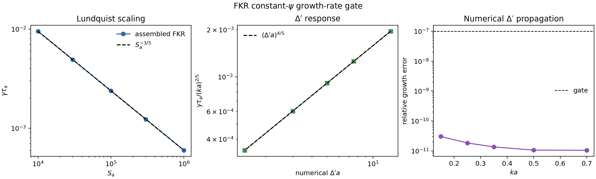
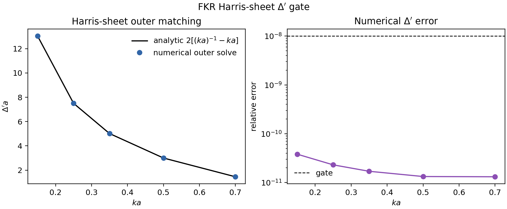
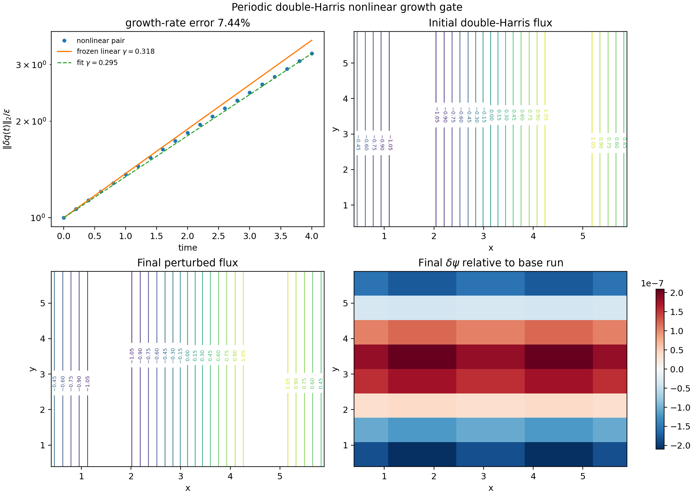
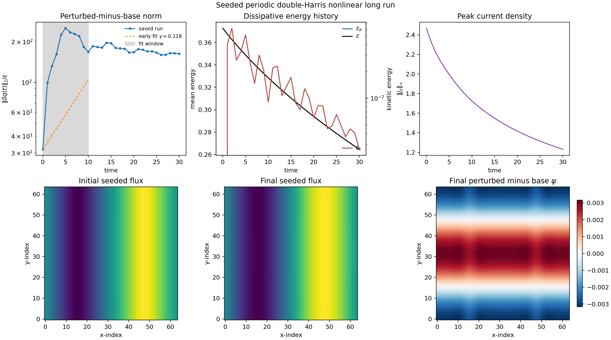
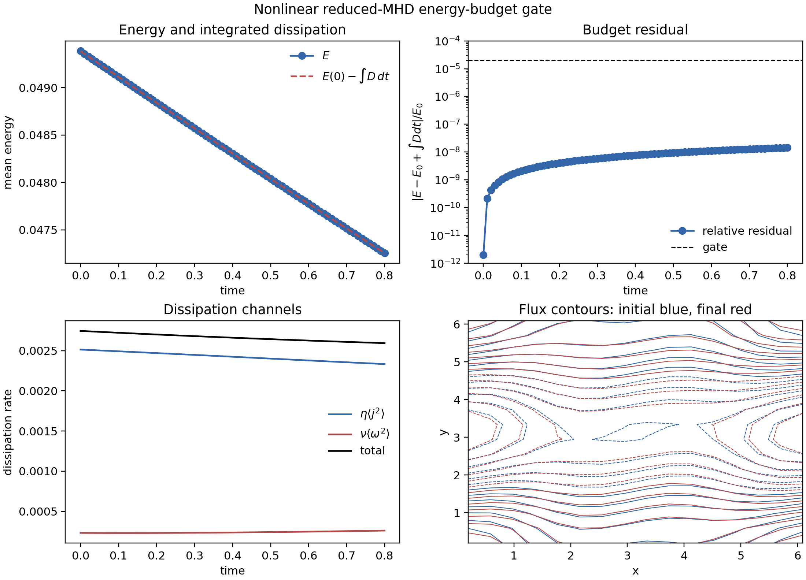

# Physics validation

MHX validation tests should have explicit physics gates, not just smoke-run
assertions. The first active gate is exact resistive diffusion of a single
periodic Fourier mode. This is the linear induction-equation limit of
resistive reduced MHD and is a prerequisite for credible tearing-mode,
plasmoid, and extended-MHD studies.

## Exact resistive decay

With zero flow and one flux mode,

$$
\psi(x,y,0)=\cos(k_x x + k_y y), \qquad \omega(x,y,0)=0,
$$

the reduced-MHD flux equation collapses to

$$
\partial_t\psi = \eta\nabla^2\psi.
$$

The exact solution is

$$
\psi(x,y,t)=\psi(x,y,0)\exp(-\eta |k|^2 t),
\qquad |k|^2=k_x^2+k_y^2,
$$

and magnetic energy must decay as

$$
E_B(t)=E_B(0)\exp(-2\eta |k|^2t).
$$

These gates test the spectral Laplacian sign convention, RK4 time stepping,
mode diagnostics, energy diagnostics, output files, and plotting path.

Run the validation:

```bash
mhx benchmark decay --outdir outputs/benchmarks/resistive_decay
```

Expected files:

- `outputs/benchmarks/resistive_decay/diagnostics.json`
- `outputs/benchmarks/resistive_decay/validation.json`
- `outputs/benchmarks/resistive_decay/decay_history.npz`
- `outputs/benchmarks/resistive_decay/figures/decay_amplitude.png`
- `outputs/benchmarks/resistive_decay/figures/decay_energy.png`
- `outputs/benchmarks/resistive_decay/figures/decay_relative_error.png`

Regenerate the documentation figures:

```bash
python examples/make_validation_media.py
```

Run every active FAST validation gate and write a single reviewer-facing
summary:

```bash
mhx validate all --outdir outputs/validation_suite
```

The suite writes `validation_suite.json`, `validation_suite.md`,
`artifact_manifest.json`, and one subdirectory per validation case.

## Validation figures

The numerical mode amplitude is visually indistinguishable from
$A_0\exp(-\eta |k|^2t)$ at FAST settings.


The magnetic energy follows the required $E_B(0)\exp(-2\eta |k|^2t)$ law.


The relative-error plot is the reviewer-facing numerical gate. The corresponding
unit test fails if amplitude, energy, fitted rate, monotonicity, or final-field
L2 gates exceed documented tolerances.


## Literature anchors

The exact-decay test is deliberately simpler than a tearing eigenvalue problem,
but it validates the finite-resistivity induction term used in classical
resistive-MHD reconnection theory. The benchmark roadmap then builds toward
the [FKR tearing mode](https://cir.nii.ac.jp/crid/1363107370207531008),
[plasmoid instability scalings](https://arxiv.org/abs/astro-ph/0703631), and
ideal-tearing regimes. For broader reconnection context, see Biskamp's
[Magnetic Reconnection in Plasmas](https://www.cambridge.org/core/books/magnetic-reconnection-in-plasmas/bibliography/AE068F5AE38E940925A4291E3087F02D)
and the MHX [literature page](literature.md).

## Source links

- [Validation implementation](https://github.com/uwplasma/MHX/blob/main/src/mhx/benchmarks/decay.py)
- [Validation tests](https://github.com/uwplasma/MHX/blob/main/tests/test_resistive_decay_validation.py)
- [Plotting helpers](https://github.com/uwplasma/MHX/blob/main/src/mhx/plotting/reduced_mhd.py)

## Seed-robust QI validation

MHX now includes a FAST seed-robust quality-indicator lane. It adds tiny
smooth, zero-mean perturbations to the reduced-MHD tearing initial condition and
gates whether `gamma_fit`, final energies, and spectral magnetic-divergence
diagnostics are stable across the seed ensemble.

The CLI command is:

```bash
mhx benchmark seed-robust-qi --outdir outputs/benchmarks/seed_robust_qi
```

The manifest is `claim_level = "validation"`. This supports only local FAST
metric-sensitivity claims, not turbulent ensemble uncertainty quantification or
production plasmoid statistics.

Source anchors:

- [QI implementation](https://github.com/uwplasma/MHX/blob/main/src/mhx/benchmarks/seed_robust_qi.py)
- [Validation-suite registry](https://github.com/uwplasma/MHX/blob/main/src/mhx/benchmarks/suite.py)
- [QI documentation](seed_robust_qi.md)

## Reconnection scaling gates

The next validation layer checks that MHX's analytic benchmark scaffolds encode
the literature exponents that future numerical benchmarks must recover.

For constant-$\psi$ FKR tearing, using the Harris-sheet proxy

$$
\Delta'a = 2\left[(ka)^{-1}-ka\right],
$$

MHX gates the order-unity-coefficient-free scalings

$$
\gamma\tau_a \sim S_a^{-3/5}(ka)^{2/5}(\Delta'a)^{4/5},
\qquad
\delta/a \sim S_a^{-2/5}(ka)^{-2/5}(\Delta'a)^{1/5}.
$$


For a Sweet-Parker current sheet, the Loureiro--Schekochihin--Cowley plasmoid
theory predicts

$$
\gamma_{\max}\tau_A \sim S^{1/4}, \qquad k_{\max}L \sim S^{3/8}.
$$


For ideal tearing, MHX checks the Pucci--Velli aspect-ratio scaling

$$
a/L \sim S^{-1/3}.
$$


Run the scaling gates:

```bash
mhx benchmark scaling --outdir outputs/benchmarks/reconnection_scaling
```

Expected files:

- `outputs/benchmarks/reconnection_scaling/diagnostics.json`
- `outputs/benchmarks/reconnection_scaling/validation.json`
- `outputs/benchmarks/reconnection_scaling/scaling_history.npz`
- `outputs/benchmarks/reconnection_scaling/figures/fkr_scaling.png`
- `outputs/benchmarks/reconnection_scaling/figures/plasmoid_scaling.png`
- `outputs/benchmarks/reconnection_scaling/figures/ideal_tearing_scaling.png`

These gates do not prove the PDE solver has recovered FKR or plasmoid growth.
They make the expected exponents explicit, tested, plotted, and reviewable so
that future eigenmode and nonlinear-current-sheet benchmarks have fixed targets.

## FKR constant-psi regime window

The FKR estimate is only appropriate in a restricted asymptotic window. MHX now
ships a separate analytic gate that samples wavenumbers at fixed local
Lundquist number and checks:

$$
\Delta'a > 0,\qquad \delta/a \le \delta_{\max},\qquad
\Delta'\delta \le \epsilon_{\max}.
$$

The last condition is the constant-$\psi$ gate; large values move toward the
Coppi large-$\Delta'$ regime and should not be judged against the FKR
constant-$\psi$ scaling.

```bash
mhx benchmark fkr-window --outdir outputs/benchmarks/fkr_window
```

Expected files:

- `outputs/benchmarks/fkr_window/diagnostics.json`
- `outputs/benchmarks/fkr_window/validation.json`
- `outputs/benchmarks/fkr_window/fkr_window.npz`
- `outputs/benchmarks/fkr_window/figures/fkr_constant_psi_window.png`


## FKR growth-rate gate

The next layer converts the numerically recovered Harris outer-region
$\Delta'a$ into the FKR constant-$\psi$ growth-rate estimate. MHX gates

$$
\gamma\tau_a \propto S_a^{-3/5}
$$

at fixed $ka$ and

$$
\frac{\gamma\tau_a}{(ka)^{2/5}} \propto (\Delta'a)^{4/5}
$$

at fixed $S_a$. The $\Delta'a$ values used in the second scan come from the
same backward-integration outer solve used by the Harris Delta-prime gate, so
the benchmark now checks propagation from numerical outer matching into the
growth-rate assembly.

```bash
mhx benchmark fkr-growth --outdir outputs/benchmarks/fkr_growth_rate
```

Expected files:

- `outputs/benchmarks/fkr_growth_rate/diagnostics.json`
- `outputs/benchmarks/fkr_growth_rate/validation.json`
- `outputs/benchmarks/fkr_growth_rate/fkr_growth_rate.npz`
- `outputs/benchmarks/fkr_growth_rate/figures/fkr_growth_rate.png`



This is still an asymptotic growth-rate assembly gate, not a full resistive
inner-layer or global eigenvalue solve. The direct eigenvalue gate below closes
one targeted part of that gap for a published Harris-sheet test case; broader
FKR/Coppi scans still require a documented asymptotic-resolution study.

## Harris-sheet Delta-prime gate

The first numerical tearing-specific validation is the Harris-sheet ideal outer
equation. With

$$
B_y/B_0=\tanh(x/a),\qquad \xi=x/a,
$$

the zero-inertia outer equation for the tearing-parity flux eigenfunction is

$$
\frac{d^2\psi}{d\xi^2}
-
\left[(ka)^2 - 2\,\operatorname{sech}^2\xi\right]\psi=0.
$$

The decaying solution on each side of the sheet gives the FKR matching
parameter

$$
\Delta'a =
2\frac{\psi'(0^+)}{\psi(0)}
=2\left[(ka)^{-1}-ka\right].
$$

MHX now integrates this outer ODE numerically from large positive $\xi$ back to
the resonant surface and gates the recovered $\Delta'a$ against the analytic
formula. This is more substantial than plotting the formula, but it still is
not the full resistive inner-layer eigenvalue solve.

```bash
mhx benchmark harris-delta-prime --outdir outputs/benchmarks/harris_delta_prime
```

Expected files:

- `outputs/benchmarks/harris_delta_prime/diagnostics.json`
- `outputs/benchmarks/harris_delta_prime/validation.json`
- `outputs/benchmarks/harris_delta_prime/harris_delta_prime.npz`
- `outputs/benchmarks/harris_delta_prime/figures/harris_delta_prime.png`



## Direct Harris-sheet tearing eigenvalue gate

MHX now includes a direct 1D linear tearing eigenproblem benchmark anchored to
published reduced-MHD calculations. For a Harris sheet,

$$
B_y/B_0=\tanh(x/a),
$$

normal-mode perturbations proportional to $\exp(iky+\sigma t)$ satisfy the
inviscid linear reduced-MHD system

$$
\sigma\left(\frac{d^2}{dx^2}-k^2\right)u
=
ikB\left(\frac{d^2}{dx^2}-k^2\right)b
-ikB''b,
$$

$$
\sigma b
=
ikBu
+S^{-1}\left(\frac{d^2}{dx^2}-k^2\right)b.
$$

The benchmark uses conducting/no-slip perturbation boundaries,

$$
u=b=0\qquad \text{at}\qquad x=\pm d,
$$

with $S=1000$, $ka=0.5$, and $d/a=10$. It solves the dense finite-difference
operator on three grids, extrapolates the growth rate linearly in $\Delta x^2$,
and gates against the published tearing eigenvalue $\gamma\simeq0.0131$.
Additional gates check that the selected eigenvalue is real and positive, the
dense eigenpair residual is small, grid refinement decreases the finite-grid
growth rate, and the selected mode has tearing parity: $b(x)=b(-x)$ with odd
stream-function perturbation. A stable-control solve at $ka=1.2$ checks the
same operator has no positive-growth eigenvalue outside the tearing-unstable
$0<ka<1$ interval.

Run the gate:

```bash
mhx benchmark linear-tearing-eigenvalue \
  --outdir outputs/benchmarks/linear_tearing_eigenvalue
```

Expected files:

- `outputs/benchmarks/linear_tearing_eigenvalue/diagnostics.json`
- `outputs/benchmarks/linear_tearing_eigenvalue/validation.json`
- `outputs/benchmarks/linear_tearing_eigenvalue/linear_tearing_eigenvalue.npz`
- `outputs/benchmarks/linear_tearing_eigenvalue/figures/linear_tearing_eigenvalue.png`


This is a materially stronger tearing validation than the analytic scaling and
outer-region gates, but it is still a single reference eigenproblem. It does not
yet establish production nonlinear reconnection fidelity, Coppi-regime
dispersion curves, or plasmoid dynamics.

## Finite-domain tearing dispersion gate

The next validation layer repeats the same finite-difference eigenproblem over
a small $ka$ scan. This is deliberately a FAST finite-domain gate, not a
production asymptotic scan. It checks:

$$
\operatorname{Re}\lambda(ka)>0 \quad\text{for sampled}\quad 0<ka<1,
$$

$$
\operatorname{Re}\lambda(ka)\le 0 \quad\text{for sampled}\quad ka>1,
$$

plus dense eigenpair residuals and the same $ka=0.5$ literature anchor used by
the direct eigenvalue gate. The default samples are
$ka=(0.3,0.5,0.7,0.9,1.1,1.2)$ at $S=1000$ and $d/a=10$.

Run the scan:

```bash
mhx benchmark linear-tearing-dispersion \
  --outdir outputs/benchmarks/linear_tearing_dispersion
```

Expected files:

- `outputs/benchmarks/linear_tearing_dispersion/diagnostics.json`
- `outputs/benchmarks/linear_tearing_dispersion/validation.json`
- `outputs/benchmarks/linear_tearing_dispersion/linear_tearing_dispersion.npz`
- `outputs/benchmarks/linear_tearing_dispersion/figures/linear_tearing_dispersion.png`


The scan is useful because it catches sign mistakes that a single unstable
eigenvalue cannot: the code must recover an unstable tearing band below
$ka=1$ and stable oscillatory controls above $ka=1$. The remaining
research-grade target is a higher-resolution Lundquist-number sweep that
separates constant-$\psi$ FKR and large-$\Delta'$ Coppi branches.

## Harris eigenfunction layer gate

The direct eigenvalue and dispersion gates verify growth rates and residuals.
They do not by themselves verify that the selected eigenfunction has the
expected resonant-surface localization. MHX therefore adds a conservative FAST
shape gate over a Lundquist-number scan. For each sampled $S$, it solves the
same Harris eigenproblem and measures half-maximum widths for:

$$
b(x),\qquad \operatorname{Im}u(x),\qquad
j_1(x)=-\left(\frac{d^2}{dx^2}-k^2\right)b(x).
$$

The validation gates are deliberately qualitative:

$$
\Delta_u(S_1)>\Delta_u(S_2)>\cdots,\qquad
\operatorname{spread}(\Delta_b)/\langle\Delta_b\rangle \ll 1,
$$

where $\Delta_u$ is the flow-layer half-width and $\Delta_b$ is the outer flux
half-width. The fitted slopes are recorded and checked only against broad FAST
ranges. They should not be interpreted as production FKR/Coppi exponents.

```bash
mhx benchmark linear-tearing-layer \
  --outdir outputs/benchmarks/linear_tearing_layer
```

Expected files:

- `outputs/benchmarks/linear_tearing_layer/diagnostics.json`
- `outputs/benchmarks/linear_tearing_layer/validation.json`
- `outputs/benchmarks/linear_tearing_layer/linear_tearing_layer.npz`
- `outputs/benchmarks/linear_tearing_layer/figures/linear_tearing_layer.png`


This gate is useful because it catches a different class of failure than a
growth-rate check: an implementation can select a plausible eigenvalue while
returning a poorly localized or mis-phased eigenfunction. The current gate
confirms monotonic narrowing of the flow layer and stability of the outer flux
envelope in the FAST scan.

## Time-domain Harris eigenmode replay

A growth-rate diagnostic is only useful if it recovers the known rate from a
time signal. MHX therefore reuses the same direct Harris-sheet operator
$L$ and selected eigenvector $q_0$ from the eigenvalue gate, then integrates

$$
\frac{dq}{dt}=Lq,\qquad q(0)=q_0,\qquad Lq_0=\lambda q_0 .
$$

For a pure eigenmode,

$$
\|q(t)\|_2 = \|q_0\|_2\exp(\operatorname{Re}\lambda\,t).
$$

The benchmark advances the finite-dimensional system with RK4, fits
$\log\|q(t)\|_2$ over the configured window, and gates:

$$
\frac{|\gamma_\mathrm{fit}-\operatorname{Re}\lambda|}
     {|\operatorname{Re}\lambda|}\le \epsilon_\gamma,
\qquad
\max_t\frac{|\|q(t)\|_2-\exp(\operatorname{Re}\lambda t)|}
          {\exp(\operatorname{Re}\lambda t)}
\le \epsilon_A .
$$

It also verifies that the final state remains aligned with the initial
eigenvector. This closes the loop between eigenvalue calculation, time
integration, and growth fitting. It is still a linear finite-domain replay; it
does not claim nonlinear island growth or saturation.

```bash
mhx benchmark linear-tearing-timedomain \
  --outdir outputs/benchmarks/linear_tearing_timedomain
```

Expected files:

- `outputs/benchmarks/linear_tearing_timedomain/diagnostics.json`
- `outputs/benchmarks/linear_tearing_timedomain/validation.json`
- `outputs/benchmarks/linear_tearing_timedomain/linear_tearing_timedomain.npz`
- `outputs/benchmarks/linear_tearing_timedomain/figures/linear_tearing_timedomain.png`


## Matrix-free linearized RHS

Tearing eigenmode calculations require a linearized operator
$\mathcal{L}=\partial F/\partial q$ for the reduced-MHD state
$q=(\psi,\omega)$. MHX exposes this as a matrix-free Jacobian-vector product:

$$
\mathcal{L}(q)\,\delta q
=
\left.\frac{d}{d\epsilon}F(q+\epsilon\delta q)\right|_{\epsilon=0},
$$

computed by JAX forward-mode automatic differentiation. The validation gate
compares that JVP against the centered finite-difference approximation

$$
\frac{F(q+\epsilon\delta q)-F(q-\epsilon\delta q)}{2\epsilon}.
$$

```bash
mhx benchmark linearized-rhs --outdir outputs/benchmarks/linearized_rhs
```

Expected files:

- `outputs/benchmarks/linearized_rhs/diagnostics.json`
- `outputs/benchmarks/linearized_rhs/validation.json`
- `outputs/benchmarks/linearized_rhs/linearized_rhs.npz`
- `outputs/benchmarks/linearized_rhs/figures/linearized_rhs_errors.png`


## Reduced-MHD linear eigenmode gate

At zero flux and zero flow, the reduced-MHD JVP operator decouples into two
Fourier diffusion blocks:

$$
\partial_t\delta\psi = \eta\nabla^2\delta\psi,\qquad
\partial_t\delta\omega = \nu\nabla^2\delta\omega.
$$

For a periodic Fourier mode $\sin(k_xx+k_yy)$, the expected eigenvalues are

$$
\lambda_\psi = -\eta(k_x^2+k_y^2),\qquad
\lambda_\omega = -\nu(k_x^2+k_y^2).
$$

This gate applies `linearized_reduced_mhd_operator` to flattened
$(\delta\psi,\delta\omega)$ vectors and checks Rayleigh quotients and
eigen-residuals for both blocks. It is the first physics-facing use of the full
flattened reduced-MHD linear operator; nonzero-equilibrium tearing eigenmodes
will build on this path.

```bash
mhx benchmark reduced-mhd-eigenmode --outdir outputs/benchmarks/reduced_mhd_eigenmode
```

Expected files:

- `outputs/benchmarks/reduced_mhd_eigenmode/diagnostics.json`
- `outputs/benchmarks/reduced_mhd_eigenmode/validation.json`
- `outputs/benchmarks/reduced_mhd_eigenmode/reduced_mhd_linear_eigenmode.npz`
- `outputs/benchmarks/reduced_mhd_eigenmode/figures/reduced_mhd_linear_eigenmode_errors.png`


## Nonzero cosine-equilibrium linearization gate

The next step toward a tearing eigenmode calculation is to validate the
linearized operator on a nonzero current-sheet equilibrium. MHX uses the
periodic equilibrium

$$
\psi_0=A\cos(k_y y),\qquad \omega_0=0,
$$

and checks exact Poisson-bracket couplings for two perturbations.

First, a pure vorticity perturbation $\delta\omega=\cos(k_xx)$ gives
$\delta\phi=-\cos(k_xx)/k_x^2$. The flux equation contains flow advection of
the equilibrium field:

$$
\partial_t\delta\psi
=-[\delta\phi,\psi_0]
=A\frac{k_y}{k_x}\sin(k_xx)\sin(k_yy),
\qquad
\partial_t\delta\omega=-\nu k_x^2\cos(k_xx).
$$

Second, a pure flux perturbation
$\delta\psi=\cos(k_xx)\cos(2k_yy)$ checks magnetic tension:

$$
\partial_t\delta\omega
=[\delta\psi,\nabla^2\psi_0]+[\psi_0,\nabla^2\delta\psi]
=A k_x k_y (k_x^2+4k_y^2-k_y^2)
  \sin(k_xx)\sin(k_yy)\cos(2k_yy),
$$

while the flux block diffuses as

$$
\partial_t\delta\psi=-\eta(k_x^2+4k_y^2)\delta\psi.
$$

This gate does not claim an FKR growth rate. It validates the exact nonzero
equilibrium coupling terms that the FKR/plasmoid eigenmode benchmarks will
depend on.

```bash
mhx benchmark cosine-equilibrium-linearization \
  --outdir outputs/benchmarks/cosine_equilibrium_linearization
```

Expected files:

- `outputs/benchmarks/cosine_equilibrium_linearization/diagnostics.json`
- `outputs/benchmarks/cosine_equilibrium_linearization/validation.json`
- `outputs/benchmarks/cosine_equilibrium_linearization/cosine_equilibrium_linearization.npz`
- `outputs/benchmarks/cosine_equilibrium_linearization/figures/cosine_equilibrium_linearization_errors.png`


## Periodic current-sheet eigenvalue gate

The first nonzero-equilibrium spectrum gate now assembles the full flattened
JVP matrix on a deliberately tiny grid for

$$
\psi_0=A\cos(2\pi y/L_y),\qquad \omega_0=0.
$$

This is still not an FKR/Coppi growth-rate claim. It is a conservative
operator-stability gate between exact bracket tests and future asymptotic
tearing benchmarks. The benchmark checks:

$$
\|L\,\mathbf{1}_\psi\|_2 \approx 0,\qquad
\|L\,\mathbf{1}_\omega\|_2 \approx 0,
$$

for the two mean/gauge modes, solves the complete dense spectrum, and requires
the non-gauge spectrum to be damped:

$$
\max_{\lambda\notin\mathrm{gauge}}\operatorname{Re}\lambda
\le
-c\,\min(\eta,\nu)\,k_{\min}^2,
$$

with $c=0.25$ in the FAST gate. It also stores the selected dense eigenpair and
checks the residual

$$
\frac{\|Lv-\lambda v\|_2}{\|v\|_2}
$$

against a tight x64 tolerance.

```bash
mhx benchmark current-sheet-eigenvalue \
  --outdir outputs/benchmarks/periodic_current_sheet_eigenvalue
```

Expected files:

- `outputs/benchmarks/periodic_current_sheet_eigenvalue/diagnostics.json`
- `outputs/benchmarks/periodic_current_sheet_eigenvalue/validation.json`
- `outputs/benchmarks/periodic_current_sheet_eigenvalue/periodic_current_sheet_eigenvalue.npz`
- `outputs/benchmarks/periodic_current_sheet_eigenvalue/figures/periodic_current_sheet_spectrum.png`


## Periodic current-sheet time-domain replay

The dense spectrum gate proves that the assembled periodic current-sheet JVP has
the expected gauge modes and a damped non-gauge spectrum on the FAST grid. The
time-domain replay adds the next solver-level check: select a real decaying
eigenmode of the same operator and integrate

$$
\frac{d q}{dt}=Lq,\qquad q(0)=v,\qquad Lv=\lambda v.
$$

For this linear initial value problem the exact solution is

$$
q(t)=e^{\lambda t}v .
$$

The benchmark advances $q$ with the RK4 path used by MHX validation workflows,
then gates both the full state-vector error and the decay-rate fit from
$\log\|q(t)\|_2$:

$$
\epsilon_q(t)=\frac{\|q_{\mathrm{RK4}}(t)-e^{\lambda t}v\|_2}
{\|e^{\lambda t}v\|_2},\qquad
\gamma_{\mathrm{fit}}\approx \lambda .
$$

This is deliberately a linear operator/time-step bridge, not a nonlinear
magnetic-island or FKR/Coppi tearing-growth claim.

```bash
mhx benchmark current-sheet-timedomain \
  --outdir outputs/benchmarks/periodic_current_sheet_timedomain
```

Expected files:

- `outputs/benchmarks/periodic_current_sheet_timedomain/diagnostics.json`
- `outputs/benchmarks/periodic_current_sheet_timedomain/validation.json`
- `outputs/benchmarks/periodic_current_sheet_timedomain/periodic_current_sheet_timedomain.npz`
- `outputs/benchmarks/periodic_current_sheet_timedomain/figures/periodic_current_sheet_timedomain.png`


## Nonlinear current-sheet differentiability bridge

The linear replay gate validates a frozen operator. The next differentiable
solver gate validates the nonlinear RK4 time map used by actual MHX runs. Let
$\Phi(q_0)$ be the map from an initial reduced-MHD state to the saved trajectory
vector after several RK4 steps. Around the periodic current sheet
$q_0=(\psi_0,\omega_0)$, JAX gives a tangent

$$
\delta \Phi = D\Phi(q_0)[p].
$$

MHX compares that tangent to centered finite differences of full nonlinear
trajectories:

$$
\delta \Phi_\epsilon =
\frac{\Phi(q_0+\epsilon p)-\Phi(q_0-\epsilon p)}{2\epsilon}.
$$

For a smooth RHS and x64 arithmetic, the error should converge as

$$
\frac{\|\delta \Phi_\epsilon-\delta\Phi\|_2}{\|\delta\Phi\|_2}
= O(\epsilon^2)
$$

until roundoff. This gate is specifically aimed at differentiable programming
claims: before MHX trains neural ODEs, adjoints, or inverse-design loops on
solver trajectories, the trajectory map itself must have a verified tangent.

```bash
mhx benchmark current-sheet-nonlinear-bridge \
  --outdir outputs/benchmarks/periodic_current_sheet_nonlinear_bridge
```

Expected files:

- `outputs/benchmarks/periodic_current_sheet_nonlinear_bridge/diagnostics.json`
- `outputs/benchmarks/periodic_current_sheet_nonlinear_bridge/validation.json`
- `outputs/benchmarks/periodic_current_sheet_nonlinear_bridge/periodic_current_sheet_nonlinear_bridge.npz`
- `outputs/benchmarks/periodic_current_sheet_nonlinear_bridge/figures/periodic_current_sheet_nonlinear_bridge.png`


## Periodic double-Harris nonlinear growth gate

The stable cosine-current-sheet spectrum above is intentionally conservative:
it protects the code from spurious positive growth but does not demonstrate
tearing. MHX now adds a small-grid instability gate using a periodic
double-Harris sheet,

$$
B_y(x)=A\left[\tanh\left(\frac{x-L_x/4}{a}\right)
-\tanh\left(\frac{x-3L_x/4}{a}\right)-1\right],
$$

with a zero-mean flux $\psi_0$ satisfying $B_y=\partial_x\psi_0$ to the sign
convention used by the reduced-MHD solver. The gate assembles the dense
matrix-free Jacobian $L=D F(\psi_0,0)$, selects the fastest non-gauge unstable
eigenmode $Lv=\gamma v$, and advances two full nonlinear trajectories:

$$
q_b(t)=\Phi_t(q_0),\qquad
q_p(t)=\Phi_t(q_0+\epsilon v).
$$

The measured finite-amplitude difference

$$
A(t)=\frac{\|q_p(t)-q_b(t)\|_2}{\epsilon}
$$

must grow by more than a factor of two and its fitted rate must remain within a
documented tolerance of the frozen-base eigenvalue. This is the first MHX
validation artifact that shows a physically unstable current sheet growing in
the nonlinear solver. It is still **not** a Rutherford-island or plasmoid-chain
production claim: the grid is deliberately tiny, the base sheet is periodic,
and publication claims still require duration, resolution, time-step, seed, and
aspect-ratio sweeps. The literature anchors are the classical tearing-mode
instability of Furth--Killeen--Rosenbluth
([Physics of Fluids 6, 459, 1963](https://cir.nii.ac.jp/crid/1363107370207531008))
and the high-Lundquist-number plasmoid-chain scalings of
Loureiro--Schekochihin--Cowley
([arXiv:astro-ph/0703631](https://arxiv.org/abs/astro-ph/0703631)), with
later nonlinear plasmoid-chain simulations by Samtaney et al.
([arXiv:0903.0542](https://arxiv.org/abs/0903.0542)).

```bash
mhx benchmark double-harris-growth \
  --outdir outputs/benchmarks/periodic_double_harris_nonlinear_growth
```

Expected files:

- `outputs/benchmarks/periodic_double_harris_nonlinear_growth/diagnostics.json`
- `outputs/benchmarks/periodic_double_harris_nonlinear_growth/validation.json`
- `outputs/benchmarks/periodic_double_harris_nonlinear_growth/periodic_double_harris_nonlinear_growth.npz`
- `outputs/benchmarks/periodic_double_harris_nonlinear_growth/figures/periodic_double_harris_nonlinear_growth.png`



## Seeded double-Harris long-run validation

The dense eigenmode gate above is intentionally tiny because it assembles the
full Jacobian. The next bridge is a scalable nonlinear run that does **not**
assemble the dense spectrum. It advances a base periodic double-Harris sheet
and a seeded sheet,

$$
q_b(t)=\Phi_t(q_0),\qquad
q_s(t)=\Phi_t(q_0+\epsilon\cos(2x)\cos y),
$$

and tracks the normalized difference, total energy, kinetic energy, and peak
current density:

$$
A_s(t)=\frac{\|q_s(t)-q_b(t)\|_2}{\epsilon},\qquad
E(t)=\frac{1}{2}\langle |\nabla\psi|^2+|\nabla\phi|^2\rangle,\qquad
\|j_z\|_\infty=\|-\nabla^2\psi\|_\infty .
$$

This command is meant for bounded nonlinear evidence runs under laptop/CI
budgets and for producing reviewer-visible movies before a full production
campaign. It gates finite histories, full-duration completion, an early-time
growth fit, visible maximum amplification, and dissipative total-energy
behavior. The committed `64×64`, `t_end=30` evidence bundle gives
`gamma_early = 0.118`, early amplification `5.27×`, maximum amplification
`7.89×`, and zero measured total-energy increase. The result is stronger than
a smoke test, but it remains a validation artifact rather than a converged
Rutherford/plasmoid claim because the late-time perturbation saturates/relaxes
and no resolution/seed/aspect-ratio sweep has yet closed.

```bash
mhx benchmark double-harris-long-run \
  --outdir outputs/benchmarks/periodic_double_harris_seeded_long_run \
  --nx 64 --ny 64 --t-end 30 --save-every 100 --movies
```

Expected files:

- `outputs/benchmarks/periodic_double_harris_seeded_long_run/diagnostics.json`
- `outputs/benchmarks/periodic_double_harris_seeded_long_run/validation.json`
- `outputs/benchmarks/periodic_double_harris_seeded_long_run/periodic_double_harris_seeded_long_run.npz`
- `outputs/benchmarks/periodic_double_harris_seeded_long_run/figures/periodic_double_harris_seeded_long_run.png`
- `outputs/benchmarks/periodic_double_harris_seeded_long_run/figures/periodic_double_harris_flux.gif`
- `outputs/benchmarks/periodic_double_harris_seeded_long_run/figures/periodic_double_harris_current.gif`




Source anchors:

- [double-Harris equilibrium](https://github.com/uwplasma/MHX/blob/main/src/mhx/physics/equilibria.py)
- [growth and long-run benchmark implementation](https://github.com/uwplasma/MHX/blob/main/src/mhx/benchmarks/current_sheet.py)
- [growth benchmark tests](https://github.com/uwplasma/MHX/blob/main/tests/test_current_sheet_eigenvalue_validation.py)

## Nonlinear reduced-MHD energy budget

The first full nonlinear PDE gate is deliberately not a plasmoid claim. It
checks the periodic reduced-MHD energy theorem under the complete nonlinear
Poisson-bracket RHS. For

$$
E(t)=\frac{1}{2}\left\langle |\nabla\psi|^2+|\nabla\phi|^2\right\rangle,
\qquad \nabla^2\phi=\omega,\qquad j=-\nabla^2\psi,
$$

periodic integration by parts gives

$$
\frac{dE}{dt}=-\eta\langle j^2\rangle-\nu\langle\omega^2\rangle.
$$

This identity is a strong nonlinear sign/cancellation check: the advection and
magnetic-tension brackets must cancel in the energy balance, while the
resistive and viscous terms must remove energy. MHX starts from a multi-mode
state with active nonlinear RHS, advances the full nonlinear RK4 solver, and
gates:

- all saved arrays are finite;
- the initial nonlinear RHS norm is a nontrivial fraction of the full RHS;
- total energy is nonincreasing;
- the integrated residual
  $|E(t)-E(0)+\int_0^t[\eta\langle j^2\rangle+\nu\langle\omega^2\rangle]dt|/E(0)$
  stays below tolerance;
- net dissipative energy loss is observed.

```bash
mhx benchmark nonlinear-energy-budget \
  --outdir outputs/benchmarks/nonlinear_energy_budget
```

Expected files:

- `outputs/benchmarks/nonlinear_energy_budget/diagnostics.json`
- `outputs/benchmarks/nonlinear_energy_budget/validation.json`
- `outputs/benchmarks/nonlinear_energy_budget/nonlinear_energy_budget.npz`
- `outputs/benchmarks/nonlinear_energy_budget/figures/nonlinear_energy_budget.png`



This is the most important nonlinear solver gate currently in MHX. It supports
claims about nonlinear reduced-MHD consistency, but it still does not validate
nonlinear island growth, Rutherford saturation, Sweet--Parker reconnection
rates, or plasmoid chains.

## Nonlinear duration audit

The nonlinear energy-budget gate is intentionally short. To prevent accidental
overclaiming, MHX includes a reviewer-facing duration audit. For a linear
tearing eigenmode with growth rate $\gamma$, observing $N_e$ e-folds requires

$$
t_\mathrm{end}\ge \frac{N_e}{\gamma}.
$$

Using the direct Harris benchmark anchor $\gamma\simeq0.0131$ for
$S=1000$, $ka=0.5$, ten e-folds require $t_\mathrm{end}\approx763.4$.
The current nonlinear budget run reaches $t=0.8$, so it is a code-validity
gate, not a nonlinear island or plasmoid physics result. The audit also records
Loureiro-type Sweet--Parker plasmoid one-e-fold estimates
$1/\gamma_{\max}\sim S^{-1/4}$ as a separate linear-timescale reference.

```bash
mhx benchmark nonlinear-duration-audit \
  --outdir outputs/benchmarks/nonlinear_duration_audit
```

Expected files:

- `outputs/benchmarks/nonlinear_duration_audit/diagnostics.json`
- `outputs/benchmarks/nonlinear_duration_audit/validation.json`
- `outputs/benchmarks/nonlinear_duration_audit/nonlinear_duration_audit.npz`
- `outputs/benchmarks/nonlinear_duration_audit/figures/nonlinear_duration_audit.png`


This audit is a pass/fail gate on scientific honesty: it passes only when the
current FAST nonlinear runs are explicitly flagged as too short for
Rutherford-island or plasmoid-chain claims and when the production time windows
are recorded in machine-readable artifacts.

## Duration-policy gate

The duration audit is the figure-facing view. The duration-policy gate is the
machine-readable rule that future production workflows should call before
launching long nonlinear runs:

```bash
mhx benchmark duration-policy --outdir outputs/benchmarks/duration_policy
```

Expected files:

- `outputs/benchmarks/duration_policy/duration_policy.json`
- `outputs/benchmarks/duration_policy/duration_policy.md`
- `outputs/benchmarks/duration_policy/validation.json`
- `outputs/benchmarks/duration_policy/manifest.json`

The policy gate passes when short historical/CI runs are scoped as
validation-only and when future production templates satisfy
$t_\mathrm{end}\ge s_f N_e/\gamma$. This prevents a future script from silently
using a smoke-test time window for a nonlinear reconnection claim.

## Diffusion eigenvalue scaffold

Before applying eigenvalue machinery to tearing equilibria, MHX validates the
matrix-free operator path on a single Fourier eigenfunction of the periodic
diffusion operator:

$$
\mathcal{D}\psi = \eta\nabla^2\psi,\qquad
\psi_k=\sin(k_x x+k_y y),\qquad
\lambda_k = -\eta(k_x^2+k_y^2).
$$

The benchmark computes the Rayleigh quotient

$$
\lambda_{\mathrm{RQ}} = \frac{\langle \psi_k,\mathcal{D}\psi_k\rangle}
{\langle \psi_k,\psi_k\rangle},
$$

and the relative eigen-residual

$$
\frac{\|\mathcal{D}\psi_k-\lambda_k\psi_k\|_2}{\|\psi_k\|_2}.
$$

```bash
mhx benchmark diffusion-eigenvalue --outdir outputs/benchmarks/diffusion_eigenvalue
```

Expected files:

- `outputs/benchmarks/diffusion_eigenvalue/diagnostics.json`
- `outputs/benchmarks/diffusion_eigenvalue/validation.json`
- `outputs/benchmarks/diffusion_eigenvalue/diffusion_eigenvalue.npz`
- `outputs/benchmarks/diffusion_eigenvalue/figures/diffusion_eigenvalue_errors.png`


## Power-iteration scaffold

The next eigenvalue-control-path gate validates the dominant-eigenpair iteration
on a diagonal matrix-free operator

$$
\mathcal{A}u = \operatorname{diag}(3,-1.5,0.5,0.1)u,
$$

whose dominant eigenvalue is known exactly:

$$
\lambda_\star = 3.
$$

Power iteration repeatedly applies

$$
u_{n+1}=\frac{\mathcal{A}u_n}{\|\mathcal{A}u_n\|_2},
$$

and records the Rayleigh quotient

$$
\lambda_n = \frac{\langle u_n,\mathcal{A}u_n\rangle}{\langle u_n,u_n\rangle}
$$

plus residual $\|\mathcal{A}u_n-\lambda_nu_n\|_2$. This is intentionally a
known finite-dimensional operator, not a tearing benchmark. It makes the
dominant-eigenpair loop, convergence history, plotting, schemas, CLI, and CI
artifact checks deterministic before coupling the same machinery to the
reduced-MHD JVP operator.

```bash
mhx benchmark power-iteration --outdir outputs/benchmarks/power_iteration
```

Expected files:

- `outputs/benchmarks/power_iteration/diagnostics.json`
- `outputs/benchmarks/power_iteration/validation.json`
- `outputs/benchmarks/power_iteration/power_iteration_history.npz`
- `outputs/benchmarks/power_iteration/figures/power_iteration_history.png`


## Arnoldi Ritz-spectrum scaffold

Tearing eigenmode validation needs more than a dominant-mode iteration: the
linearized reduced-MHD operator can be non-normal, and nearby Ritz values must
be handled explicitly. MHX therefore includes a deterministic Arnoldi gate on a
small non-normal upper-triangular fixture,

$$
\mathcal{A} =
\begin{bmatrix}
2 & 0.4 & 0 & 0 \\
0 & 1 & 0.1 & 0 \\
0 & 0 & -0.5 & 0.2 \\
0 & 0 & 0 & 0.1
\end{bmatrix},
$$

whose exact spectrum is the diagonal:

$$
\sigma(\mathcal{A}) = \{2, 1, -0.5, 0.1\}.
$$

The Arnoldi process constructs an orthonormal Krylov basis $Q_m$ and projected
Hessenberg matrix $H_m$,

$$
\mathcal{A}Q_m = Q_mH_m + h_{m+1,m}q_{m+1}e_m^\top.
$$

The eigenvalues of $H_m$ are Ritz values approximating the spectrum of
$\mathcal{A}$. The validation gate checks the recovered fixture spectrum,
negligible imaginary parts for this real fixture, and residual estimates
$|h_{m+1,m}e_m^\top y_i|$.

```bash
mhx benchmark arnoldi --outdir outputs/benchmarks/arnoldi
```

Expected files:

- `outputs/benchmarks/arnoldi/diagnostics.json`
- `outputs/benchmarks/arnoldi/validation.json`
- `outputs/benchmarks/arnoldi/arnoldi_spectrum.npz`
- `outputs/benchmarks/arnoldi/figures/arnoldi_ritz_values.png`


Additional source links:

- [Scaling validation implementation](https://github.com/uwplasma/MHX/blob/main/src/mhx/benchmarks/scaling.py)
- [Scaling validation tests](https://github.com/uwplasma/MHX/blob/main/tests/test_reconnection_scaling_validation.py)
- [FKR window implementation](https://github.com/uwplasma/MHX/blob/main/src/mhx/benchmarks/fkr.py)
- [FKR window tests](https://github.com/uwplasma/MHX/blob/main/tests/test_fkr_window_validation.py)
- [Direct tearing eigenvalue implementation](https://github.com/uwplasma/MHX/blob/main/src/mhx/benchmarks/tearing_eigen.py)
- [Direct tearing eigenvalue tests](https://github.com/uwplasma/MHX/blob/main/tests/test_linear_tearing_eigenvalue_validation.py)
- [Linearized RHS implementation](https://github.com/uwplasma/MHX/blob/main/src/mhx/benchmarks/linearized.py)
- [Linearized RHS tests](https://github.com/uwplasma/MHX/blob/main/tests/test_linearized_rhs_validation.py)
- [Reduced-MHD linear eigenmode implementation](https://github.com/uwplasma/MHX/blob/main/src/mhx/benchmarks/linearized.py)
- [Nonlinear energy-budget implementation](https://github.com/uwplasma/MHX/blob/main/src/mhx/benchmarks/nonlinear.py)
- [Nonlinear energy-budget tests](https://github.com/uwplasma/MHX/blob/main/tests/test_nonlinear_energy_budget_validation.py)
- [Diffusion eigenvalue implementation](https://github.com/uwplasma/MHX/blob/main/src/mhx/benchmarks/eigenvalue.py)
- [Diffusion eigenvalue tests](https://github.com/uwplasma/MHX/blob/main/tests/test_diffusion_eigenvalue_validation.py)
- [Power-iteration utilities](https://github.com/uwplasma/MHX/blob/main/src/mhx/numerics/linear_operator.py)
- [Arnoldi benchmark implementation](https://github.com/uwplasma/MHX/blob/main/src/mhx/benchmarks/eigenvalue.py)
