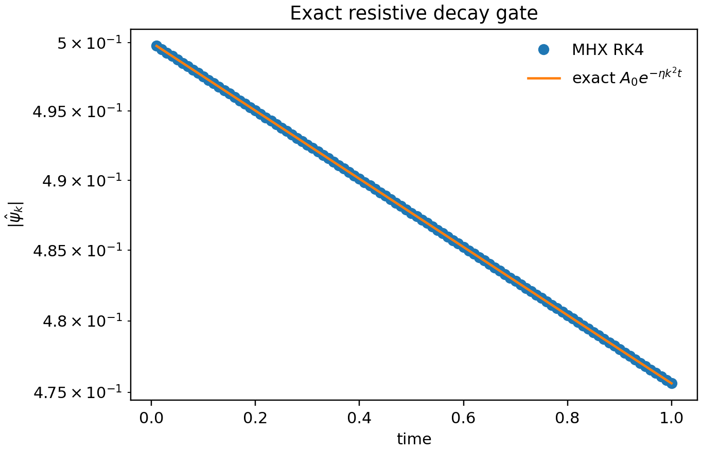
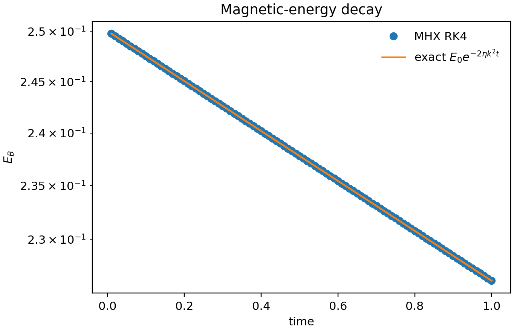
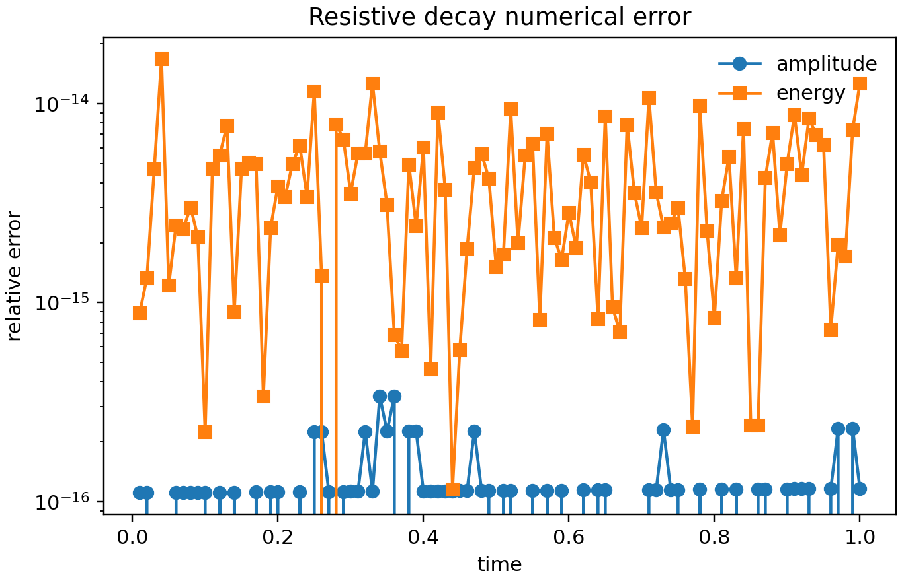

# Physics validation

MHX validation tests have explicit physics gates, not just smoke-run
assertions. The suite starts from exact resistive diffusion of a single Fourier
mode and now includes Harris tearing eigenvalue checks, nonlinear
energy-budget identities, duration guards, Orszag--Tang morphology, decaying
turbulence, forced turbulent-reconnection media with a validation-only
readiness gate, double-Harris promotion/convergence evidence, seed-QI,
neural-ODE reproducibility, and restartable campaign-executor artifacts.

## Validation figures

The numerical mode amplitude is visually indistinguishable from
$A_0\exp(-\eta |k|^2t)$ at FAST settings.

The magnetic energy follows the required $E_B(0)\exp(-2\eta |k|^2t)$ law.

The relative-error plot is the reviewer-facing numerical gate. The corresponding
unit test fails if amplitude, energy, fitted rate, monotonicity, or final-field
L2 gates exceed documented tolerances.

## Literature anchors

The exact-decay test is deliberately simpler than a tearing eigenvalue problem,
but it validates the finite-resistivity induction term used in classical
resistive-MHD reconnection theory. The benchmark roadmap then builds toward
the [FKR tearing mode](https://cir.nii.ac.jp/crid/1363107370207531008),
[plasmoid instability scalings](https://arxiv.org/abs/astro-ph/0703631), and
ideal-tearing regimes. For broader reconnection context, see Biskamp's
[Magnetic Reconnection in Plasmas](https://www.cambridge.org/core/books/magnetic-reconnection-in-plasmas/bibliography/AE068F5AE38E940925A4291E3087F02D)
and the MHX [literature page](../project/literature.md).

## Source links

- [Validation implementation](https://github.com/uwplasma/MHX/blob/main/src/mhx/benchmarks/decay.py)
- [Validation tests](https://github.com/uwplasma/MHX/blob/main/tests/test_resistive_decay_validation.py)
- [Plotting helpers](https://github.com/uwplasma/MHX/blob/main/src/mhx/plotting/reduced_mhd.py)
