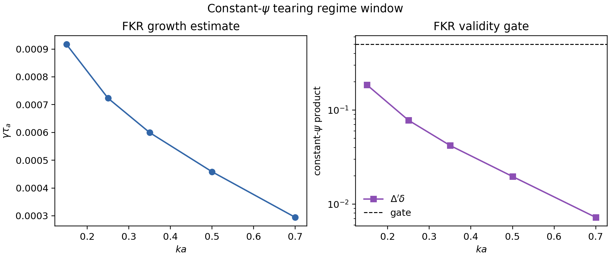
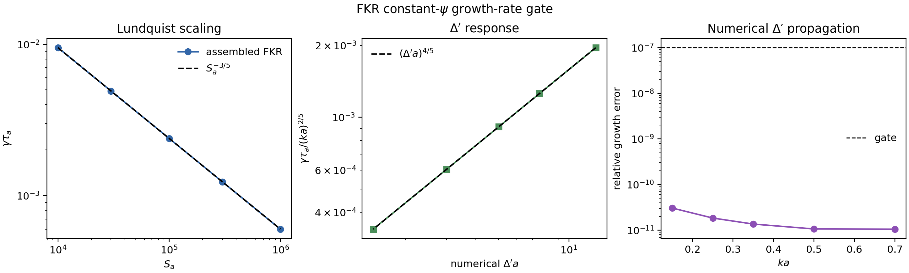
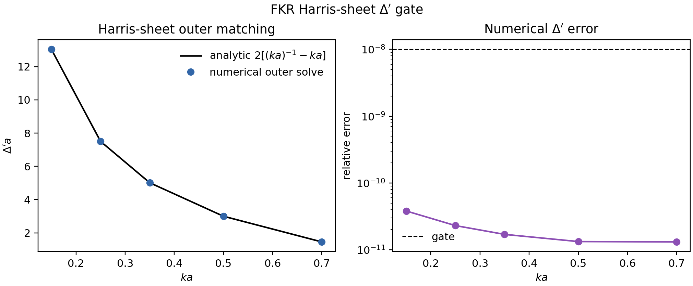
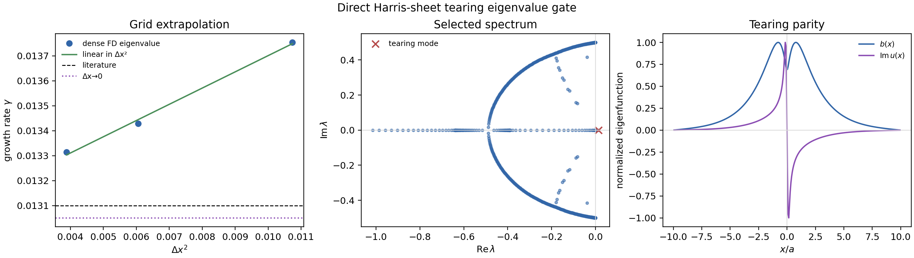
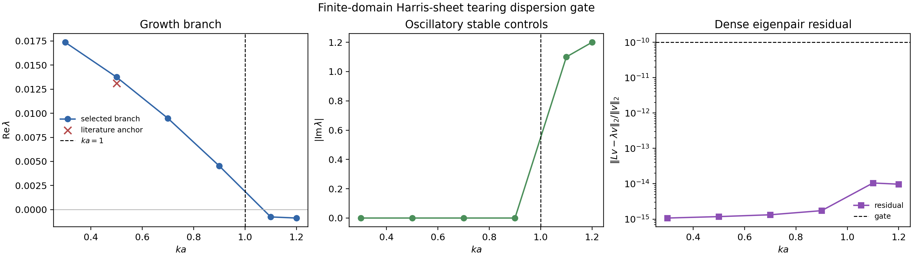
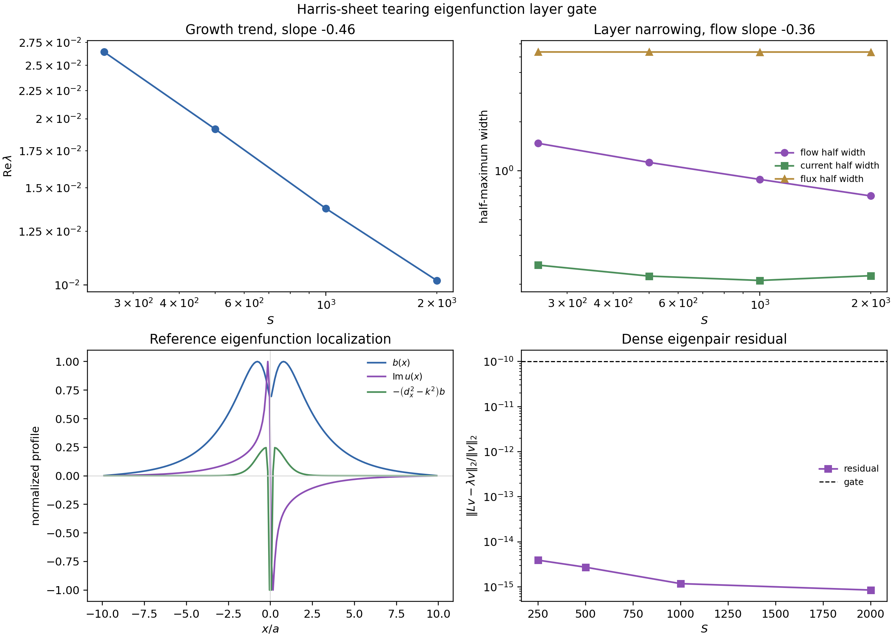
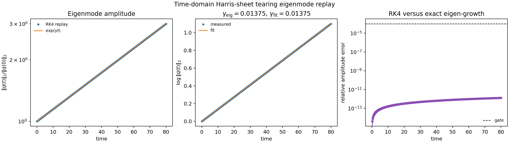
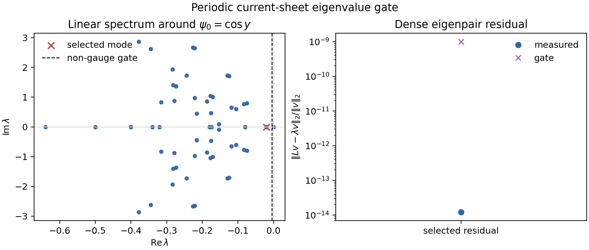
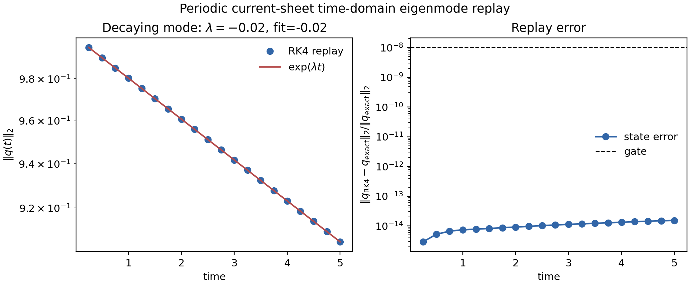

# Linear tearing gates

## FKR constant-psi regime window

The FKR estimate is only appropriate in a restricted asymptotic window. MHX now
ships a separate analytic gate that samples wavenumbers at fixed local
Lundquist number and checks:

$$
\Delta'a > 0,\qquad \delta/a \le \delta_{\max},\qquad
\Delta'\delta \le \epsilon_{\max}.
$$

The last condition is the constant-$\psi$ gate; large values move toward the
Coppi large-$\Delta'$ regime and should not be judged against the FKR
constant-$\psi$ scaling.

```bash
mhx benchmark fkr-window --outdir outputs/benchmarks/fkr_window
```

Expected files:

- `outputs/benchmarks/fkr_window/diagnostics.json`
- `outputs/benchmarks/fkr_window/validation.json`
- `outputs/benchmarks/fkr_window/fkr_window.npz`
- `outputs/benchmarks/fkr_window/figures/fkr_constant_psi_window.png`



## FKR growth-rate gate

The next layer converts the numerically recovered Harris outer-region
$\Delta'a$ into the FKR constant-$\psi$ growth-rate estimate. MHX gates

$$
\gamma\tau_a \propto S_a^{-3/5}
$$

at fixed $ka$ and

$$
\frac{\gamma\tau_a}{(ka)^{2/5}} \propto (\Delta'a)^{4/5}
$$

at fixed $S_a$. The $\Delta'a$ values used in the second scan come from the
same backward-integration outer solve used by the Harris Delta-prime gate, so
the benchmark now checks propagation from numerical outer matching into the
growth-rate assembly.

```bash
mhx benchmark fkr-growth --outdir outputs/benchmarks/fkr_growth_rate
```

Expected files:

- `outputs/benchmarks/fkr_growth_rate/diagnostics.json`
- `outputs/benchmarks/fkr_growth_rate/validation.json`
- `outputs/benchmarks/fkr_growth_rate/fkr_growth_rate.npz`
- `outputs/benchmarks/fkr_growth_rate/figures/fkr_growth_rate.png`



This is still an asymptotic growth-rate assembly gate, not a full resistive
inner-layer or global eigenvalue solve. The direct eigenvalue gate below closes
one targeted part of that gap for a published Harris-sheet test case; broader
FKR/Coppi scans still require a documented asymptotic-resolution study.

## Harris-sheet Delta-prime gate

The first numerical tearing-specific validation is the Harris-sheet ideal outer
equation. With

$$
B_y/B_0=\tanh(x/a),\qquad \xi=x/a,
$$

the zero-inertia outer equation for the tearing-parity flux eigenfunction is

$$
\frac{d^2\psi}{d\xi^2}
-
\left[(ka)^2 - 2\,\operatorname{sech}^2\xi\right]\psi=0.
$$

The decaying solution on each side of the sheet gives the FKR matching
parameter

$$
\Delta'a =
2\frac{\psi'(0^+)}{\psi(0)}
=2\left[(ka)^{-1}-ka\right].
$$

MHX now integrates this outer ODE numerically from large positive $\xi$ back to
the resonant surface and gates the recovered $\Delta'a$ against the analytic
formula. This is more substantial than plotting the formula, but it still is
not the full resistive inner-layer eigenvalue solve.

```bash
mhx benchmark harris-delta-prime --outdir outputs/benchmarks/harris_delta_prime
```

Expected files:

- `outputs/benchmarks/harris_delta_prime/diagnostics.json`
- `outputs/benchmarks/harris_delta_prime/validation.json`
- `outputs/benchmarks/harris_delta_prime/harris_delta_prime.npz`
- `outputs/benchmarks/harris_delta_prime/figures/harris_delta_prime.png`



## Direct Harris-sheet tearing eigenvalue gate

MHX now includes a direct 1D linear tearing eigenproblem benchmark anchored to
published reduced-MHD calculations. For a Harris sheet,

$$
B_y/B_0=\tanh(x/a),
$$

normal-mode perturbations proportional to $\exp(iky+\sigma t)$ satisfy the
inviscid linear reduced-MHD system

$$
\sigma\left(\frac{d^2}{dx^2}-k^2\right)u
=
ikB\left(\frac{d^2}{dx^2}-k^2\right)b
-ikB''b,
$$

$$
\sigma b
=
ikBu
+S^{-1}\left(\frac{d^2}{dx^2}-k^2\right)b.
$$

The benchmark uses conducting/no-slip perturbation boundaries,

$$
u=b=0\qquad \text{at}\qquad x=\pm d,
$$

with $S=1000$, $ka=0.5$, and $d/a=10$. It solves the dense finite-difference
operator on three grids, extrapolates the growth rate linearly in $\Delta x^2$,
and gates against the published tearing eigenvalue $\gamma\simeq0.0131$.
Additional gates check that the selected eigenvalue is real and positive, the
dense eigenpair residual is small, grid refinement decreases the finite-grid
growth rate, and the selected mode has tearing parity: $b(x)=b(-x)$ with odd
stream-function perturbation. A stable-control solve at $ka=1.2$ checks the
same operator has no positive-growth eigenvalue outside the tearing-unstable
$0<ka<1$ interval.

Run the gate:

```bash
mhx benchmark linear-tearing-eigenvalue \
  --outdir outputs/benchmarks/linear_tearing_eigenvalue
```

Expected files:

- `outputs/benchmarks/linear_tearing_eigenvalue/diagnostics.json`
- `outputs/benchmarks/linear_tearing_eigenvalue/validation.json`
- `outputs/benchmarks/linear_tearing_eigenvalue/linear_tearing_eigenvalue.npz`
- `outputs/benchmarks/linear_tearing_eigenvalue/figures/linear_tearing_eigenvalue.png`



This is a materially stronger tearing validation than the analytic scaling and
outer-region gates, but it is still a single reference eigenproblem. It does not
yet establish production nonlinear reconnection fidelity, Coppi-regime
dispersion curves, or plasmoid dynamics.

## Finite-domain tearing dispersion gate

The next validation layer repeats the same finite-difference eigenproblem over
a small $ka$ scan. This is deliberately a FAST finite-domain gate, not a
production asymptotic scan. It checks:

$$
\operatorname{Re}\lambda(ka)>0 \quad\text{for sampled}\quad 0<ka<1,
$$

$$
\operatorname{Re}\lambda(ka)\le 0 \quad\text{for sampled}\quad ka>1,
$$

plus dense eigenpair residuals and the same $ka=0.5$ literature anchor used by
the direct eigenvalue gate. The default samples are
$ka=(0.3,0.5,0.7,0.9,1.1,1.2)$ at $S=1000$ and $d/a=10$.

Run the scan:

```bash
mhx benchmark linear-tearing-dispersion \
  --outdir outputs/benchmarks/linear_tearing_dispersion
```

Expected files:

- `outputs/benchmarks/linear_tearing_dispersion/diagnostics.json`
- `outputs/benchmarks/linear_tearing_dispersion/validation.json`
- `outputs/benchmarks/linear_tearing_dispersion/linear_tearing_dispersion.npz`
- `outputs/benchmarks/linear_tearing_dispersion/figures/linear_tearing_dispersion.png`



The scan is useful because it catches sign mistakes that a single unstable
eigenvalue cannot: the code must recover an unstable tearing band below
$ka=1$ and stable oscillatory controls above $ka=1$. The remaining
research-grade target is a higher-resolution Lundquist-number sweep that
separates constant-$\psi$ FKR and large-$\Delta'$ Coppi branches.

## Harris eigenfunction layer gate

The direct eigenvalue and dispersion gates verify growth rates and residuals.
They do not by themselves verify that the selected eigenfunction has the
expected resonant-surface localization. MHX therefore adds a conservative FAST
shape gate over a Lundquist-number scan. For each sampled $S$, it solves the
same Harris eigenproblem and measures half-maximum widths for:

$$
b(x),\qquad \operatorname{Im}u(x),\qquad
j_1(x)=-\left(\frac{d^2}{dx^2}-k^2\right)b(x).
$$

The validation gates are deliberately qualitative:

$$
\Delta_u(S_1)>\Delta_u(S_2)>\cdots,\qquad
\operatorname{spread}(\Delta_b)/\langle\Delta_b\rangle \ll 1,
$$

where $\Delta_u$ is the flow-layer half-width and $\Delta_b$ is the outer flux
half-width. The fitted slopes are recorded and checked only against broad FAST
ranges. They should not be interpreted as production FKR/Coppi exponents.

```bash
mhx benchmark linear-tearing-layer \
  --outdir outputs/benchmarks/linear_tearing_layer
```

Expected files:

- `outputs/benchmarks/linear_tearing_layer/diagnostics.json`
- `outputs/benchmarks/linear_tearing_layer/validation.json`
- `outputs/benchmarks/linear_tearing_layer/linear_tearing_layer.npz`
- `outputs/benchmarks/linear_tearing_layer/figures/linear_tearing_layer.png`



This gate is useful because it catches a different class of failure than a
growth-rate check: an implementation can select a plausible eigenvalue while
returning a poorly localized or mis-phased eigenfunction. The current gate
confirms monotonic narrowing of the flow layer and stability of the outer flux
envelope in the FAST scan.

## Time-domain Harris eigenmode replay

A growth-rate diagnostic is only useful if it recovers the known rate from a
time signal. MHX therefore reuses the same direct Harris-sheet operator
$L$ and selected eigenvector $q_0$ from the eigenvalue gate, then integrates

$$
\frac{dq}{dt}=Lq,\qquad q(0)=q_0,\qquad Lq_0=\lambda q_0 .
$$

For a pure eigenmode,

$$
\|q(t)\|_2 = \|q_0\|_2\exp(\operatorname{Re}\lambda\,t).
$$

The benchmark advances the finite-dimensional system with RK4, fits
$\log\|q(t)\|_2$ over the configured window, and gates:

$$
\frac{|\gamma_\mathrm{fit}-\operatorname{Re}\lambda|}
     {|\operatorname{Re}\lambda|}\le \epsilon_\gamma,
\qquad
\max_t\frac{|\|q(t)\|_2-\exp(\operatorname{Re}\lambda t)|}
          {\exp(\operatorname{Re}\lambda t)}
\le \epsilon_A .
$$

It also verifies that the final state remains aligned with the initial
eigenvector. This closes the loop between eigenvalue calculation, time
integration, and growth fitting. It is still a linear finite-domain replay; it
does not claim nonlinear island growth or saturation.

```bash
mhx benchmark linear-tearing-timedomain \
  --outdir outputs/benchmarks/linear_tearing_timedomain
```

Expected files:

- `outputs/benchmarks/linear_tearing_timedomain/diagnostics.json`
- `outputs/benchmarks/linear_tearing_timedomain/validation.json`
- `outputs/benchmarks/linear_tearing_timedomain/linear_tearing_timedomain.npz`
- `outputs/benchmarks/linear_tearing_timedomain/figures/linear_tearing_timedomain.png`



## Periodic current-sheet eigenvalue gate

The first nonzero-equilibrium spectrum gate now assembles the full flattened
JVP matrix on a deliberately tiny grid for

$$
\psi_0=A\cos(2\pi y/L_y),\qquad \omega_0=0.
$$

This is still not an FKR/Coppi growth-rate claim. It is a conservative
operator-stability gate between exact bracket tests and future asymptotic
tearing benchmarks. The benchmark checks:

$$
\|L\,\mathbf{1}_\psi\|_2 \approx 0,\qquad
\|L\,\mathbf{1}_\omega\|_2 \approx 0,
$$

for the two mean/gauge modes, solves the complete dense spectrum, and requires
the non-gauge spectrum to be damped:

$$
\max_{\lambda\notin\mathrm{gauge}}\operatorname{Re}\lambda
\le
-c\,\min(\eta,\nu)\,k_{\min}^2,
$$

with $c=0.25$ in the FAST gate. It also stores the selected dense eigenpair and
checks the residual

$$
\frac{\|Lv-\lambda v\|_2}{\|v\|_2}
$$

against a tight x64 tolerance.

```bash
mhx benchmark current-sheet-eigenvalue \
  --outdir outputs/benchmarks/periodic_current_sheet_eigenvalue
```

Expected files:

- `outputs/benchmarks/periodic_current_sheet_eigenvalue/diagnostics.json`
- `outputs/benchmarks/periodic_current_sheet_eigenvalue/validation.json`
- `outputs/benchmarks/periodic_current_sheet_eigenvalue/periodic_current_sheet_eigenvalue.npz`
- `outputs/benchmarks/periodic_current_sheet_eigenvalue/figures/periodic_current_sheet_spectrum.png`



## Periodic current-sheet time-domain replay

The dense spectrum gate proves that the assembled periodic current-sheet JVP has
the expected gauge modes and a damped non-gauge spectrum on the FAST grid. The
time-domain replay adds the next solver-level check: select a real decaying
eigenmode of the same operator and integrate

$$
\frac{d q}{dt}=Lq,\qquad q(0)=v,\qquad Lv=\lambda v.
$$

For this linear initial value problem the exact solution is

$$
q(t)=e^{\lambda t}v .
$$

The benchmark advances $q$ with the RK4 path used by MHX validation workflows,
then gates both the full state-vector error and the decay-rate fit from
$\log\|q(t)\|_2$:

$$
\epsilon_q(t)=\frac{\|q_{\mathrm{RK4}}(t)-e^{\lambda t}v\|_2}
{\|e^{\lambda t}v\|_2},\qquad
\gamma_{\mathrm{fit}}\approx \lambda .
$$

This is deliberately a linear operator/time-step bridge, not a nonlinear
magnetic-island or FKR/Coppi tearing-growth claim.

```bash
mhx benchmark current-sheet-timedomain \
  --outdir outputs/benchmarks/periodic_current_sheet_timedomain
```

Expected files:

- `outputs/benchmarks/periodic_current_sheet_timedomain/diagnostics.json`
- `outputs/benchmarks/periodic_current_sheet_timedomain/validation.json`
- `outputs/benchmarks/periodic_current_sheet_timedomain/periodic_current_sheet_timedomain.npz`
- `outputs/benchmarks/periodic_current_sheet_timedomain/figures/periodic_current_sheet_timedomain.png`


