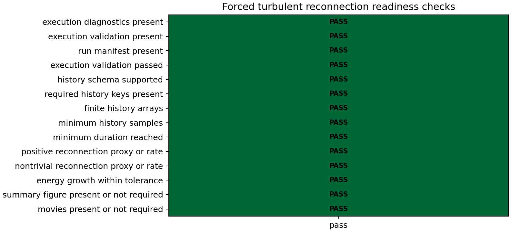
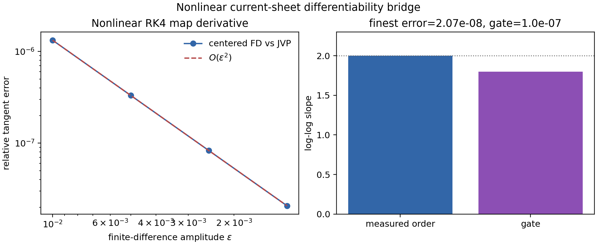
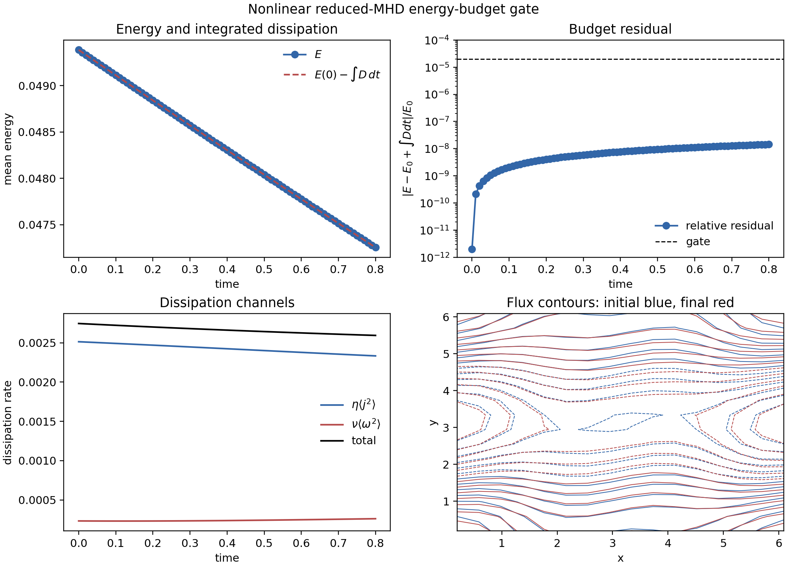
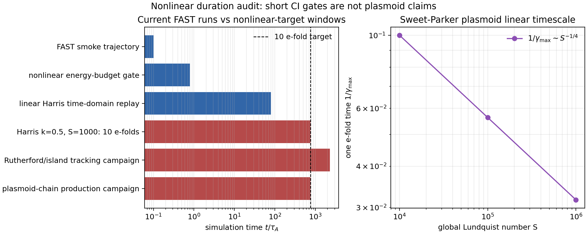

# Nonlinear gates

## Nonlinear Orszag--Tang reduced-MHD gate

MHX includes a solver-generated nonlinear Orszag--Tang validation case:

```bash
mhx benchmark orszag-tang --outdir outputs/benchmarks/orszag_tang_vortex --movies
```

The initial condition adapts the classic
[Orszag--Tang two-dimensional MHD vortex](https://doi.org/10.1017/S002211207900210X)
to the incompressible reduced-MHD variables:

$$
\phi=\cos x+\cos y,\qquad
\psi=\cos y+\frac{1}{2}\cos 2x,
$$

giving

$$
\mathbf{v}_\perp=(-\sin y,\sin x),\qquad
\mathbf{B}_\perp=(-\sin y,\sin 2x).
$$

The validation checks finite fields, monotone resistive-viscous energy decay,
net dissipation, high-wavenumber growth in current density and vorticity, and
spectral preservation of $\nabla\cdot\mathbf{B}_\perp=0$. This is not a
compressible full-MHD shock benchmark; it is the nonlinear reduced-MHD example
used by the README media and extension tutorials.

Expected files:

- `outputs/benchmarks/orszag_tang_vortex/diagnostics.json`
- `outputs/benchmarks/orszag_tang_vortex/validation.json`
- `outputs/benchmarks/orszag_tang_vortex/orszag_tang_vortex.npz`
- `outputs/benchmarks/orszag_tang_vortex/figures/orszag_tang_summary.png`
- `outputs/benchmarks/orszag_tang_vortex/figures/orszag_tang_current.gif`
- `outputs/benchmarks/orszag_tang_vortex/figures/orszag_tang_vorticity.gif`

## Decaying turbulence and forced turbulent reconnection

The turbulence validations exercise nonlinear advection, current-sheet
formation, and reconnection-proxy diagnostics without claiming converged
turbulent reconnection rates. The reduced-MHD equations remain

$$
\partial_t\psi + [\phi,\psi] = \eta\nabla^2\psi,
\qquad
\partial_t\omega + [\phi,\omega] = [\psi,\nabla^2\psi]
  + \nu\nabla^2\omega + F_\omega ,
$$

where the decaying case sets $F_\omega=0$ and the forced current-sheet case
uses a weak deterministic large-scale vorticity forcing. The decaying gate
checks finite arrays, total-energy decay, current amplification, and high-$k$
transfer. The forced gate checks finite arrays, bounded injected energy,
current amplification, and a reconnection proxy built from X/O critical-point
flux separation when available, with a documented max-min flux fallback.

Run the validations:

```bash
mhx benchmark decaying-turbulence --outdir outputs/benchmarks/decaying_mhd_turbulence --movies
mhx benchmark forced-turbulent-reconnection --outdir outputs/benchmarks/forced_turbulent_reconnection --movies
mhx benchmark forced-turbulent-reconnection-readiness-check outputs/benchmarks/forced_turbulent_reconnection
```

Expected files:

- `outputs/benchmarks/decaying_mhd_turbulence/decaying_mhd_turbulence.npz`
- `outputs/benchmarks/decaying_mhd_turbulence/figures/decaying_mhd_turbulence_summary.png`
- `outputs/benchmarks/forced_turbulent_reconnection/forced_turbulent_reconnection.npz`
- `outputs/benchmarks/forced_turbulent_reconnection/figures/forced_turbulent_reconnection_summary.png`
- `outputs/benchmarks/forced_turbulent_reconnection/readiness/promotion_readiness.json`
- `outputs/benchmarks/forced_turbulent_reconnection/readiness/figures/promotion_matrix.png`
- optional flux/current GIFs under each `figures/` directory

The readiness matrix is a validation-only claim boundary for the forced
current-sheet replay. It requires finite histories, enough saved samples,
minimum duration, nontrivial reconnecting-flux or reconnection-rate proxy,
bounded total-energy growth, and the expected summary/movie artifacts.



These examples are literature-anchored to 2-D MHD turbulence and
turbulent-reconnection studies, including the current-sheet/turbulence
diagnostic tradition used by Servidio and collaborators and the broader
Lazarian--Vishniac picture of turbulence-assisted reconnection. The current
MHX examples are pedagogical 2-D reduced-MHD validation artifacts, not 3-D
fast-reconnection production evidence.

Source links:

- [Turbulence implementation](https://github.com/uwplasma/MHX/blob/main/src/mhx/benchmarks/turbulence.py)
- [Critical-point diagnostics](https://github.com/uwplasma/MHX/blob/main/src/mhx/diagnostics/critical_points.py)
- [Turbulence tests](https://github.com/uwplasma/MHX/blob/main/tests/test_turbulence_validation.py)

## Nonlinear current-sheet differentiability bridge

The linear replay gate validates a frozen operator. The next differentiable
solver gate validates the nonlinear RK4 time map used by actual MHX runs. Let
$\Phi(q_0)$ be the map from an initial reduced-MHD state to the saved trajectory
vector after several RK4 steps. Around the periodic current sheet
$q_0=(\psi_0,\omega_0)$, JAX gives a tangent

$$
\delta \Phi = D\Phi(q_0)[p].
$$

MHX compares that tangent to centered finite differences of full nonlinear
trajectories:

$$
\delta \Phi_\epsilon =
\frac{\Phi(q_0+\epsilon p)-\Phi(q_0-\epsilon p)}{2\epsilon}.
$$

For a smooth RHS and x64 arithmetic, the error should converge as

$$
\frac{\|\delta \Phi_\epsilon-\delta\Phi\|_2}{\|\delta\Phi\|_2}
= O(\epsilon^2)
$$

until roundoff. This gate is specifically aimed at differentiable programming
claims: before MHX trains neural ODEs, adjoints, or inverse-design loops on
solver trajectories, the trajectory map itself must have a verified tangent.

```bash
mhx benchmark current-sheet-nonlinear-bridge \
  --outdir outputs/benchmarks/periodic_current_sheet_nonlinear_bridge
```

Expected files:

- `outputs/benchmarks/periodic_current_sheet_nonlinear_bridge/diagnostics.json`
- `outputs/benchmarks/periodic_current_sheet_nonlinear_bridge/validation.json`
- `outputs/benchmarks/periodic_current_sheet_nonlinear_bridge/periodic_current_sheet_nonlinear_bridge.npz`
- `outputs/benchmarks/periodic_current_sheet_nonlinear_bridge/figures/periodic_current_sheet_nonlinear_bridge.png`



## Nonlinear reduced-MHD energy budget

The first full nonlinear PDE gate is deliberately not a plasmoid claim. It
checks the periodic reduced-MHD energy theorem under the complete nonlinear
Poisson-bracket RHS. For

$$
E(t)=\frac{1}{2}\left\langle |\nabla\psi|^2+|\nabla\phi|^2\right\rangle,
\qquad \nabla^2\phi=\omega,\qquad j=-\nabla^2\psi,
$$

periodic integration by parts gives

$$
\frac{dE}{dt}=-\eta\langle j^2\rangle-\nu\langle\omega^2\rangle.
$$

This identity is a strong nonlinear sign/cancellation check: the advection and
magnetic-tension brackets must cancel in the energy balance, while the
resistive and viscous terms must remove energy. MHX starts from a multi-mode
state with active nonlinear RHS, advances the full nonlinear RK4 solver, and
gates:

- all saved arrays are finite;
- the initial nonlinear RHS norm is a nontrivial fraction of the full RHS;
- total energy is nonincreasing;
- the integrated residual
  $|E(t)-E(0)+\int_0^t[\eta\langle j^2\rangle+\nu\langle\omega^2\rangle]dt|/E(0)$
  stays below tolerance;
- net dissipative energy loss is observed.

```bash
mhx benchmark nonlinear-energy-budget \
  --outdir outputs/benchmarks/nonlinear_energy_budget
```

Expected files:

- `outputs/benchmarks/nonlinear_energy_budget/diagnostics.json`
- `outputs/benchmarks/nonlinear_energy_budget/validation.json`
- `outputs/benchmarks/nonlinear_energy_budget/nonlinear_energy_budget.npz`
- `outputs/benchmarks/nonlinear_energy_budget/figures/nonlinear_energy_budget.png`



This is the most important nonlinear solver gate currently in MHX. It supports
claims about nonlinear reduced-MHD consistency, but it still does not validate
nonlinear island growth, Rutherford saturation, Sweet--Parker reconnection
rates, or plasmoid chains.

## Nonlinear duration audit

The nonlinear energy-budget gate is intentionally short. To prevent accidental
overclaiming, MHX includes a reviewer-facing duration audit. For a linear
tearing eigenmode with growth rate $\gamma$, observing $N_e$ e-folds requires

$$
t_\mathrm{end}\ge \frac{N_e}{\gamma}.
$$

Using the direct Harris benchmark anchor $\gamma\simeq0.0131$ for
$S=1000$, $ka=0.5$, ten e-folds require $t_\mathrm{end}\approx763.4$.
The default FAST nonlinear budget run reaches $t=0.8$, so it is a
code-validity gate, not a nonlinear island or plasmoid physics result. Longer
validation runs are documented separately and still require convergence and
seed-QI promotion evidence before supporting production physics claims. The
audit also records Loureiro-type Sweet--Parker plasmoid one-e-fold estimates
$1/\gamma_{\max}\sim S^{-1/4}$ as a separate linear-timescale reference.

```bash
mhx benchmark nonlinear-duration-audit \
  --outdir outputs/benchmarks/nonlinear_duration_audit
```

Expected files:

- `outputs/benchmarks/nonlinear_duration_audit/diagnostics.json`
- `outputs/benchmarks/nonlinear_duration_audit/validation.json`
- `outputs/benchmarks/nonlinear_duration_audit/nonlinear_duration_audit.npz`
- `outputs/benchmarks/nonlinear_duration_audit/figures/nonlinear_duration_audit.png`



This audit is a pass/fail gate on scientific honesty: it passes only when the
current FAST nonlinear runs are explicitly flagged as too short for
Rutherford-island or plasmoid-chain claims and when the production time windows
are recorded in machine-readable artifacts.

## Duration-policy gate

The duration audit is the figure-facing view. The duration-policy gate is the
machine-readable rule that future production workflows should call before
launching long nonlinear runs:

```bash
mhx benchmark duration-policy --outdir outputs/benchmarks/duration_policy
```

Expected files:

- `outputs/benchmarks/duration_policy/duration_policy.json`
- `outputs/benchmarks/duration_policy/duration_policy.md`
- `outputs/benchmarks/duration_policy/validation.json`
- `outputs/benchmarks/duration_policy/manifest.json`

The policy gate passes when short historical/CI runs are scoped as
validation-only and when future production templates satisfy
$t_\mathrm{end}\ge s_f N_e/\gamma$. This prevents a future script from silently
using a smoke-test time window for a nonlinear reconnection claim.
