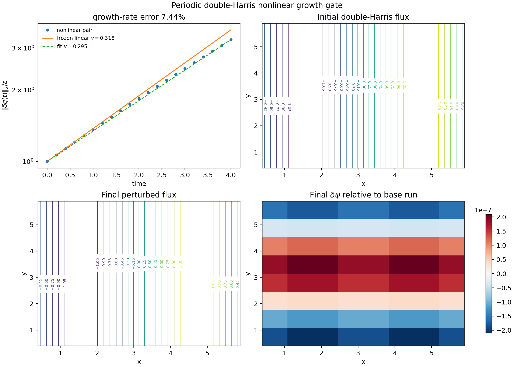
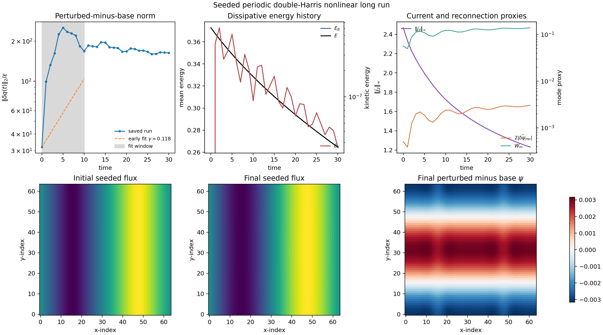
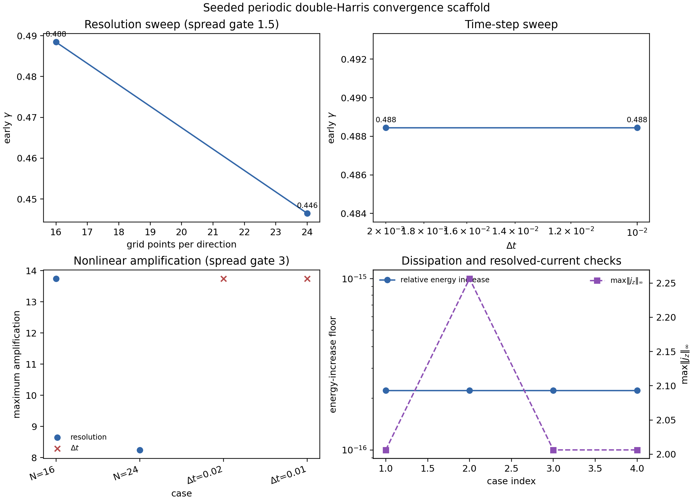
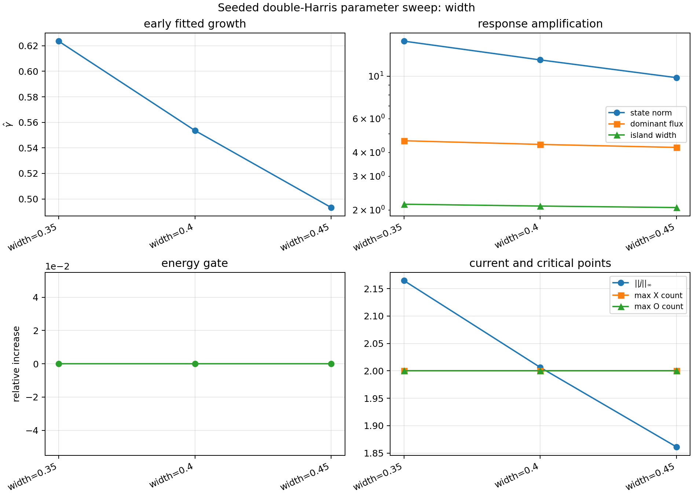

# Reconnection campaign evidence

## Seed-robust QI validation

MHX now includes a FAST seed-robust quality-indicator lane. It adds tiny
smooth, zero-mean perturbations to the reduced-MHD tearing initial condition and
gates whether `gamma_fit`, final energies, and spectral magnetic-divergence
diagnostics are stable across the seed ensemble.

The CLI command is:

```bash
mhx benchmark seed-robust-qi --outdir outputs/benchmarks/seed_robust_qi
```

The manifest is `claim_level = "validation"`. This supports only local FAST
metric-sensitivity claims, not turbulent ensemble uncertainty quantification or
production plasmoid statistics.

Source anchors:

- [QI implementation](https://github.com/uwplasma/MHX/blob/main/src/mhx/benchmarks/seed_robust_qi.py)
- [Validation-suite registry](https://github.com/uwplasma/MHX/blob/main/src/mhx/benchmarks/suite.py)
- [QI documentation](../project/seed_robust_qi.md)

## Periodic double-Harris nonlinear growth gate

The stable cosine-current-sheet spectrum above is intentionally conservative:
it protects the code from spurious positive growth but does not demonstrate
tearing. MHX now adds a small-grid instability gate using a periodic
double-Harris sheet,

$$
B_y(x)=A\left[\tanh\left(\frac{x-L_x/4}{a}\right)
-\tanh\left(\frac{x-3L_x/4}{a}\right)-1\right],
$$

with a zero-mean flux $\psi_0$ satisfying $B_y=\partial_x\psi_0$ to the sign
convention used by the reduced-MHD solver. The gate assembles the dense
matrix-free Jacobian $L=D F(\psi_0,0)$, selects the fastest non-gauge unstable
eigenmode $Lv=\gamma v$, and advances two full nonlinear trajectories:

$$
q_b(t)=\Phi_t(q_0),\qquad
q_p(t)=\Phi_t(q_0+\epsilon v).
$$

The measured finite-amplitude difference

$$
A(t)=\frac{\|q_p(t)-q_b(t)\|_2}{\epsilon}
$$

must grow by more than a factor of two and its fitted rate must remain within a
documented tolerance of the frozen-base eigenvalue. This is the first MHX
validation artifact that shows a physically unstable current sheet growing in
the nonlinear solver. It is still **not** a Rutherford-island or plasmoid-chain
production claim: the grid is deliberately tiny, the base sheet is periodic,
and publication claims still require duration, resolution, time-step, seed, and
aspect-ratio sweeps. The literature anchors are the classical tearing-mode
instability of Furth--Killeen--Rosenbluth
([Physics of Fluids 6, 459, 1963](https://cir.nii.ac.jp/crid/1363107370207531008))
and the high-Lundquist-number plasmoid-chain scalings of
Loureiro--Schekochihin--Cowley
([arXiv:astro-ph/0703631](https://arxiv.org/abs/astro-ph/0703631)), with
later nonlinear plasmoid-chain simulations by Samtaney et al.
([arXiv:0903.0542](https://arxiv.org/abs/0903.0542)).

```bash
mhx benchmark double-harris-growth \
  --outdir outputs/benchmarks/periodic_double_harris_nonlinear_growth
```

Expected files:

- `outputs/benchmarks/periodic_double_harris_nonlinear_growth/diagnostics.json`
- `outputs/benchmarks/periodic_double_harris_nonlinear_growth/validation.json`
- `outputs/benchmarks/periodic_double_harris_nonlinear_growth/periodic_double_harris_nonlinear_growth.npz`
- `outputs/benchmarks/periodic_double_harris_nonlinear_growth/figures/periodic_double_harris_nonlinear_growth.png`



## Seeded double-Harris long-run validation

The dense eigenmode gate above is intentionally tiny because it assembles the
full Jacobian. The next bridge is a scalable nonlinear run that does **not**
assemble the dense spectrum. It advances a base periodic double-Harris sheet
and a seeded sheet,

$$
q_b(t)=\Phi_t(q_0),\qquad
q_s(t)=\Phi_t(q_0+\epsilon\cos(2x)\cos y),
$$

and tracks the normalized difference, dominant reconnecting-flux proxy, local
Rutherford-width proxy, total energy, kinetic energy, peak current density, and
X/O critical-point counts:

$$
A_s(t)=\frac{\|q_s(t)-q_b(t)\|_2}{\epsilon},\qquad
\psi_\mathrm{rec}(t)=2\max_{0<|k_i|\le N_i/4}|\widehat{\delta\psi}_k(t)|,
\qquad
W_m(t)=4\sqrt{\frac{|\psi_\mathrm{rec}(t)|}{|A|/a}},
\qquad
E(t)=\frac{1}{2}\langle |\nabla\psi|^2+|\nabla\phi|^2\rangle,\qquad
\|j_z\|_\infty=\|-\nabla^2\psi\|_\infty .
$$

This command is meant for bounded nonlinear evidence runs under laptop/CI
budgets and for producing reviewer-visible movies before a full production
campaign. It gates finite histories, full-duration completion, an early-time
growth fit, visible maximum amplification, and dissipative total-energy
behavior. The reconnection proxy is deliberately stated as a **dominant
low-mode perturbation-flux diagnostic** for periodic double-Harris validation:
the configured seed-mode amplitude is archived separately as
`seed_mode_reconnected_flux`, so mode transfer is visible rather than hidden.
The committed `64×64`, `t_end=30` evidence bundle gives
`gamma_early = 0.118`, early amplification `5.27×`, maximum amplification
`7.89×`, and zero measured total-energy increase. The result is stronger than
a smoke test, but it remains a validation artifact rather than a converged
Rutherford/plasmoid claim because the late-time perturbation saturates/relaxes
and no resolution/seed/aspect-ratio sweep has yet closed.

```bash
mhx benchmark double-harris-long-run \
  --outdir outputs/benchmarks/periodic_double_harris_seeded_long_run \
  --nx 64 --ny 64 --t-end 30 --save-every 100 --movies
```

Expected files:

- `outputs/benchmarks/periodic_double_harris_seeded_long_run/diagnostics.json`
- `outputs/benchmarks/periodic_double_harris_seeded_long_run/validation.json`
- `outputs/benchmarks/periodic_double_harris_seeded_long_run/periodic_double_harris_seeded_long_run.npz`
- `outputs/benchmarks/periodic_double_harris_seeded_long_run/figures/periodic_double_harris_seeded_long_run.png`
- `outputs/benchmarks/periodic_double_harris_seeded_long_run/figures/periodic_double_harris_flux.gif`
- `outputs/benchmarks/periodic_double_harris_seeded_long_run/figures/periodic_double_harris_current.gif`

Once a convergence bundle exists, the promotion-boundary report is:

```bash
mhx benchmark double-harris-promotion-check \
  outputs/benchmarks/periodic_double_harris_seeded_long_run \
  --convergence-dir outputs/benchmarks/periodic_double_harris_convergence
```

This writes `promotion/promotion_readiness.json`,
`promotion/validation.json`, and `promotion/figures/promotion_matrix.png`.
Passing means the run is convergence-backed validation evidence; it still does
not authorize Rutherford, Sweet--Parker, or plasmoid production claims.



The historical flux and current-density movies remain in the
[media inventory](../project/media_inventory.md). They are not embedded here
because the total-field view is dominated by the static equilibrium; the
response-history figure above is the clearer validation evidence.

Source anchors:

- [double-Harris equilibrium](https://github.com/uwplasma/MHX/blob/main/src/mhx/physics/equilibria.py)
- [growth and long-run benchmark implementation](https://github.com/uwplasma/MHX/blob/main/src/mhx/benchmarks/current_sheet.py)
- [growth benchmark tests](https://github.com/uwplasma/MHX/blob/main/tests/test_current_sheet_eigenvalue_validation.py)

## Seeded double-Harris convergence evidence

This gate asks whether the measured early growth and nonlinear amplification
are artifacts of one tiny grid or one RK4 step size. The command

```bash
mhx benchmark double-harris-convergence \
  --outdir outputs/benchmarks/periodic_double_harris_convergence \
  --resolutions 16,24 --dt-values 0.02,0.01 \
  --reference-resolution 16 --t-end 8 --fit-stop 4
```

runs the same base-vs-seeded replay across a small resolution sweep and a small
time-step sweep. For each case it records

$$
\gamma_\mathrm{fit},\quad
G_\mathrm{early}=A_s(t_b)/A_s(t_a),\quad
G_\mathrm{max}=\max_t A_s(t)/A_s(0),\quad
\Delta E_+=\max_t(E(t)-E(0))_+/E(0).
$$

The gate requires finite metrics, positive early growth, dissipative total
energy, successful subcase gates, and bounded relative spread in
`gamma_fit`/`G_max`. The same code path has also been exercised on a
GPU-assisted medium sweep with resolutions `32,48,64`, `t_end=16`, and
`0.41%` growth-rate spread. This is intentionally **validation** evidence, not
a production claim: it prevents single-run overclaiming before larger
aspect-ratio, Lundquist-number, seed, and duration sweeps are executed.

Expected files:

- `outputs/benchmarks/periodic_double_harris_convergence/diagnostics.json`
- `outputs/benchmarks/periodic_double_harris_convergence/validation.json`
- `outputs/benchmarks/periodic_double_harris_convergence/periodic_double_harris_convergence.npz`
- `outputs/benchmarks/periodic_double_harris_convergence/figures/periodic_double_harris_convergence.png`




## Seeded double-Harris parameter sweeps

Convergence sweeps ask whether one numerical setting dominates the result.
Parameter sweeps ask a different question: do the nonlinear response
diagnostics remain finite, dissipative, and visibly reconnecting when the seed
mode, sheet width, or resistivity is changed? The command

```bash
mhx benchmark double-harris-parameter-sweep \
  --outdir outputs/benchmarks/periodic_double_harris_parameter_sweep \
  --sweep-axis width --widths 0.35,0.4,0.45 \
  --t-end 6 --fit-stop 3
```

runs three seeded base-vs-perturbed replays and records

$$
\gamma_\mathrm{fit},\quad
G_\mathrm{max},\quad
G_\psi=\max_t \psi_\mathrm{rec}(t)/\psi_\mathrm{rec}(0),\quad
G_W=\max_t W(t)/W(0),\quad
\Delta E_+ .
$$

The gate requires all cases to pass the underlying seeded-long-run checks, and
also requires finite per-case metrics, at least three cases, positive fitted
growth, visible amplification, reconnecting-flux and island-width response,
dissipative total energy, and bounded anomaly-scale spreads. The spread gates
are deliberately loose because physically different sheets need not agree; they
catch runaway or degenerate cases before figures are promoted.

Expected files:

- `outputs/benchmarks/periodic_double_harris_parameter_sweep/diagnostics.json`
- `outputs/benchmarks/periodic_double_harris_parameter_sweep/validation.json`
- `outputs/benchmarks/periodic_double_harris_parameter_sweep/periodic_double_harris_parameter_sweep.npz`
- `outputs/benchmarks/periodic_double_harris_parameter_sweep/figures/periodic_double_harris_parameter_sweep.png`



Source anchors:

- [convergence runner](https://github.com/uwplasma/MHX/blob/main/src/mhx/benchmarks/current_sheet.py)
- [convergence CLI](https://github.com/uwplasma/MHX/blob/main/src/mhx/cli/main.py)
- [convergence tests](https://github.com/uwplasma/MHX/blob/main/tests/test_current_sheet_eigenvalue_validation.py)
