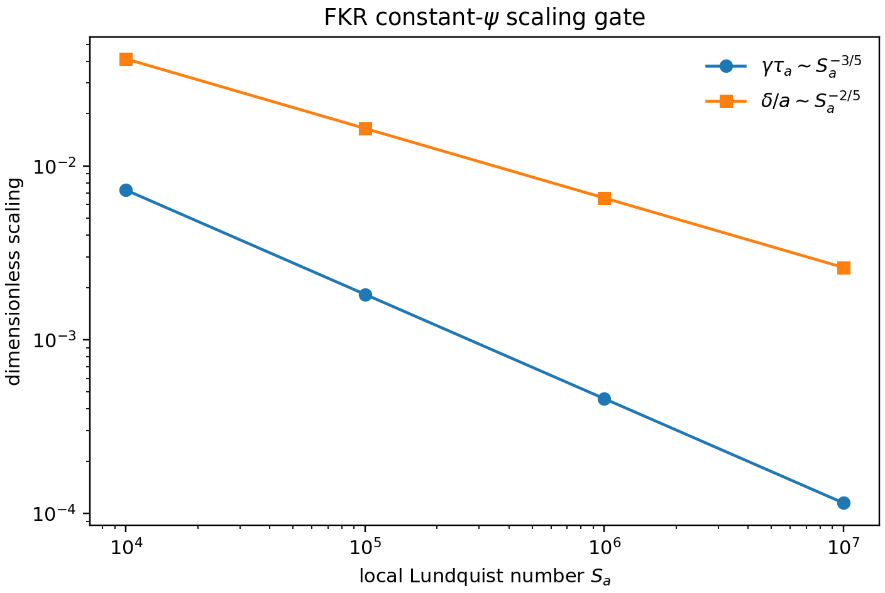
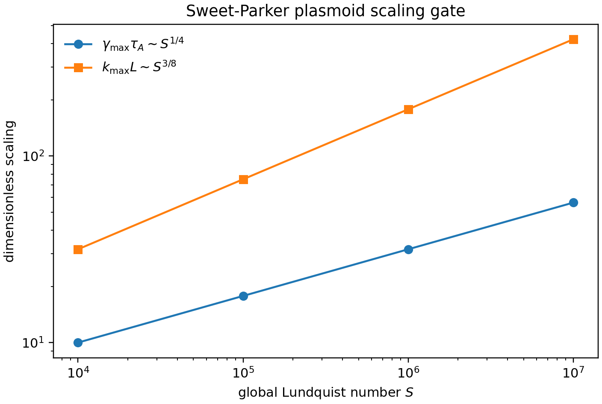
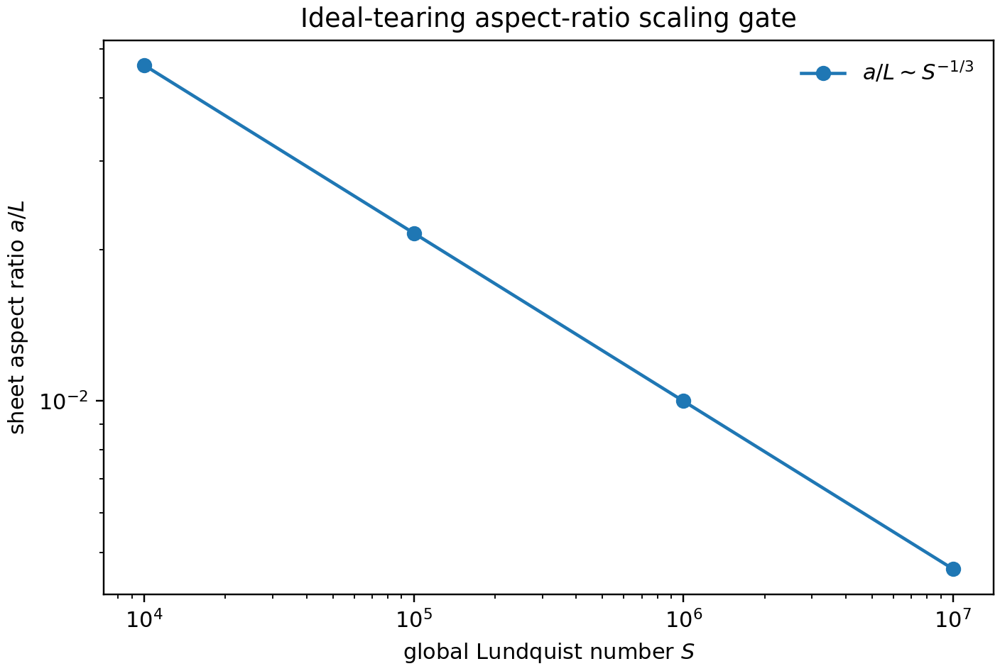

# Reconnection scaling theory gates

## Reconnection scaling gates

The next validation layer checks that MHX's analytic benchmark scaffolds encode
the literature exponents that future numerical benchmarks must recover.

For constant-$\psi$ FKR tearing, using the Harris-sheet proxy

$$
\Delta'a = 2\left[(ka)^{-1}-ka\right],
$$

MHX gates the order-unity-coefficient-free scalings

$$
\gamma\tau_a \sim S_a^{-3/5}(ka)^{2/5}(\Delta'a)^{4/5},
\qquad
\delta/a \sim S_a^{-2/5}(ka)^{-2/5}(\Delta'a)^{1/5}.
$$



For a Sweet-Parker current sheet, the Loureiro--Schekochihin--Cowley plasmoid
theory predicts

$$
\gamma_{\max}\tau_A \sim S^{1/4}, \qquad k_{\max}L \sim S^{3/8}.
$$



For ideal tearing, MHX checks the Pucci--Velli aspect-ratio scaling

$$
a/L \sim S^{-1/3}.
$$



Run the scaling gates:

```bash
mhx benchmark scaling --outdir outputs/benchmarks/reconnection_scaling
```

Expected files:

- `outputs/benchmarks/reconnection_scaling/diagnostics.json`
- `outputs/benchmarks/reconnection_scaling/validation.json`
- `outputs/benchmarks/reconnection_scaling/scaling_history.npz`
- `outputs/benchmarks/reconnection_scaling/figures/fkr_scaling.png`
- `outputs/benchmarks/reconnection_scaling/figures/plasmoid_scaling.png`
- `outputs/benchmarks/reconnection_scaling/figures/ideal_tearing_scaling.png`

These gates do not prove the PDE solver has recovered FKR or plasmoid growth.
They make the expected exponents explicit, tested, plotted, and reviewable so
that future eigenmode and nonlinear-current-sheet benchmarks have fixed targets.
